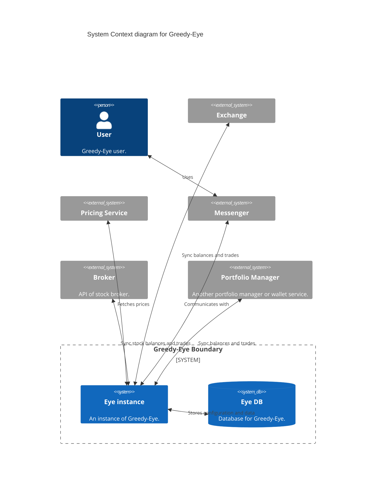
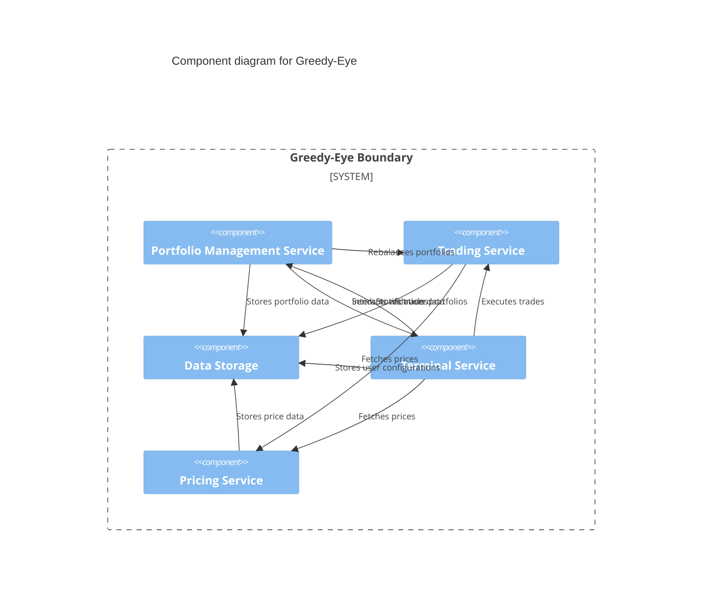

# Greedy-Eye


**Greedy-Eye** is a comprehensive portfolio management system with advanced trading features, analytics, notifications, and metrics, built using Go.

## ⚠️ Status

:warning: **Under development.** Features are being actively added and improvements are ongoing.

## 📜 Table of Contents

- [Overview](#overview)
- [Features](#features)
- [Supported Services](#supported-services)
- [Architecture](#architecture)
- [Quickstart](#quickstart)
- [License](#license)

## Overview

Greedy-Eye is designed to help investment enthusiasts manage their portfolios efficiently. It integrates data fetching, analysis, trading, and real-time notifications to provide a seamless experience for tracking and optimizing your crypto investments.



## Features

- Portfolio Management: Track and manage your cryptocurrency holdings across multiple wallets and exchanges.
- Automated Trading: Execute trades based on predefined strategies and market conditions.
- Analytics & Metrics: Gain insights into portfolio performance with detailed analytics.
- Real-Time Notifications: Receive instant alerts on trades, portfolio changes, and important market events.
- Extensible Architecture: Easily add new services and integrations as your needs grow.

## Supported Services

- Exchanges: Binance, GateIO.
- Notification Channels: Telegram.
- Price Providers: CoinGecko.

(Note: Currently in development. More services will be supported in upcoming releases.)

## Architecture

Greedy-Eye follows a modular monolithic architecture, with each component responsible for a specific set of functionalities. The system is designed to be extensible, allowing for easy integration of new services and features.



Key Components:

- **Portfolio Management Service**: Handles the aggregation and management of user portfolios, including balances, trades, and performance metrics.
- **Trading Service**: Manages trade executions based on predefined strategies and market conditions.
- **Data Storage**: Central repository for storing all relevant data, including user configurations, balances, trades, and analytics.
- **Terminal Service**: Provides a control interface for users to interact with the system and receive real-time notifications.
- **Pricing Service**: Fetches and stores price data from external providers for use in portfolio analysis and trading.

## Quickstart

### Docker

To run Greedy-Eye using Docker, follow these steps:

Write a docker-compose.yml file:

```yaml
version: '3.8'

services:
   greedy-eye:
      image: fox/greedy-eye:latest
      ports:
         - "8080:80"
      environment:
         - GREEDY_EYE_DB_URL=postgresql://greedy-eye:password@db:5432/greedy-eye
      depends_on:
         - db
      networks:
         - greedy-eye

   db:
      image: postgres:13
      environment:
         - POSTGRES_USER=greedy-eye
         - POSTGRES_PASSWORD=password
         - POSTGRES_DB=greedy-eye
      networks:
         - greedy-eye

networks:
   greedy-eye:
```

Run the following command:

```bash
docker-compose up -d
```

Greedy-Eye will be accessible at <http://localhost:8080>.

### Manual

To run Greedy-Eye manually, follow these steps:

Clone the repository:

```bash
git clone https://github.com/foxcool/greedy-eye.git
```

Build the project:

```bash
make build
```

Run the application:

```bash
./greedy-eye
```

Greedy-Eye will be accessible at <http://localhost:8080>.

## License

This project is licensed under the MIT License. See the [LICENSE](LICENSE) file for details.
