# Greedy Eye

**Universal portfolio management system** for managing diverse investment portfolios including cryptocurrencies, 
securities, and other financial instruments - featuring conversational interface and voice support.

## 🚀 What is Greedy Eye?

Greedy Eye helps you manage your investment portfolio through:
- **Conversational Interface**: Chat with your portfolio via Telegram bot (with voice support)
- **Rule-Based Automation**: Set up alerts, DCA strategies, rebalancing rules
- **Multi-Platform Support**: Connect exchanges, brokerages, and other platforms to track all assets in one place
- **Voice Commands**: Speak to your bot in Russian or English using advanced STT/TTS
- **Real-Time Alerts**: Get notified about price changes, portfolio performance

## 🏛️ Supported Asset Types

**Universal Design**: The system architecture supports diverse financial instruments:

- **Cryptocurrencies** - Bitcoin, Ethereum, altcoins (primary implementation focus)
- **Securities** - Stocks, bonds, ETFs, mutual funds
- **Derivatives** - Options, futures, swaps
- **Alternative Assets** - REITs, commodities, forex pairs
- **Custom Assets** - Any tradeable instrument with price data

*Current implementation focuses on cryptocurrency exchanges and market data, with securities and other asset types 
planned for future releases.*

## ⚡ Current Status

**Architecture**: ✅ **Complete** - All services implemented with comprehensive APIs  
**Implementation**: 🔄 **Business Logic Phase** - Core functionality being added  
**Production**: 📋 **Planned** - Full deployment preparation in progress  

**Ready to use**: HTTP API Gateway, Database layer, Service architecture  
**Coming soon**: External integrations (crypto exchanges, market data providers, brokerage APIs), Telegram bot activation

## 📖 Documentation

**→ [Complete Documentation](docs/README.md)** - Architecture, development guides, service details

### Quick Links
- **[Getting Started](docs/DEVELOPMENT.md#quick-start)** - Setup and run the project
- **[Architecture Overview](docs/ARCHITECTURE.md)** - System design and decisions  
- **[Telegram Bot](docs/services/telegram-bot.md)** - Conversational interface details
- **[Rule Engine](docs/services/rule-service.md)** - Automation and alerts system

## 🏗️ Architecture

**Pattern**: Modular Monolith with gRPC Services + HTTP API Gateway  
**Deployment**: Single binary or microservices via configuration  
**Database**: PostgreSQL with Ent ORM  
**APIs**: Internal gRPC + External HTTP (auto-generated)

```mermaid
graph TB
    User[👤 User] --> Telegram[📱 Telegram Bot<br/>Voice + Text]
    User --> API[🌐 HTTP API<br/>:8080]
    
    Telegram --> TBot[🤖 TelegramBotService]
    API --> Gateway[🌐 gRPC-Gateway]
    Gateway --> Services[📋 Core Services]
    TBot --> Services
    
    Services --> Storage[💾 StorageService]
    Storage --> DB[(🗄️ PostgreSQL)]
    
    Services --> External[🔌 External APIs]
    External --> Speech[🎤 STT/TTS<br/>Providers]
    External --> Exchanges[📊 Exchanges &<br/>Brokerages]
    External --> Price[💰 Market<br/>Data]
    
    subgraph "8 Core Services"
        Services --> Auth[🔐 Auth]
        Services --> Rules[⚙️ Rules + Alerts] 
        Services --> Portfolio[📈 Portfolio]
        Services --> Assets[🏦 Multi-Asset<br/>Management]
        Services --> Prices[💲 Prices]
        Services --> Users[👥 Users]
    end
```



## ✨ Key Features

### 🤖 Conversational Interface
- **Telegram Bot** with comprehensive command support (`/portfolio`, `/balance`, `/alerts`)
- **Voice Support** - Speak in Russian or English, get voice responses back
- **Multi-Provider STT/TTS** - Google Cloud Speech, OpenAI Whisper, Yandex SpeechKit
- **Session Management** - Stateful conversations with context preservation

### ⚙️ Portfolio Automation  
- **Rule Engine** - Set up automated strategies (DCA, rebalancing, stop-loss, dividend reinvestment)
- **Smart Alerts** - Price alerts, portfolio change notifications, earnings announcements with rate limiting
- **Flexible Scheduling** - Cron-based execution for regular operations across all asset types
- **Simulation Mode** - Test strategies before applying real money to any asset class

### 🔌 Multi-Platform Integration
- **Unified Interface** - Manage portfolios across exchanges, brokerages, and other platforms
- **Real-Time Sync** - Keep balances and transactions synchronized across all asset types
- **External APIs** - Crypto exchanges (Binance), market data (CoinGecko), securities brokerages (T-Bank Invest API)
- **HTTP API** - RESTful endpoints auto-generated from gRPC definitions

### 🛡️ Enterprise-Ready
- **Modular Architecture** - Run as monolith or microservices
- **Authentication** - JWT-based auth with API key management
- **Database Layer** - PostgreSQL with automated migrations
- **Docker Support** - Multi-platform containers (AMD64/ARM64)

## 🚀 Quick Start

**Prerequisites**: Docker and Docker Compose

1. **Clone the repository**:
   ```bash
   git clone https://github.com/foxcool/greedy-eye.git
   cd greedy-eye
   ```

2. **Start the system**:
   ```bash
   docker-compose up -d
   ```

3. **Access the application**:
   - HTTP API: http://localhost:8080
   - Health check: http://localhost:8080/health
   - gRPC endpoint: localhost:50051

**Next Steps**: Check [Getting Started Guide](docs/DEVELOPMENT.md#quick-start) for detailed setup and development instructions.

## 💻 Development

**Want to contribute?** See our [Development Guide](docs/DEVELOPMENT.md) for:
- Setting up your development environment  
- Running tests and linting
- Contributing guidelines
- Service architecture details

**Key Commands**:
```bash
make dev      # Start with live reload
make test     # Run tests
make buf-gen  # Generate protobuf code
```

## License

This project is licensed under the MIT License.
