# Greedy-Eye

**Greedy-Eye** is a comprehensive portfolio management system with advanced trading features,
analytics, notifications, and metrics, built using Go.

## ⚠️ Status

:warning: **Under development.**

**Current state (v0.0.3-alpha):**

- ✅ Infrastructure foundation complete (storage, DB, CI/CD)
- ✅ Application bootstrapping and configuration
- ✅ Database schema with Ent ORM integration
- ✅ Docker deployment with multiplatform support
- ✅ gRPC-Gateway HTTP API implementation
- ✅ Core service structure (Asset, Portfolio, Price, User, Storage)
- ✅ Authentication service with API keys and JWT
- ✅ Rule-based portfolio management system

**Next phase:**

- Implementing external API integrations (Binance, CoinGecko)
- Adding business logic to services
- Integration testing and validation

## 📜 Table of Contents

- [Overview](#overview)
- [Features](#features)
- [Supported Services](#supported-services)
- [Architecture](#architecture)
- [Deployment Options](#deployment-options)
- [Quickstart](#quickstart)
- [Development](#development)
- [Roadmap](#roadmap)
- [License](#license)

## Overview

Greedy-Eye is designed to help investment enthusiasts manage their portfolios efficiently.
It integrates data fetching, analysis, trading, and real-time notifications to provide a
seamless experience for tracking and optimizing your crypto investments.

```mermaid
graph TB
    User[👤 User] --> API[🌐 gRPC/HTTP API]
    API --> Services[📋 Business Services]
    Services --> Storage[💾 Storage Layer]
    Storage --> DB[(🗄️ PostgreSQL)]
    
    Services --> External[🔌 External APIs]
    External --> Binance[📊 Binance]
    External --> CoinGecko[💰 CoinGecko]
    External --> Telegram[📱 Telegram]
    
    subgraph "Core Services"
        Services --> Auth[🔐 AuthService]
        Services --> Rules[⚙️ RuleService] 
        Services --> Portfolio[📈 PortfolioService]
        Services --> Assets[🏦 AssetService]
        Services --> Prices[💲 PriceService]
        Services --> Users[👥 UserService]
    end
```



## Features

- **Portfolio Management**:
  - [x] Database schema and storage layer
  - [ ] Basic portfolio structure and holdings
  - [ ] Multiple portfolios support
  - [ ] Advanced portfolio metrics and analytics
  - [ ] Rebalancing suggestions

- **Data Integration**:
  - [x] Storage layer for price data
  - [ ] Basic price fetching from CoinGecko
  - [ ] Balance synchronization with exchanges
  - [ ] Transaction history import

- **Notifications**:
  - [x] Telegram client adapter structure
  - [ ] Basic Telegram integration
  - [ ] Price alerts
  - [ ] Portfolio performance alerts

- **Trading Automation**:
  - [ ] Automated trading strategies
  - [ ] DCA and rebalancing automation
  - [ ] Trade execution on exchanges

*Note: Checked items [x] are implemented in the current version.*

## Supported Services

- **Exchanges**:
  - Binance (in progress)
  - GateIO (planned)

- **Notification Channels**:
  - Telegram (basic implementation)

- **Price Providers**:
  - CoinGecko (implemented)

## Architecture

Greedy-Eye follows a modular monolithic architecture with microservices deployment capability.
Each component is responsible for a specific set of functionalities, and the system is designed
to be extensible, allowing for easy integration of new services and features.

```mermaid
graph TB
    subgraph "Interface Layer"
        API[🌐 gRPC-Gateway<br/>HTTP:8080]
        gRPC[🔌 gRPC Server<br/>:50051]
    end
    
    subgraph "Business Logic Layer"
        Auth[🔐 AuthService<br/>JWT & Auth]
        Rules[⚙️ RuleService<br/>Automation]
        Portfolio[📈 PortfolioService<br/>Calculations]
        Assets[🏦 AssetService<br/>Metadata]
        Prices[💲 PriceService<br/>Data Fetching]
        Users[👥 UserService<br/>Management]
    end
    
    subgraph "Data Layer"
        Storage[💾 StorageService<br/>CRUD Operations]
    end
    
    subgraph "Database"
        DB[(🗄️ PostgreSQL<br/>Persistent Storage)]
    end
    
    API --> gRPC
    gRPC --> Auth
    gRPC --> Rules  
    gRPC --> Portfolio
    gRPC --> Assets
    gRPC --> Prices
    gRPC --> Users
    
    Auth --> Storage
    Rules --> Storage
    Portfolio --> Storage
    Assets --> Storage
    Prices --> Storage
    Users --> Storage
    
    Storage --> DB
```



### Key Components

- **Asset Service**: Asset metadata and external data enrichment
- **Portfolio Service**: Portfolio calculations, performance metrics, and analytics  
- **Price Service**: Price data fetching from external providers (CoinGecko, exchanges)
- **User Service**: User account management and preferences
- **Auth Service**: JWT authentication and token management
- **Rule Service**: Rule execution engine for portfolio automation (DCA, rebalancing, stop-loss)
- **Storage Service**: Low-level CRUD operations and database abstraction

### Service Layer Separation

Greedy-Eye follows a layered architecture pattern with clear separation of concerns:

#### Domain Services

Services like `AssetService`, `PortfolioService`, `UserService`, `AuthService`, and `RuleService`
represent the business domain and implement domain-specific logic:

- Business rules validation
- Domain workflows and operations
- Cross-entity operations
- External integrations

#### Storage Service

`StorageService` acts as an abstraction layer for persistent storage:

- Low-level data CRUD operations
- Database transaction management
- Data versioning and history tracking
- Query optimization

Domain services depend on the Storage service for data persistence needs, never directly
accessing the database.

**Note**: All API Key CRUD operations are handled by StorageService, while AuthService 
focuses on JWT business logic.

## Deployment Options

Greedy-Eye offers flexible deployment options:

1. **Monolithic Mode**: Run all services in a single binary
2. **Microservices Mode**: Run each service separately and communicate via gRPC

Configure which services to run using either:

- Configuration file with `-c [config file path]`
- Environment variables (e.g., `EYE_SERVICES="asset,portfolio,price"`)

## Quickstart

### Docker

Greedy-Eye provides multiplatform Docker images supporting:

- `linux/amd64` (Intel/AMD 64-bit)
- `linux/arm64` (ARM 64-bit, including Apple Silicon)

To run Greedy-Eye using Docker, follow these steps:

Create a docker-compose.yml file:

```yaml
version: '3.8'

services:
  greedy-eye:
    image: foxcool/greedy-eye:latest
    ports:
      - "8080:80"
    environment:
      - EYE_LOGGING_LEVEL=DEBUG
      - EYE_DATABASE_URL=postgresql://greedy-eye:password@db:5432/greedy-eye
      - EYE_SERVICES="asset,portfolio,price,user"
    depends_on:
      - db
    networks:
      - greedy-eye

  db:
    image: postgres:13
    environment:
      - POSTGRES_USER=greedy-eye
      - POSTGRES_PASSWORD=password
      - POSTGRES_DB=greedy-eye
    volumes:
      - postgres_data:/var/lib/postgresql/data
    networks:
      - greedy-eye

networks:
  greedy-eye:

volumes:
  postgres_data:
```

Run the following command:

```bash
docker-compose up -d
```

Greedy-Eye will be accessible at <http://localhost:8080>.

### Manual Build

To build and run Greedy-Eye manually:

1. Clone the repository:

```bash
git clone https://github.com/foxcool/greedy-eye.git
cd greedy-eye
```

2. Generate Go code from Protocol Buffers:

```bash
make buf-gen
```

3. Build the project:

```bash
make build
```

4. Run the application:

```bash
./bin/eye -c configs/config.yaml
```

## Development

### Prerequisites

- Go 1.23+
- Protocol Buffers compiler
- Docker and Docker Compose (for local development)

### Development Commands

```bash
# Generate protobuf files
make buf-gen

# Run linting
make lint

# Run tests
make test

# Start development environment
make up
```

## Roadmap

- [x] Core architecture and service structure
- [x] Basic gRPC interfaces
- [x] Database schema and migrations
- [x] Storage service implementation
- [x] Docker containerization and CI/CD
- [ ] Core business logic services (Asset, Portfolio, Price, User)
- [ ] Basic portfolio tracking
- [ ] Binance API integration
- [ ] Telegram notifications
- [ ] Portfolio analytics
- [ ] Trading automation
- [ ] Web interface

## License

This project is licensed under the MIT License.
