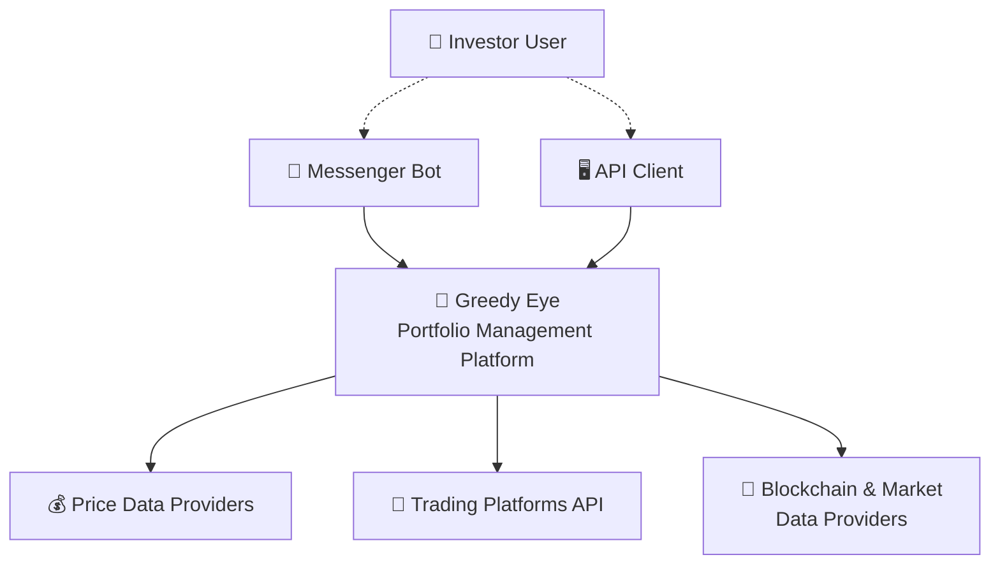
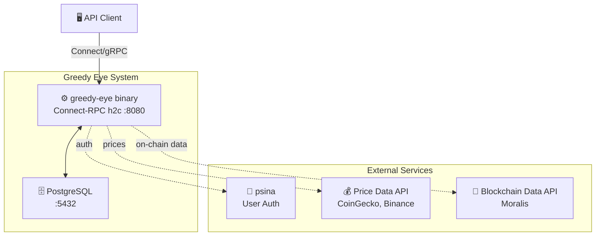
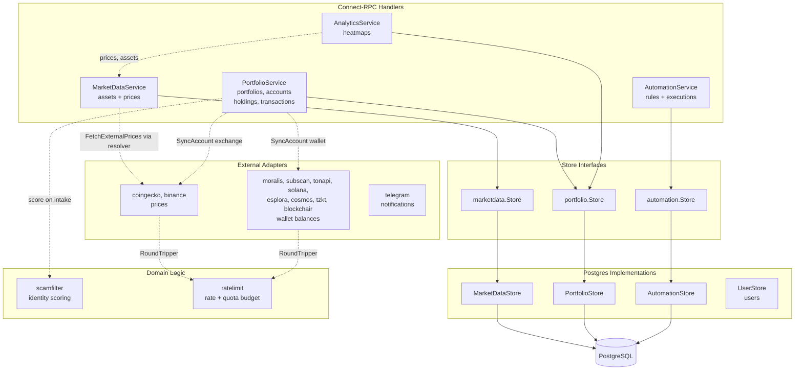

# Greedy Eye - Architecture Documentation

## Overview

Universal portfolio management system based on arc42 + C4 Model

> **Source of truth**: the API contract lives in `api/v1/*.proto`, the schema in
> `schema.hcl`, and the wiring in `cmd/eye/main.go`. This document is
> hand-maintained prose about that code — when they disagree, the code wins.
> Some HTTP routes (e.g. `GET /eye/health`) are wired directly in `main.go`, not
> generated from proto. There is no OpenAPI spec: the service is Connect-RPC,
> which the OpenAPI generator does not cover.

---

## Document Navigation

This architecture document is organized according to the arc42 template and C4 model. Different sections serve
different audiences:

**Business & Product Context** (Sections 1-4)
- Introduction, requirements, constraints, and solution strategy
- Target audience: Product owners, business stakeholders, new team members

**Technical Implementation** (Sections 5-7)
- Building blocks, components, runtime behavior, and deployment
- Target audience: Developers, architects, DevOps engineers

**Operational & Quality Aspects** (Section 8)
- Security, performance, monitoring, and crosscutting concerns
- Target audience: SRE, operations team, security engineers

**Architecture Decisions & Risk Management** (Sections 9-11)
- ADRs, quality requirements, and technical debt tracking
- Target audience: Tech leads, architects, decision makers

**Reference** (Section 12)
- Glossary of domain terms
- Target audience: All stakeholders

**Related documents**
- [providers.md](providers.md) — which external providers can be connected, what
  each needs, and what the account fields mean
- [development.md](development.md) — local setup and workflow

---

## 1. Introduction and Goals

### 1.1 Requirements and Constraints

**Business Requirements:**
- Universal investment portfolio management (cryptocurrencies, securities, derivatives) platform
- Automated investment strategies (DCA, rebalancing, stop-losses)
- Different interfaces types and easy integration with client apps
- Integration with external APIs (exchanges, brokers, data providers)

**Functional Requirements:**
- Portfolio management with portfolio service
- Automated trading strategies using rule system
- Real-time price tracking from multiple sources
- Notifications and alerts about portfolio changes
- Support for multiple asset types and accounts

**Non-functional Requirements:**
- HTTP API response time < 200ms for simple operations
- Support for 100+ concurrent users
- 99.9% system availability
- Secure storage of API keys and user data

### 1.2 Quality Goals

**Top-3 priority quality goals:**

1. **Scalability** - Modular monolith architecture with microservices transition capability
   - Metrics: support 10x user growth without architectural changes
   - Horizontal scaling through configuration

2. **Security** - Multi-layered protection for financial data
   - Metrics: encryption of all external API keys, audit of all operations
   - Authentication delegated to psina (session cookies or personal access tokens);
     ownership enforced per entity inside this service
3. **Reliability** - Fault tolerance for financial operations
   - Metrics: 99.9% uptime, automatic recovery after failures
   - Graceful degradation when external services are unavailable

### 1.3 Stakeholders

| Role | Contact | Expectations |
| --- | --- | --- |
| Founder | fox@darkfox.info | Fast MVP delivery, universality for all asset types, maintainability |

---

## 2. Constraints

### 2.1 Technical Constraints

**Technology Stack:**
- **Language**: Go 1.25+
- **Database**: PostgreSQL 17+ (ACID compliance for financial data)
- **Protocol**: Connect-RPC over HTTP/2 (h2c) — serves both Connect and gRPC clients
- **Schema Management**: Atlas declarative migrations
- **Containerization**: Docker + Docker Compose

**Performance Constraints:**
- API response time < 200ms for 95% of requests
- Support up to 1000 concurrent connections
- Price fetch batch processing < 5 seconds

**Compatibility and Integrations:**
- Messenger Bot APIs (chat interface)
- Price data providers (cryptocurrency and securities market data)
- Trading platform APIs (exchanges and brokers)
- Blockchain data providers (on-chain analytics and wallet information)

### 2.2 Organizational Constraints

**Development Team:**
- 1 Developer (Go, docker, ansible, protobuf)

**Development Processes:**
- Code generation with proto using buf
- Declarative schema management with Atlas (schema.hcl)
- Integration tests with testcontainers (ephemeral PostgreSQL)
- Continuous Integration through GitHub Actions

### 2.3 External Constraints

**Legal Requirements:**
- GDPR compliance for user data

**Corporate Standards:**
- Open Source approach (MIT License)
- Documentation of architectural decisions (ADR)
- Security: encrypted at rest, encrypted in transit

---

## 3. Context and Scope

### 3.1 C1: Context Diagram


```mermaid
graph TB
    User[👤 Investor User]
    MessengerBot[📱 Messenger Bot]
    APIClient[🖥️ API Client]

    GreedyEye[🏦 Greedy Eye<br/>Portfolio Management Platform]

    Price[💰 Price Data Providers]
    Trading[🔄 Trading Platforms API]
    DataProviders[🔎 Blockchain & Market<br/>Data Providers]

    User -.-> MessengerBot
    User -.-> APIClient
    MessengerBot --> GreedyEye
    APIClient --> GreedyEye

    GreedyEye --> Price
    GreedyEye --> Trading
    GreedyEye --> DataProviders
```

### 3.2 Business Context

**External Systems and Their Roles:**
- **Messenger Bot API**: Chat user interface
- **Price Data Providers**: Cryptocurrency and securities price data and market information
- **Trading Platforms API**: Trading operations for various asset types
- **Blockchain & Market Data Providers**: On-chain data and market analytics
- **Speech APIs**: Voice to text conversion and vice versa

**User Roles:**
- **Individual Investors**: Primary system users
- **API Clients**: Integration with external systems through HTTP API

### 3.3 Technical Context

**Network Protocols:**
- **gRPC**: Internal communication between services
- **HTTP/HTTPS**: External API and webhook integrations
- **WebSocket**: Real-time notifications (planned)

**Data Formats:**
- **Protocol Buffers**: Internal API definitions
- **JSON**: HTTP API requests/responses
- **Encrypted**: Storage of API keys and sensitive data

---

## 4. Solution Strategy

### 4.1 Architectural Decisions

**Selected Architectural Patterns:**
- **Modular Monolith**: Balance between development simplicity and scalability
- **4-service domain API**: MarketDataService, PortfolioService, AutomationService, AnalyticsService
- **Layered architecture**: handler → store interface → postgres implementation
- **CQRS elements**: Separation of read and write operations in critical places

**Technology Stack:**
- **Backend**: Go 1.25+ for performance and type safety
- **Database**: PostgreSQL + pgx (raw SQL) for reliability
- **Schema**: Atlas declarative migrations (schema.hcl)
- **Communication**: Connect-RPC (h2c) — single server serves both Connect and gRPC clients
- **Deployment**: Docker containers for environment consistency

**Responsibility boundaries:**
- **User management / Auth**: delegated to external service (psina)
- **Messenger Bot**: separate future service
- **Greedy Eye core**: market data, portfolios, automation rules

### 4.2 Approach to Quality Goals

**Scalability:**
- Modular architecture with clear service boundaries
- Deployment capability as monolith or separate microservices
- Connection pooling and efficient resource usage

**Security:**
- Multi-layer authentication (JWT + API keys)
- Encryption of external API keys in database
- Rate limiting and audit logging of all operations

**Reliability:**
- Health checks for all services
- Graceful degradation when external APIs are unavailable
- Retry mechanisms with exponential backoff

---

## 5. Building Block View

### 5.1 C2: Container Diagram


```mermaid
graph TB
    subgraph "Greedy Eye System"
        App[⚙️ greedy-eye binary<br/>Connect-RPC h2c :8080]
        Database[🗄️ PostgreSQL<br/>:5432]
    end

    subgraph "External Services"
        Psina[👥 psina<br/>User Auth]
        PriceAPI[💰 Price Data API<br/>CoinGecko, Binance]
        BlockchainAPI[🔎 Blockchain Data API<br/>Moralis]
    end

    APIClient[🖥️ API Client] -->|Connect/gRPC| App
    App <--> Database
    App -.->|prices| PriceAPI
    App -.->|on-chain data| BlockchainAPI
    App -.->|auth| Psina
```

**Level 1 Containers:**

- **greedy-eye binary**:
  - Purpose: Single Go binary serving 4 domain services over Connect-RPC
  - Technologies: Go, Connect-RPC, Protocol Buffers, h2c
  - Services: MarketDataService, PortfolioService, AutomationService, AnalyticsService
  - Health check: `GET /eye/health`

- **PostgreSQL Database**:
  - Purpose: Persistent storage with ACID guarantees
  - Technologies: PostgreSQL 17+, pgx driver
  - Schema: Atlas declarative migrations (schema.hcl)
  - Interfaces: SQL, pgxpool connection pooling

### 5.2 C3: Component Diagrams

#### Service Layer - Component Details


```mermaid
graph TB
    subgraph "Connect-RPC Handlers"
        MDS[MarketDataService<br/>assets + prices]
        PS[PortfolioService<br/>portfolios, accounts<br/>holdings, transactions]
        AS[AutomationService<br/>rules + executions]
        ANS[AnalyticsService<br/>heatmaps]
    end

    subgraph "Store Interfaces"
        MDSI[marketdata.Store]
        PSI[portfolio.Store]
        ASI[automation.Store]
    end

    subgraph "Postgres Implementations"
        MDSP[MarketDataStore]
        PSP[PortfolioStore]
        ASP[AutomationStore]
        SSP[UserStore<br/>users]
    end

    subgraph "External Adapters"
        Prices[coingecko, binance<br/>prices]
        Wallets[moralis, subscan, tonapi, solana,<br/>esplora, cosmos, tzkt, blockchair<br/>wallet balances]
        Telegram[telegram<br/>notifications]
    end

    subgraph "Domain Logic"
        SF[scamfilter<br/>identity scoring]
        RL[ratelimit<br/>rate + quota budget]
    end

    MDS --> MDSI --> MDSP --> DB[(PostgreSQL)]
    PS  --> PSI  --> PSP  --> DB
    AS  --> ASI  --> ASP  --> DB
    ANS --> PSI
    ANS -.->|prices, assets| MDS

    MDS -.->|FetchExternalPrices via resolver| Prices
    PS  -.->|SyncAccount wallet| Wallets
    PS  -.->|SyncAccount exchange| Prices
    PS  -.->|score on intake| SF
    Prices -.->|RoundTripper| RL
    Wallets -.->|RoundTripper| RL
```

### 5.3 Level 3: Service Details

**MarketDataService** (`internal/service/marketdata/`):
- RPCs implemented: CreateAsset, GetAsset, UpdateAsset, DeleteAsset, ListAssets,
  FindOrCreateAsset (by the composite identity, ADR-006), SetAssetVerdict (scam filter, ADR-007),
  CreatePrice, CreatePrices, GetLatestPrice, ListPriceHistory, ListPricesByInterval, DeletePrice,
  DeletePrices, FetchExternalPrices (via the credentials resolver: CoinGecko live, Binance batch
  has issues)
- RPCs stubbed: EnrichAssetData, FindSimilarAssets
- Store: `MarketDataStore` (PostgreSQL) — assets, prices, `asset_external_refs`
- Owns `ValuationCoverage` (ADR-008): the message lives here because it describes the price side
  of a valuation, and both the portfolio total and the analytics heatmap embed the same block

**PortfolioService** (`internal/service/portfolio/`):
- RPCs implemented: full CRUD for Portfolio, Account, Holding, Transaction; DeleteHolding;
  CalculatePortfolioValue (with `ValuationCoverage`); SyncAccount (wallet balances across eight
  ecosystems, exchange balances via Binance); ImportPositions / ImportTransactions
- RPCs stubbed: GetPortfolioPerformance
- **Manual accounts and import**: an account of type `manual` carries no credentials and holds
  hand-entered positions (`manual_positions` capability). Import is simulation-first — `dry_run=true`
  returns a per-item plan with no writes, and the same call with `dry_run=false` commits under one
  `import_id`. Every written row is stamped with `source` and `import_id` server-side, so imported
  data is always distinguishable from synced data. `full_snapshot=true` reconciles: positions absent
  from the payload are zeroed rather than left stale
- Ownership: every by-ID and list RPC enforces caller ownership (`middleware.EnsureOwner`);
  `user_id` list overrides are admin-only. See §8.1.
- Accounts carry a capability model (capabilities + admin-managed system_scopes) and encrypted
  `data` credentials (ADR-005). See the Account credential model below and §8.1.
- Store: `PortfolioStore` (PostgreSQL)

**AutomationService** (`internal/service/automation/`):
- RPCs implemented: CRUD for Rule and RuleExecution, EnableRule, DisableRule, PauseRule,
  ResumeRule, ValidateRule, ExecuteRule, ExecuteRuleAsync, CancelRuleExecution, SimulateRule
- Ownership enforced per rule (`ownedRule`); execution engines (DCA/rebalancing/stop-loss) are
  still stubs pending the rule-engine package.
- Store: `AutomationStore` (PostgreSQL) — `rules` + `rule_executions` tables

**AnalyticsService** (`internal/service/analytics/`):
- RPCs implemented: GetHeatmap — treemap nodes; tile size = holding value in the quote asset,
  tile color = price change % over a 24h/7d/30d window
- Scopes: PORTFOLIO (one portfolio; flat or grouped by account) and BALANCE (all caller's
  holdings across portfolios; flat, by account, or by portfolio — holdings inherit the account's
  portfolio, accounts outside any portfolio land in an "unassigned" group)
- Scopes MARKET/BASKET, PNL/target-drift color metrics and class/sector grouping return
  Unimplemented until their data prerequisites land (market metrics, asset identity, cost basis)
- Read-only derived views: no store of its own — reads via `portfolio.Store` (holdings) and the
  MarketData client (prices, asset labels); price resolution mirrors `portfolio.Handler.unitPrice`
  (duplicated consciously; extract a shared pricing package on the third consumer)
- Ownership enforced on the scope portfolio (`middleware.EnsureOwner`)

**User provisioning** (`internal/middleware/user.go` + `postgres.UserStore`):
- Users are provisioned lazily from `X-User-Id`/`X-User-Email`/`X-User-Roles` headers set by the
  auth proxy (psina). Roles are per-request and never persisted (psina owns them). There is no
  standalone settings/user Connect service.

**External Adapters** (Integration Layer):

The system uses the **Adapter Pattern** to isolate external API dependencies from core business logic.
Adapters are no longer singletons: the credentials resolver (`internal/service/credentials/`) builds
per-account clients from stored credentials, falling back to env-configured clients.

- **Price Adapters** (`internal/adapter/coingecko/`, `internal/adapter/binance/`): CoinGecko (live
  prices; tier-aware — the tier picks the host, the auth header and the plan allowance),
  Binance (`ticker/price`; batch fails on invalid symbols — tracked separately)
- **Exchange sync** (`internal/adapter/binance/`): Binance spot balances via the SIGNED
  `GET /api/v3/account` (HMAC-SHA256) → `entity.ExchangeSyncer`
- **Blockchain Adapters** (all → `entity.WalletSyncer`), one package per ecosystem:

  | Package | Covers | Notes |
  |---|---|---|
  | `moralis` | EVM: eth, base, arbitrum, optimism, linea, polygon, bsc, avalanche | native + ERC-20; reports `possible_spam`/`verified` as signals |
  | `subscan` | Substrate: Polkadot, Kusama, Hydration, Astar, Moonbeam + Asset Hub | position = `free + reserved`; whole units scaled to raw by chain decimals |
  | `tonapi` | TON + jettons | |
  | `solana` | Solana via Helius | both token programs, DAS symbols, batched asset lookups |
  | `esplora` | Bitcoin | confirmed balances only |
  | `cosmos` | Cosmos LCD | bank + delegations + unbonding, bech32 re-encode between chains |
  | `tzkt` | Tezos | |
  | `blockchair` | DASH, DOGE | keyless tier is very narrow |

  A recurring trap, caught three times across these adapters: **never add
  `free + reserved` or `balance + staked`.** In every one of these APIs the headline balance
  already includes what is locked or staked, so summing them doubles the largest position on a
  staking-heavy account.

- **Messenger Adapters** (`internal/adapter/telegram/`): Telegram (notifications)
- **Rate budget** (`internal/adapter/ratelimit/`): a process-wide registry of token buckets keyed by
  provider + digest of the API key, injected into every adapter client as an `http.RoundTripper`.
  Because clients are per-account and short-lived, a limiter inside a client paces one account and
  is blind to the rest — a sweep over three accounts on one key would triple the observed rate.
  `429`/`418`/`430` freeze the bucket for `Retry-After` (default 1 min, capped at 15) while the
  response still reaches the adapter, which owns the error handling. Limits per provider live in
  `defaultLimits`; `ratelimit.<provider>.rps`/`.burst` in config overrides them. In-process only:
  like the scheduler, this assumes a single backend instance — a second instance gets its own
  budget and their sum reaches the provider.

**Wallet syncer routing (chain-keyed registry)**:

One `WalletSyncer` per ecosystem, selected by the account's `data.chain`. Each provider is
registered as a `credentials.WalletProvider{Factory, Chains}`; the resolver picks the provider
covering *every* requested chain.

- No provider covers the chains → sync fails with `Unimplemented` naming the chain. This is
  deliberate: falling through to an EVM syncer for a Substrate address would report an empty
  wallet and silently zero the position instead of erroring.
- **Auto-discovery** (account names no chain, or `auto`) is routed by `HandlesAddress`: each
  provider claims an address shape (EVM hex, SS58, …) and then sweeps its own chains, keeping
  the ones holding a balance. A provider claiming no shape stays out of discovery rather than
  being tried blindly. `Chains: nil` still marks a catch-all for any named chain.
- **Shape claims must decode, not measure.** SS58 and a Solana address are both base58 of a
  similar length, so a length check routes a Solana key to Substrate and reports an empty wallet.
  `subscan.HandlesAddress` verifies the SS58 blake2b checksum; the Solana claim requires the
  payload to decode to exactly 32 bytes. Both have regression tests fed with the other
  ecosystem's addresses.
- Discovery costs one request per chain swept, so it trades API budget for not having to
  configure chains. Chains named explicitly skip the sweep.
- Adding an ecosystem: implement `entity.WalletSyncer` in `internal/adapter/<name>/`, expose a
  `SupportedChains()`, register it in `cmd/eye/main.go`. Test pattern: golden fixtures of provider
  responses driven through an `httptest` server (see `internal/adapter/moralis`, `internal/adapter/subscan`).
- **Substrate balance model** (`internal/adapter/subscan/`): a position is `free + reserved`.
  Locks — staking bonds, governance, vesting — restrict the free balance rather than sitting
  beside it, so adding `bonded` would double-count the largest holding on a staking-heavy
  account. Subscan reports whole token units; the adapter scales them to raw integers by the
  chain's decimals. SS58 re-encodes one public key per network (generic `5…`, Polkadot `1…`,
  Kusama `C…`), so a single account covers the ecosystem: discovery sweeps every Substrate
  network the adapter knows. Moonbeam is the exception — EVM H160 addresses, so it must be
  named explicitly.
- Accounts entered by hand during a manual import become live wallets by updating `type`,
  `capabilities` and `data` in **one** call — a wallet may not keep `manual_positions`, so a
  split update is rejected by the merged capability validation.

**Scam filter** (`internal/scamfilter/`):

A pure scoring function over what is cheaply knowable at sync intake or during a rescoring pass:
the symbol and name text, plus context signals a provider may report. It replaced the interim
per-adapter drops (Moralis `possible_spam`, Solana `isJunk`), which silently deleted positions.

- **The verdict lives on the asset** (`assets.identity_verdict`), not on the holding — identity is
  a property of the thing, and the same fake token seen from two accounts is one fake token.
  Values: `unknown | legit | suspect | scam | impersonation`. `identity_score` and
  `identity_signals` (jsonb, `{signal: weight}`) are kept for UI explainability and weight tuning
- **`holdings.excluded` is derived, not authored**: a `scam` or `impersonation` verdict excludes
  the holding from sums. The position keeps syncing and stays visible in quarantine — dropping it
  would make a real balance disappear with no trace
- **A user verdict is terminal.** `verdict_source` records provenance (`heuristic`,
  `provider:<name>`, `curated`, `user:<id>`); the rescore job never overwrites a user's judgement
- **Hard signals bypass the score**: invisible Unicode in a ticker (`UNILP.NET` with U+2063) and
  mixed-script confusables are impersonation on sight, not a weighted sum
- Weights and thresholds live in `Weights` so they can be tuned from config without a release
- The scheduler runs a periodic rescore (`internal/scheduler/rescore.go`)

**Asset identity resolution order** (why a counterfeit cannot inherit a real price):

1. **Contract first.** A synced token resolves through
   `asset_external_refs(source="onchain:<chain>", ref=<contract>)`. `UNIQUE(source, ref)` makes
   the same address on two chains two distinct identities
2. **Symbol only after the contract is vouched for.** With no matching ref, the code asks a
   contract-confirming price provider (CoinGecko, as the one with a full-universe contract
   catalog) what ticker that contract actually trades under. Only a match lets the token join the
   ticker's asset row; anything else — listed under a different symbol, not listed, no provider
   configured — sends it to a market of its own (`marketForContract`), so it becomes a visible,
   mergeable duplicate row instead of extra balance on the genuine asset
3. **A provider error fails loud.** Treating an unreachable provider as "not listed" would scatter
   genuine multi-chain tokens into per-contract rows permanently

Name, ticker and amount are all copyable; the contract is not. Matching by ticker alone is exactly
how three different tokens once merged into one "Tether USD" on production and summed their
balances — including 594 956 units of a "USDT" that does not exist.

**Account credential model**:
- Provider credentials live in `accounts.data` (encrypted at rest, ADR-005), keyed by a `provider`
  slug (`moralis`, `coingecko`, `binance`). Secret-looking keys are write-only over the API
  (`••••`+last4 mask; echoing the mask keeps the stored secret).
- `capabilities` (`portfolio_sync`, `trading`, `market_data`, `onchain_lookup`) declare what the
  credentials may do, validated against account type.
- `system_scopes` ⊆ capabilities marks user-agnostic capabilities (market_data, onchain_lookup) an
  admin shares system-wide. The resolver resolves clients user → system → env.

---

## 6. Runtime View

### 6.1 Execution Scenarios

#### Scenario 1: Track a New Asset Price

```text
API Client → MarketDataService → MarketDataStore → PostgreSQL
  1. POST /eye.v1.MarketDataService/CreateAsset (or CreatePrice)
  2. Handler validates request, maps proto → entity
  3. Store persists to PostgreSQL
  4. Response: created Asset or Price proto
```

#### Scenario 2: Fetch Prices from External Provider

```text
API Client → MarketDataService/FetchExternalPrices → resolver → adapter → CreatePrices
  1. POST /eye.v1.MarketDataService/FetchExternalPrices
  2. Handler resolves the price providers for the caller (credentials resolver:
     user account → system account → env fallback)
  3. Each provider (CoinGecko / Binance) fetches prices for the tracked assets
  4. Prices are bulk-inserted via CreatePrices
  5. Response: FetchExternalPricesResponse{prices_fetched, prices_stored, errors}
```

#### Scenario 2b: Sync Account Balances

```text
API Client → PortfolioService/SyncAccount → resolver → syncer → upsert holdings
  1. POST /eye.v1.PortfolioService/SyncAccount (owner or admin only)
  2. Branch on account type:
     - wallet   → WalletSyncer for the account's chains (registry, see §5.3)
     - exchange → ExchangeSyncer (Binance) via the account's own API key
  3. Each balance resolves to an asset: contract ref first, confirmed symbol second
  4. New or unscored assets are scored by scamfilter; the verdict lands on the asset
  5. Holdings upserted; scam/impersonation verdicts derive holdings.excluded
  6. Response: SyncAccountResponse{assets_upserted, holdings_upserted, errors}
```

#### Scenario 2c: Value a Portfolio

```text
API Client → PortfolioService/CalculatePortfolioValue
  1. Load holdings, skip excluded ones (they are reported separately)
  2. For each holding, resolve a unit price in the quote asset
  3. Check the market behind that price: under $100k of 24h volume it does not value
     the holding (ADR-009). A source that reported no volume is not a reason to drop it
  4. Priced holdings sum into total_value; unpriced ones DO NOT contribute zero —
     they are collected into ValuationCoverage{priced, unpriced, unpriced[]}, each
     carrying whether it lacked a quote or lacked a market
  5. Response: value + coverage, so the caller can render "X of Y positions priced"
```

#### Scenario 2d: Import Positions (simulation-first)

```text
LLM / API Client → PortfolioService/ImportPositions
  1. dry_run=true  → per-item plan (create | update | skip), zero writes
  2. Human confirms the plan
  3. dry_run=false → commit under one import_id; every row stamped source+import_id
     full_snapshot=true additionally zeroes positions missing from the payload
```

#### Scenario 3: Execute Rebalancing Rule

```text
Cron / API Client → AutomationService/ExecuteRule
  1. Validate rule_id, check rule.status == active
  2. CreateRuleExecution(status=in_progress)
  3. Run rule logic (calculate rebalancing trades)
  4. Create Transaction records via PortfolioService
  5. UpdateRuleExecution(status=completed, completed_at=now)
  Note: dry_run=true returns simulated execution without DB writes
```

### 6.2 Critical Scenarios

**Error Handling:**
- Graceful degradation when external APIs are unavailable
- Retry with exponential backoff for temporary failures
- Transaction rollback for critical errors

**Load Scenarios:**
- Database connection pooling under high load
- Rate limiting to prevent exceeding external API limits
- Circuit breaker pattern for protection against cascading failures

---

## 7. Deployment View

### 7.1 Infrastructure

```
[Production Environment]
├── Reverse Proxy (Traefik)
│   ├── SSL Termination
│   ├── h2c upstream (HTTP/2 cleartext for Connect-RPC)
│   └── Path routing: Host($EYE_DOMAIN) && PathPrefix(/eye)
├── Application Container
│   ├── Connect-RPC h2c Server (:8080)
│   │   ├── MarketDataService
│   │   ├── PortfolioService
│   │   ├── AutomationService
│   │   └── AnalyticsService
│   └── Health: GET /eye/health
├── Database Container
│   ├── PostgreSQL 17+
│   ├── Automated Backups
│   └── pgxpool Connection Pooling
└── Monitoring Stack
    ├── Health Checks
    ├── Sentry (error tracking)
    └── Structured JSON logging
```

### 7.2 Component Mapping to Infrastructure

**Production Deployment:**
- **Single Container**: All gRPC services + HTTP Gateway in one Go binary
- **Database**: Separate PostgreSQL container with persistent volumes
- **Configuration**: Environment variables for API keys and settings
- **Scaling**: Horizontal scaling through load balancer + multiple app instances

**Development Environment:**
- **Docker Compose**: Local deployment of entire stack
- **Live Reload**: Air for automatic reloading on changes
- **Debug Mode**: Delve integration for debugging

---

## 8. Crosscutting Concepts

### 8.1 Security

**Authentication and Authorization:**
- **Delegated auth (psina)**: authentication is handled by the external psina service
  behind a Traefik `forwardAuth`. It validates the session/token and injects
  `X-User-Id`, `X-User-Email`, and `X-User-Roles` headers (ADR-004).
- **User provisioning**: `middleware.UserProvisioningInterceptor` reads those headers, lazily
  provisions the user, and binds roles to the request context (roles never persisted).
- **Ownership enforcement**: every by-ID RPC loads the entity and requires the caller to be its
  owner or an admin (`middleware.EnsureOwner`), returning `NotFound` for foreign IDs so their
  existence isn't leaked. Holdings/transactions inherit ownership through their account.
  `user_id` list overrides are admin-only.
- **Admin-gated mutations**: sharing account credentials system-wide (`system_scopes`) requires the
  admin role and an explicit update mask.

**Data Protection:**
- **Encryption at Rest**: `accounts.data` (provider API keys) is encrypted with AES-256-GCM +
  per-record HKDF keys in the store layer (ADR-005); the master key
  (`EYE_SECURITY_MASTERKEY`) never reaches the DB or logs.
- **Write-only secrets**: the API never returns credential values — only a `••••`+last4 mask.
- **Encryption in Transit**: TLS for all external connections (Traefik terminates public TLS).

### 8.2 Performance

**Caching:**
- **Price Data**: Caching current prices with TTL
- **Portfolio Calculations**: Caching portfolio calculations
- **Session Data**: In-memory caching of Telegram Bot sessions

**Query Optimization:**
- **Database Indexing**: Indexes on foreign keys and timestamp fields
- **Connection Pooling**: Efficient use of database connections
- **Batch Operations**: Group operations for multiple records

### 8.3 Honesty of a computed number

A total that quietly omits what it could not compute is worse than no total: it looks like an
answer. Two mechanisms make omissions explicit, and both are deliberately *disclosures*, not
corrections:

| Omission | Mechanism | Where it shows |
|---|---|---|
| No price path for a holding | `ValuationCoverage` (ADR-008) | Embedded in the valuation response: counts plus the identified holdings, capped with a truncation flag |
| A quote with no market behind it | `UnpricedReason.THIN_MARKET` in the same block (ADR-009) | Same place as a missing quote, with the reason attached — the position is unknown, not worthless |
| Asset judged a scam or impersonation | `holdings.excluded`, derived from the asset verdict | Reported alongside the total; the position keeps syncing and stays visible in quarantine |

Rules that follow from this:

- An absent quote and a zero valuation are **different statements**. Nothing may turn the first
  into the second
- A new consumer of a valuation (heatmap, MCP, a future report) **embeds the existing coverage
  message** instead of growing its own coverage fields
- Filtering a position out of a sum without saying so is a bug, whatever the reason for filtering

Known gap: a price that exists but has no market behind it (no volume, no depth) is still treated
as a real quote and enters the total at face value. Collecting volume and market cap — both are
returned by the provider and currently discarded — is the prerequisite for closing it.

### 8.4 Data Management

**Data Model:**
- **Universal Asset Support**: Unified model for all asset types
- **Flexible Configuration**: JSON fields for rules and settings
- **Audit Trail**: Complete history of all operations

**Schema Management:**
- **Atlas Declarative**: Schema defined in `schema.hcl` (HCL format)
- **Automated Migrations**: `atlas schema apply` for dev environment
- **Backward Compatibility**: Support for backward compatibility
- **Data Integrity**: ACID transactions for critical operations

**Testing:**
- **Testcontainers**: Ephemeral PostgreSQL for integration tests
- **Schema Apply**: Atlas CLI applies schema to test containers
- **Isolation**: Each test run gets clean database

### 8.5 Operational Concepts

**Monitoring and Alerting:**
- **Health Checks**: /health endpoint for all services
- **Provider quota**: spend per credential persisted in `provider_usage`, reported on the sweep's own log line (no metrics system in-process yet)
- **Error Tracking**: Structured logging with correlation IDs
- **SLA Monitoring**: Response time SLA tracking

**Logging:**
- **Structured Logging**: JSON format with logging levels
- **Request Tracing**: Unique IDs for request tracking
- **Security Events**: Logging of all authentication events
- **Configuration**: TEXT format for development, JSON for production
- **Log Levels**: DEBUG, INFO, WARN, ERROR, FATAL

**Configuration Management:**
- **Environment Variables**: All sensitive data via env vars
- **Config Files**: YAML format for non-sensitive settings
- **Money Precision**: Decimal amounts stored as `amount / 10^precision`
- **External APIs**: Encrypted API keys with rotation support

**Background Scheduler (`internal/scheduler`):**
- Single cron scheduler (robfig/cron/v3) inside the `eye` binary, gated by `scheduler.enabled`
- Consumers: periodic automation rules (`RuleSchedule.CronExpression` + `Timezone`), external
  price fetching (`scheduler.priceFetchCron`), and the asset rescore pass that re-applies
  scam-filter verdicts to the catalogue (`internal/scheduler/rescore.go`)
- The price sweep is budgeted, not exhaustive: it asks each source only for assets whose next attempt is due (`price_fetch_attempts`), oldest first, capped by the share of the credential's remaining plan allowance that one interval affords. Naming `asset_ids` on the RPC makes it a deliberate reconciliation and bypasses both
- Active rule schedules are fully reloaded every minute — rule CRUD needs no hooks, mutations take effect within a minute
- Missed fires during downtime are **skipped, never caught up**: executing a stale trade plan is worse than skipping it
- Rule jobs call `ExecuteRule` in-process on behalf of the rule owner, so executions are recorded identically to the RPC path
- Single-instance only: on multi-instance deployments enable the scheduler on exactly one node via config; `pg_try_advisory_lock`-based leader election is a future option if needed

---

## 9. Architecture Decisions

### ADR-001: Modular Monolith vs Microservices
- **Status**: accepted
- **Context**: Choice between microservice architecture and monolith for MVP
- **Decision**: Modular monolith with microservices transition capability
- **Consequences**:
  - ➕ Fast MVP development, deployment simplicity
  - ➕ Clear service boundaries through gRPC interfaces
  - ➖ Need for caution when changing shared components

### ADR-002: Connect-RPC over h2c instead of gRPC-Gateway
- **Status**: accepted (supersedes original gRPC + gRPC-Gateway decision)
- **Context**: Original plan used gRPC internally + gRPC-Gateway for HTTP. Connect-RPC handles both natively.
- **Decision**: Connect-RPC with h2c transport. Single server accepts both Connect (JSON/protobuf) and gRPC clients.
- **Consequences**:
  - ➕ No separate gateway process, single port, simpler deployment
  - ➕ Browser-friendly Connect protocol without grpc-web proxy
  - ➕ Type safety via generated code, same proto definitions
  - ➖ Requires h2c-aware reverse proxy (Traefik `server.scheme=h2c`)

### ADR-003: 3-service domain API instead of 8 services
- **Status**: accepted
- **Context**: Initial design had 8 gRPC services (Storage, User, Asset, Portfolio, Price, Rule,
  Auth, Messenger). This caused excessive indirection and coupling.
- **Decision**: Consolidate into 3 domain services: MarketDataService (assets + prices),
  PortfolioService (portfolios, accounts, holdings, transactions), AutomationService (rules + executions).
  A fourth, AnalyticsService, was added later (2026-07) for derived read-only views; it owns no
  store, which is what keeps it a separate service rather than a fourth data owner.
- **Consequences**:
  - ➕ Simpler handler structure, fewer inter-service calls
  - ➕ Each service owns its store directly (no StorageService middleman)
  - ➖ Larger individual service surface area
  - ➖ Cross-domain operations (e.g. calculate portfolio value using prices) require service-to-service calls in the future

### ADR-004: User management delegated to external service (psina)
- **Status**: accepted
- **Context**: Managing users, auth, and sessions is significant scope separate from portfolio domain.
- **Decision**: Delegate user management and authentication to external `psina` service.
  Greedy Eye stores user references (user_id) but does not manage user lifecycle.
- **Consequences**:
  - ➕ Greedy Eye stays focused on financial domain
  - ➕ Auth reused across multiple services
  - ➖ Dependency on external service availability

### ADR-005: Application-level encryption for accounts.data
- **Status**: accepted
- **Context**: Provider credentials (API keys/secrets) move from env config into `accounts.data`
  (jsonb). A database dump must not leak them. Nothing queries `data` content via SQL — the store
  reads/writes the map only as a whole.
- **Decision**: AES-256-GCM in the Go store layer (not pgcrypto). The whole JSON-serialized map is
  encrypted as one blob and stored as `{"enc": "v1:<base64(nonce || ciphertext)>"}` — the column
  stays jsonb, no migration. Per-record keys via HKDF-SHA256 from a 32-byte master key
  (`EYE_SECURITY_MASTERKEY`, base64), `info` = account ID, so ciphertext is bound to its row.
  Read path: a map with the single `enc` key is decrypted; any other shape is a legacy plaintext
  row, returned as is and re-encrypted on its next update. Empty key = plaintext mode with a
  startup warning (dev); production must set the key.

  **Rotation** (added later; the original decision left it as a follow-up).
  `EYE_SECURITY_MASTERKEY` is a comma-separated **list**: the first key is current and the only
  one written with, the rest are accepted on read. Rotating is prepending a key; without that,
  changing the key makes every row unreadable at once, and because the store fails the entire
  account row on a decryption error, that takes wallet addresses down with the credentials.

  With more than one key configured, startup launches a background **rekey job** that re-seals
  every row under the current key (the same pass that converges the legacy plaintext rows), then
  re-reads every row with the current key **alone** and only then reports that the tail can be
  dropped. The verification is not decoration: an earlier version of the pass skipped rows whose
  data was empty as "nothing to seal" and left an encrypted `{}` under the retired key while
  reporting success. A Postgres advisory lock keeps the pass to one instance. Procedure in
  `docs/development.md`.

  **Rejected**: re-encrypting lazily when a row is read under a stale key. It never converges —
  a row nobody reads is a row nobody rewrites — so it could not answer the only question an
  operator has ("is the old key still load bearing?"), and it turns every list into a burst of
  writes that a read-only replica cannot serve.
- **Consequences**:
  - ➕ Key never reaches the DB process, SQL statements, or server logs; unit-testable
  - ➕ No schema migration; legacy rows stay readable; format versioned (`v1:`) for rotation
  - ➕ Encrypted values can't be swapped between rows (fails GCM authentication)
  - ➕ A key is retired without downtime and without an operator remembering a command; the pass
    is idempotent and resumable, and it verifies its own completion
  - ➖ Wallet addresses no longer visible in raw SQL
  - ➖ Losing the master key still loses all encrypted `accounts.data`: the list covers a planned
    rotation, not a lost key
  - ➖ Every deploy during a rotation rewrites every credential row, and the outcome lives in
    logs and Sentry rather than in a command's exit code
  - ➖ Dropping the tail stays a manual step nothing enforces — an operator who never removes it
    keeps the retired key load bearing forever
  - ➖ Rolling back to a binary without the new key after a partial pass fails to read the rows
    already re-sealed
- **Rejected**: pgcrypto (key surfaces in `pg_stat_statements`/server logs, PG-coupled);
  per-field encryption (needs a secret-field classification, mixed-plaintext states);
  single static key without HKDF (swappable ciphertexts, shared nonce space)

### ADR-006: Composite asset identity (symbol, market, type)
- **Status**: accepted
- **Context**: `assets` had `UNIQUE(symbol)`, which physically blocks multi-market coverage:
  AAPL on NASDAQ vs an AAPL token, SBER on MOEX, same ticker with different semantics per venue.
  Manual/broker import and non-crypto assets are blocked on this.
- **Decision**: Identity is the composite `UNIQUE(symbol, market, type)`. `market` is the
  listing market/venue — `crypto` is a single global market for all crypto assets — **not** the
  price source: mapping to provider-native identifiers lives in
  `asset_external_refs(asset_id, source, ref)` — one asset has refs in many sources, so it is not
  an asset column. `source` namespaces the ref (`onchain:<chain>` for a contract or mint,
  `coingecko`/`cmc` for a provider id, broker id spaces later) and `UNIQUE(source, ref)` makes the
  same address on two chains two distinct identities. `quote` holds
  the quote currency where applicable. On create, `market` defaults by type
  (cryptocurrency → `crypto`, forex → `forex`) and is required for exchange-listed types.
  Symbol-only lookups (`GetAssetBySymbol`) return the unique match or fail with
  InvalidArgument when the symbol exists on several markets — no silent picking.
- **Consequences**:
  - ➕ Multi-market catalog possible (stocks, bonds, funds) without symbol collisions
  - ➕ One asset row per crypto asset regardless of price provider (no BTC duplication)
  - ➕ Existing rows backfilled via column default `'crypto'`; no data migration needed
  - ➖ Symbol-only lookups become ambiguous once a ticker exists on two markets; callers
    must then resolve by ID or market
- **Rejected**: market = price source (duplicates every asset per provider, fragments
  holdings); an `external_ref` column on `assets` (one asset maps to many provider IDs —
  1:N belongs in a mapping table, and a 1:1 column would die on the second source);
  prefixing symbol with venue in one field (loses clean symbol for search/display)
- **Status of the ref table**: landed. Sync binds `("onchain:<chain>", address)` automatically
  with `origin=auto`; manual, seeded and discovered refs (plus a link RPC) are still to come and
  are needed by the first source with a dynamic instrument universe (T-Invest/FIGI, CMC)

### ADR-007: The scam verdict belongs to the asset; exclusion is derived
- **Status**: accepted
- **Context**: A synced catalogue fills with phishing tokens (`VISIT [AAVE-SR.XYZ] AND CLAIM…`,
  `UNILP.NET` with an invisible U+2063 in the ticker) and with lookalikes of real tickers. The
  interim behaviour was per-adapter dropping: Moralis `possible_spam` and Solana `isJunk` made
  positions vanish during sync. A vanished balance is indistinguishable from a balance that was
  never there, and the rule was unexplainable and unfixable by the user.
- **Decision**: One scorer (`internal/scamfilter`) produces a verdict stored **on the asset**
  (`identity_verdict` + `identity_score` + `identity_signals`), and `holdings.excluded` is
  **derived** from it. A `scam`/`impersonation` verdict keeps the position syncing and visible,
  but out of the sums. `verdict_source` records provenance and a user verdict is terminal — the
  periodic rescore never overwrites it. Hard signals (invisible Unicode, mixed-script confusables)
  bypass the weighted score.
- **Consequences**:
  - ➕ Judging identity once per asset instead of once per holding; two accounts holding the same
    fake token get one judgement
  - ➕ Every exclusion is explainable: the signals that fired are stored with their weights
  - ➕ Weights and thresholds are config, tunable without a release
  - ➖ A user's terminal verdict is global on a shared catalogue — with more than one user, whose
    judgement applies to whose sums becomes an open question
- **Rejected**: dropping at the adapter (unexplainable, loses a real balance silently); a status
  column mixing identity with a user's accounting decision (they answer different questions and
  change for different reasons); marking holdings directly (repeats the same judgement per row and
  desynchronises)

### ADR-008: A valuation reports what it could not price
- **Status**: accepted
- **Context**: `CalculatePortfolioValue` skipped any holding without a price path. The `stocks`
  portfolio on production therefore reported $0.00 with live positions in it — a number
  indistinguishable from an empty portfolio.
- **Decision**: The valuation response carries a `ValuationCoverage` block: how many holdings were
  priced, how many were not, and which ones (capped, with a truncation flag). Unpriced holdings
  still do not enter the total — an unknown price must not be spent as zero — but the response
  no longer hides them. The message lives in `marketdata.proto` because it describes the price
  side of a valuation, so every consumer (portfolio total, heatmap, MCP) embeds the same block
  instead of growing its own fields.
- **Consequences**:
  - ➕ A partial answer is visibly partial; clients can render "X of Y positions priced"
  - ➕ One message, one shape, across every surface
  - ➖ Every valuation consumer must be updated to render it, or the disclosure stops at the API
    boundary — currently the case for the frontend and MCP
- **Rejected**: valuing unpriced holdings at zero (silently wrong in the safe-looking direction);
  failing the whole request (one obscure asset would deny the user their portfolio value);
  per-service coverage fields (three shapes drifting apart)

### ADR-009: A quote with no market behind it is not a valuation
- **Status**: accepted
- **Context**: ADR-008 answered "was there a quote", not "was the quote meaningful". MNEP
  (Minereum Polygon) stood second in the dev portfolio at $4,175 — 300,000 airdropped units
  times a genuine CoinGecko price — while the token's entire market turned over $40,655 a day.
  Nothing was wrong by the system's own rules: identity was correct, the price was real, the
  arithmetic was right. Selling the position at that price was not possible.
- **Decision**: a price whose reported 24h volume falls below **$100,000**, converted to the
  quote asset, does not value a holding. The holding routes into the existing
  `ValuationCoverage` bucket with `UNPRICED_REASON_THIN_MARKET` — no parallel disclosure
  mechanism, and no writing the position down to zero (zero is an assertion about the market;
  this is a refusal to assert). The predicate lives in `internal/marketdepth` and is applied by
  both valuation consumers, the portfolio total and the heatmap.

  The threshold was measured, not guessed. A sweep of the 66 held assets on dev (2026-08-02)
  gives a bimodal distribution with an empty bucket between the modes:

  | 24h volume | assets |
  |---|---|
  | not reported | 11 |
  | < $1k | 7 |
  | $1k – 10k | 2 |
  | $10k – 100k | 5 |
  | **$100k – 1M** | **0** |
  | $1M – 100M | 27 |
  | > $100M | 14 |

  Any threshold inside the empty bucket separates the same 14 assets; $100k is its lower edge
  and so excludes the fewest. MNEP sits at $40,655, in the low mode.
- **Consequences**:
  - ➕ A price that cannot be realised stops inflating the total, without anyone marking
    `holdings.excluded` by hand
  - ➕ `UnpricedReason` distinguishes "nobody quoted this" from "we do not trust this quote";
    `personal-tlz` will add `STALE` to the same enum rather than inventing a third state
  - ➖ The gate is only as good as the volume the provider reports — an asset whose source
    reports none is not gated at all
  - ➖ The heatmap drops thin assets without saying so until it carries a coverage block
    (`personal-saw`)
  - ➖ One global threshold for every asset class; a thinly-traded bond will need its own rule
- **Rejected**: a `volume > 0` floor (does not catch MNEP, which reports real volume);
  gating on a missing market cap (the 11 no-volume assets on dev are mostly Aave receipt
  tokens — aUSDC, aETHUSDC, aWETH — real money with no market of its own, and a naive gate
  would report them as unknown); a position-relative ratio, i.e. holding value over daily
  volume (answers a genuine question and catches more, but no distribution was measured for it,
  and it makes a property of the price into a property of the position); a configuration knob
  for the threshold (one documented number whose change is a code change with a test beats a
  setting nobody can re-derive)

---

## 10. Quality Requirements

### 10.1 Quality Tree

```
System Quality
├── Performance
│   ├── HTTP API response time < 200ms (95th percentile)
│   ├── gRPC response time < 50ms (95th percentile)
│   ├── Throughput > 1000 RPS
│   └── Voice processing < 3s
├── Availability
│   ├── 99.9% uptime
│   ├── Graceful degradation on external API failures
│   └── Health checks for monitoring
├── Security
│   ├── Authentication (psina: cookies or PAT)
│   ├── Authorization (user-scoped operations)
│   ├── Encryption (TLS + database encryption)
│   └── Audit logging
├── Scalability
│   ├── Horizontal scaling readiness
│   ├── Database connection pooling
│   └── Stateless services design
└── Usability
    ├── Intuitive Telegram commands
    ├── Voice control
    └── Automatic notifications
```

### 10.2 Quality Scenarios

**Performance:**
- **Scenario**: Peak load of 100 concurrent Telegram Bot users
- **Metric**: 95th percentile response time < 500ms for portfolio commands
- **Current State**: Architecture ready, load testing required

**Security:**
- **Scenario**: Unauthorized portfolio access attempt
- **Metric**: 100% blocking of unauthorized requests
- **Current State**: JWT + API key mechanisms implemented

**Reliability:**
- **Scenario**: External price data API unavailable for 30 minutes
- **Metric**: System continues working with cached data
- **Current State**: Graceful degradation implementation required

---

## 11. Risks and Technical Debt

### 11.1 Identified Risks

| Risk | Probability | Impact | Mitigation |
| --- | --- | --- | --- |
| External API rate limit exceeded | High | Medium | Circuit breaker + caching + multiple providers |
| Data inaccuracy from price providers | Medium | High | Data validation + multiple sources + alerts |
| Monolith scaling issues | Low | High | Ready architecture for microservice split |
| API key security breach | Medium | Critical | Encryption + rotation + audit + least privilege |

### 11.2 Technical Debt

#### Debt 1: No automation engines

- Description: CRUD, valuation, price fetch, account sync and the cron scheduler are implemented.
  Remaining stubs: GetPortfolioPerformance, EnrichAssetData, FindSimilarAssets, and the execution
  engines (DCA / rebalancing / stop-loss). ExecuteRule runs a minimal synchronous flow, not
  trading logic.
- Impact: No automated strategy execution.
- Resolution Plan: extract a rule-engine package out of `automation/handler.go` → a record-only
  executor with a Plan→Apply split (paper trading) → the individual engines. Deliberately
  sequenced **after** the valuation work: a rule acting on a number that lies is worse than no
  rule.

#### Debt 2: A quote is trusted without a market behind it

- Description: A price is accepted at face value regardless of whether anything trades at it.
  Market context is now collected — `prices.volume` and `prices.market_cap` are populated on both
  the by-id and the by-contract path — but nothing reads them yet: the sum still counts every
  quote equally.
- Impact: An illiquid airdrop can dominate a portfolio total. On the dev instance one such token
  accounted for 99% of the value of its price path.
- Resolution Plan: read the distribution of volume across the real catalogue, pick the threshold
  from those numbers rather than in advance, then gate the sum through the existing
  `ValuationCoverage` — "unknown", not "zero".

#### Debt 3: Price freshness is not checked

- Description: A stored price is used as the current price no matter how old it is. There is no
  staleness cutoff and no indication of a quote's age in a valuation.
- Impact: A portfolio can be valued at prices from an arbitrary point in the past and look current.
- Resolution Plan: an age cutoff, with stale holdings reported through the same coverage block.

#### Debt 4: Lack of comprehensive monitoring

- Description: Health check plus structured logs; provider spend is reported on the sweep's own
  log line. No metrics system in-process.
- Impact: Difficult to diagnose production issues; quota exhaustion is visible only in logs.
- Resolution Plan: metrics endpoint + dashboards.

#### Debt 5: No end-to-end test of the deployed shape

- Description: Unit tests and store-level integration tests (testcontainers) exist. There is no
  test that runs the service the way it is deployed, and none at all for the microservice mode
  the architecture claims to support.
- Impact: The "splittable into services" property is asserted, never verified.
- Resolution Plan: per-domain schemas and Postgres roles as an enforced service boundary, plus a
  distributed stand in CI.

#### Debt 6: Volume-weighted provider budgets

- Description: The quota accounting understands "one request = one unit". Moralis bills in
  compute units and Binance in request weight, so their daily budgets carry no `Quota` at all and
  are effectively untracked.
- Impact: Those two providers can be exhausted without the system noticing in advance.
- Resolution Plan: weighted cost per call, and reading the provider's own remaining-budget headers
  where they exist (`X-MBX-USED-WEIGHT-*`).

#### Debt 7: Catalogue mutations are not role-gated

- Description: `assets` and `prices` are a shared catalogue that any authenticated user can
  mutate. With a single user this is harmless; it does not survive a second one.
- Impact: Blocks multi-user operation.
- Resolution Plan: RBAC on catalogue mutations; user-scoped assets stay private.

---

## 12. Glossary

| Term | Definition |
| --- | --- |
| **Asset** | Financial instrument: cryptocurrency, stock, bond, derivatives |
| **Holding** | Current position of a specific asset within an Account |
| **Account** | User's connection to an exchange, wallet, or broker |
| **Rule** | Portfolio automation rule (DCA, rebalancing, stop-loss, withdrawal) |
| **RuleExecution** | Single run of a Rule, with status and transaction references |
| **ValuationCoverage** | Block on a valuation response naming the holdings it could not price |
| **Identity verdict** | The scam filter's judgement of an asset: `unknown`, `legit`, `suspect`, `scam`, `impersonation` |
| **Quarantine** | Holdings excluded from sums by a scam/impersonation verdict; still synced and visible |
| **External ref** | An asset's identifier in another namespace: a contract, a provider coin id, a FIGI |
| **Provenance** | `source` + `import_id` stamped on imported rows, distinguishing them from synced data |
| **Connect-RPC** | Protocol from Buf that serves gRPC and browser-compatible HTTP API from one server |
| **h2c** | HTTP/2 cleartext — HTTP/2 without TLS, used for Connect-RPC behind a TLS-terminating proxy |
| **psina** | External service responsible for user management and authentication |
| **Price Provider** | External service providing price data (CoinGecko, Binance, etc.) |
| **Graceful Degradation** | Continued operation with limited functionality during failures |
| **Circuit Breaker** | Pattern protecting against cascading failures when external services are unavailable |

---

**Document Version**: 1.5
**Last Updated**: 2026-08-01
**Owner**: foxcool
**Status**: Active
