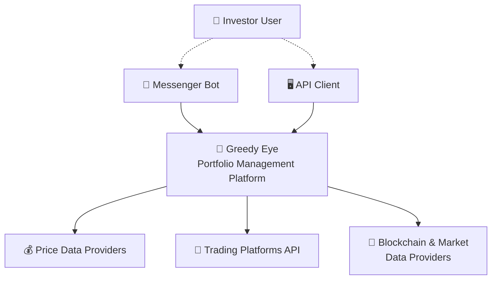
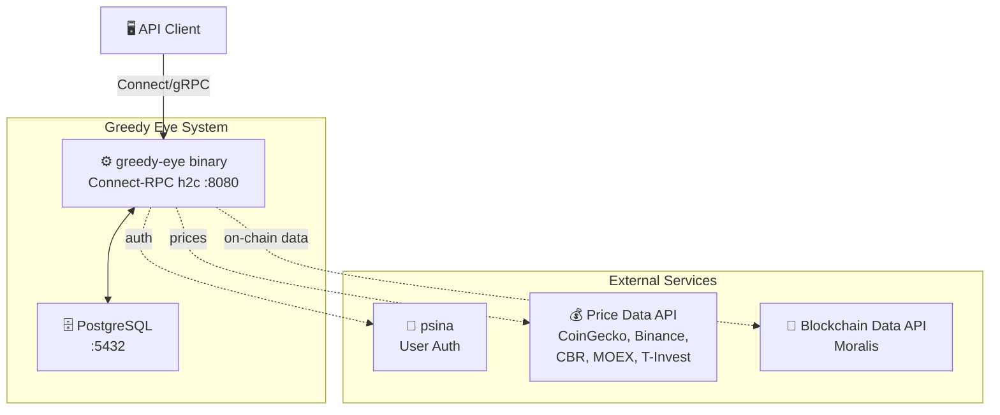
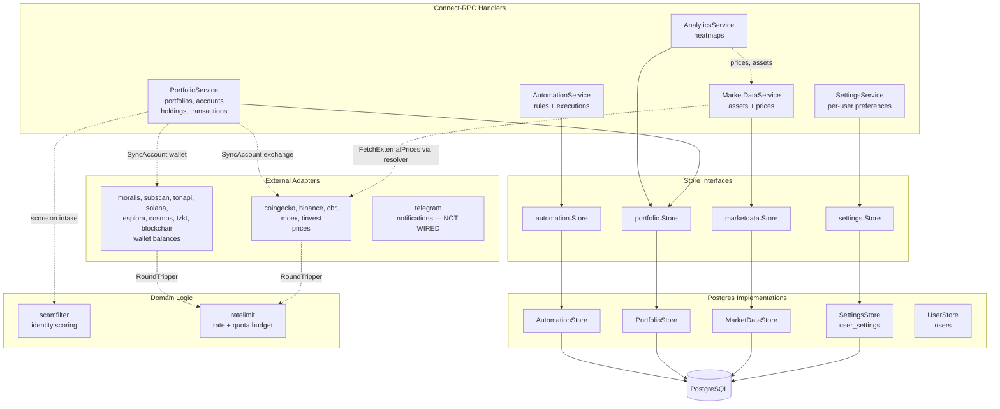

# Greedy Eye - Architecture Documentation

## Overview

Universal portfolio management system based on arc42 + C4 Model

> **Source of truth**: the API contract lives in `api/v1/*.proto`, the schema in
> `schema.hcl`, and the wiring in `cmd/eye/main.go`. This document is
> hand-maintained prose about that code — when they disagree, the code wins.
> Some HTTP routes (e.g. `GET /eye/health`) are wired directly in `main.go`, not
> generated from proto. There is no OpenAPI spec: the service is Connect-RPC,
> which the OpenAPI generator does not cover.

---

## Document Navigation

This architecture document is organized according to the arc42 template and C4 model. Different sections serve
different audiences:

**Business & Product Context** (Sections 1-4)
- Introduction, requirements, constraints, and solution strategy
- Target audience: Product owners, business stakeholders, new team members

**Technical Implementation** (Sections 5-7)
- Building blocks, components, runtime behavior, and deployment
- Target audience: Developers, architects, DevOps engineers

**Operational & Quality Aspects** (Section 8)
- Security, performance, monitoring, and crosscutting concerns
- Target audience: SRE, operations team, security engineers

**Architecture Decisions & Risk Management** (Sections 9-11)
- ADRs, quality requirements, and technical debt tracking
- Target audience: Tech leads, architects, decision makers

**Reference** (Section 12)
- Glossary of domain terms
- Target audience: All stakeholders

**Related documents**
- [providers.md](providers.md) — which external providers can be connected, what
  each needs, and what the account fields mean
- [development.md](development.md) — local setup and workflow

---

## 1. Introduction and Goals

### 1.1 Requirements and Constraints

**Business Requirements:**
- Universal investment portfolio management (cryptocurrencies, securities, derivatives) platform
- Automated investment strategies (DCA, rebalancing, stop-losses)
- Different interfaces types and easy integration with client apps
- Integration with external APIs (exchanges, brokers, data providers)

**Functional Requirements:**
- Portfolio management with portfolio service
- Automated trading strategies using rule system
- Real-time price tracking from multiple sources
- Notifications and alerts about portfolio changes
- Support for multiple asset types and accounts

**Non-functional Requirements:**
- HTTP API response time < 200ms for simple operations
- Support for 100+ concurrent users
- 99.9% system availability
- Secure storage of API keys and user data

### 1.2 Quality Goals

**Top-3 priority quality goals:**

1. **Scalability** - Modular monolith architecture with microservices transition capability
   - Metrics: support 10x user growth without architectural changes
   - Horizontal scaling through configuration

2. **Security** - Multi-layered protection for financial data
   - Metrics: encryption of all external API keys, audit of all operations
   - Authentication delegated to psina (session cookies or personal access tokens);
     ownership enforced per entity inside this service
3. **Reliability** - Fault tolerance for financial operations
   - Metrics: 99.9% uptime, automatic recovery after failures
   - Graceful degradation when external services are unavailable

### 1.3 Stakeholders

| Role | Contact | Expectations |
| --- | --- | --- |
| Founder | fox@darkfox.info | Fast MVP delivery, universality for all asset types, maintainability |

---

## 2. Constraints

### 2.1 Technical Constraints

**Technology Stack:**
- **Language**: Go 1.25+
- **Database**: PostgreSQL 17+ (ACID compliance for financial data)
- **Protocol**: Connect-RPC over HTTP/2 (h2c) — serves both Connect and gRPC clients
- **Schema Management**: Atlas declarative migrations
- **Containerization**: Docker + Docker Compose

**Performance Constraints:**
- API response time < 200ms for 95% of requests
- Support up to 1000 concurrent connections
- Price fetch batch processing < 5 seconds

**Compatibility and Integrations:**
- Messenger Bot APIs (chat interface)
- Price data providers (cryptocurrency and securities market data)
- Trading platform APIs (exchanges and brokers)
- Blockchain data providers (on-chain analytics and wallet information)

### 2.2 Organizational Constraints

**Development Team:**
- 1 Developer (Go, docker, ansible, protobuf)

**Development Processes:**
- Code generation with proto using buf
- Declarative schema management with Atlas (schema.hcl)
- Integration tests with testcontainers (ephemeral PostgreSQL)
- Continuous Integration through GitHub Actions

### 2.3 External Constraints

**Legal Requirements:**
- GDPR compliance for user data

**Corporate Standards:**
- Open Source approach (MIT License)
- Documentation of architectural decisions (ADR)
- Security: encrypted at rest, encrypted in transit

---

## 3. Context and Scope

### 3.1 C1: Context Diagram


```mermaid
graph TB
    User[👤 Investor User]
    MessengerBot[📱 Messenger Bot]
    APIClient[🖥️ API Client]

    GreedyEye[🏦 Greedy Eye<br/>Portfolio Management Platform]

    Price[💰 Price Data Providers]
    Trading[🔄 Trading Platforms API]
    DataProviders[🔎 Blockchain & Market<br/>Data Providers]

    User -.-> MessengerBot
    User -.-> APIClient
    MessengerBot --> GreedyEye
    APIClient --> GreedyEye

    GreedyEye --> Price
    GreedyEye --> Trading
    GreedyEye --> DataProviders
```

### 3.2 Business Context

**External Systems and Their Roles:**
- **Messenger Bot API**: Chat user interface
- **Price Data Providers**: Cryptocurrency and securities price data and market information
- **Trading Platforms API**: Trading operations for various asset types
- **Blockchain & Market Data Providers**: On-chain data and market analytics
- **Speech APIs**: Voice to text conversion and vice versa

**User Roles:**
- **Individual Investors**: Primary system users
- **API Clients**: Integration with external systems through HTTP API

### 3.3 Technical Context

**Network Protocols:**
- **gRPC**: Internal communication between services
- **HTTP/HTTPS**: External API and webhook integrations
- **WebSocket**: Real-time notifications (planned)

**Data Formats:**
- **Protocol Buffers**: Internal API definitions
- **JSON**: HTTP API requests/responses
- **Encrypted**: Storage of API keys and sensitive data

---

## 4. Solution Strategy

### 4.1 Architectural Decisions

**Selected Architectural Patterns:**
- **Modular Monolith**: Balance between development simplicity and scalability
- **5 Connect services**: four domain services — MarketDataService, PortfolioService,
  AutomationService, AnalyticsService — plus SettingsService, which stores per-user preferences
  and owns no domain of its own
- **Layered architecture**: handler → store interface → postgres implementation
- **CQRS elements**: Separation of read and write operations in critical places

**Technology Stack:**
- **Backend**: Go 1.25+ for performance and type safety
- **Database**: PostgreSQL + pgx (raw SQL) for reliability
- **Schema**: Atlas declarative migrations (schema.hcl)
- **Communication**: Connect-RPC (h2c) — single server serves both Connect and gRPC clients
- **Deployment**: Docker containers for environment consistency

**Responsibility boundaries:**
- **User management / Auth**: delegated to external service (psina)
- **Messenger Bot**: separate future service
- **Greedy Eye core**: market data, portfolios, automation rules

### 4.2 Approach to Quality Goals

**Scalability:**
- Modular architecture with clear service boundaries
- Deployment capability as monolith or separate microservices
- Connection pooling and efficient resource usage

**Security:**
- Multi-layer authentication (JWT + API keys)
- Encryption of external API keys in database
- Rate limiting and audit logging of all operations

**Reliability:**
- Health checks for all services
- Graceful degradation when external APIs are unavailable
- Retry mechanisms with exponential backoff

---

## 5. Building Block View

### 5.1 C2: Container Diagram


```mermaid
graph TB
    subgraph "Greedy Eye System"
        App[⚙️ greedy-eye binary<br/>Connect-RPC h2c :8080]
        Database[🗄️ PostgreSQL<br/>:5432]
    end

    subgraph "External Services"
        Psina[👥 psina<br/>User Auth]
        PriceAPI[💰 Price Data API<br/>CoinGecko, Binance,<br/>CBR, MOEX, T-Invest]
        BlockchainAPI[🔎 Blockchain Data API<br/>Moralis]
    end

    APIClient[🖥️ API Client] -->|Connect/gRPC| App
    App <--> Database
    App -.->|prices| PriceAPI
    App -.->|on-chain data| BlockchainAPI
    App -.->|auth| Psina
```

**Level 1 Containers:**

- **greedy-eye binary**:
  - Purpose: Single Go binary serving five Connect-RPC services
  - Technologies: Go, Connect-RPC, Protocol Buffers, h2c
  - Services: MarketDataService, PortfolioService, AutomationService, AnalyticsService,
    SettingsService
  - Health check: `GET /eye/health` — `{status, service, version}`. The version is stamped
    at link time (`-X main.version`, GoReleaser); an unstamped build reports `dev` rather
    than a tag it is not. It is also the first line the process logs, so which build is
    serving can be established without inferring it from behaviour

- **PostgreSQL Database**:
  - Purpose: Persistent storage with ACID guarantees
  - Technologies: PostgreSQL 17+, pgx driver
  - Schema: Atlas declarative migrations (schema.hcl)
  - Interfaces: SQL, pgxpool connection pooling

### 5.2 C3: Component Diagrams

#### Service Layer - Component Details


```mermaid
graph TB
    subgraph "Connect-RPC Handlers"
        MDS[MarketDataService<br/>assets + prices]
        PS[PortfolioService<br/>portfolios, accounts<br/>holdings, transactions]
        AS[AutomationService<br/>rules + executions]
        ANS[AnalyticsService<br/>heatmaps]
        SET[SettingsService<br/>per-user preferences]
    end

    subgraph "Store Interfaces"
        MDSI[marketdata.Store]
        PSI[portfolio.Store]
        ASI[automation.Store]
        SETI[settings.Store]
    end

    subgraph "Postgres Implementations"
        MDSP[MarketDataStore]
        PSP[PortfolioStore]
        ASP[AutomationStore]
        SETP[SettingsStore<br/>user_settings]
        SSP[UserStore<br/>users]
    end

    subgraph "External Adapters"
        Prices[coingecko, binance, cbr,<br/>moex, tinvest<br/>prices]
        Wallets[moralis, subscan, tonapi, solana,<br/>esplora, cosmos, tzkt, blockchair<br/>wallet balances]
        Telegram[telegram<br/>notifications — NOT WIRED]
    end

    subgraph "Domain Logic"
        SF[scamfilter<br/>identity scoring]
        RL[ratelimit<br/>rate + quota budget]
    end

    SET --> SETI --> SETP --> DB[(PostgreSQL)]
    MDS --> MDSI --> MDSP --> DB[(PostgreSQL)]
    PS  --> PSI  --> PSP  --> DB
    AS  --> ASI  --> ASP  --> DB
    ANS --> PSI
    ANS -.->|prices, assets| MDS

    MDS -.->|FetchExternalPrices via resolver| Prices
    PS  -.->|SyncAccount wallet| Wallets
    PS  -.->|SyncAccount exchange| Prices
    PS  -.->|score on intake| SF
    Prices -.->|RoundTripper| RL
    Wallets -.->|RoundTripper| RL
```

### 5.3 Level 3: Service Details

**MarketDataService** (`internal/service/marketdata/`):
- RPCs implemented: CreateAsset, GetAsset, UpdateAsset, DeleteAsset, ListAssets,
  FindOrCreateAsset (by the composite identity, ADR-006), SetAssetVerdict (scam filter, ADR-007),
  AddAssetRiskFlag / DeleteAssetRiskFlag (axis 2 of the risk model — a flag never moves a sum),
  DeleteAssetExternalRef (unbind a wrong contract binding; there is no link RPC yet, ADR-006),
  CreatePrice, CreatePrices, GetLatestPrice, ListPriceHistory, ListPricesByInterval, DeletePrice,
  DeletePrices, FetchExternalPrices (via the credentials resolver), GetPricingStatus (batched: what asking an asset's sources has produced, for the
  positions a valuation reports as unpriced; an asset never asked about is absent rather than
  reported empty), GetSweepSchedule (per source: how many assets are due, deferred and
  never attempted, how far the queue reaches, and why the sweep would skip the source — the
  facts that tell a frozen schedule from an idle one, which the sweep's own summary cannot)
- RPCs stubbed: EnrichAssetData, FindSimilarAssets
- Store: `MarketDataStore` (PostgreSQL) — assets, prices, `asset_external_refs`
- Owns `ValuationCoverage` (ADR-008): the message lives here because it describes the price side
  of a valuation, and both the portfolio total and the analytics heatmap embed the same block

**PortfolioService** (`internal/service/portfolio/`):
- RPCs implemented: full CRUD for Portfolio, Account, Holding, Transaction; DeleteHolding;
  CalculatePortfolioValue (with `ValuationCoverage`); SyncAccount (wallet balances across eight
  ecosystems, exchange balances via Binance); ImportPositions / ImportTransactions;
  ListProviders (the adapter registry's descriptors — see External Adapters below)
- RPCs stubbed: GetPortfolioPerformance
- Account types (`AccountType`): `wallet`, `exchange`, `bank`, `broker`, `service` (a pure
  data-provider credential with no holdings of its own — Moralis, CoinGecko, T-Invest as a quote
  source), `manual`. The type is what `capabilities` are validated against.
- **Manual accounts and import**: an account of type `manual` carries no credentials and holds
  hand-entered positions (`manual_positions` capability). Import is simulation-first — `dry_run=true`
  returns a per-item plan with no writes, and the same call with `dry_run=false` commits under one
  `import_id`. Every written row is stamped with `source` and `import_id` server-side, so imported
  data is always distinguishable from synced data. `full_snapshot=true` reconciles: positions absent
  from the payload are zeroed rather than left stale
- Ownership: every by-ID and list RPC enforces caller ownership (`middleware.EnsureOwner`);
  `user_id` list overrides are admin-only. See §8.1.
- Accounts carry a capability model (capabilities + admin-managed system_scopes) and encrypted
  `data` credentials (ADR-005). See the Account credential model below and §8.1.
- Store: `PortfolioStore` (PostgreSQL)

**AutomationService** (`internal/service/automation/`):
- RPCs implemented: CRUD for Rule and RuleExecution, EnableRule, DisableRule, PauseRule,
  ResumeRule, ValidateRule, ExecuteRule, ExecuteRuleAsync, CancelRuleExecution, SimulateRule
- Ownership enforced per rule (`ownedRule`); execution engines (DCA/rebalancing/stop-loss) are
  still stubs pending the rule-engine package.
- Store: `AutomationStore` (PostgreSQL) — `rules` + `rule_executions` tables

**AnalyticsService** (`internal/service/analytics/`):
- RPCs implemented: GetHeatmap — treemap nodes; tile size = holding value in the quote asset,
  tile color = price change % over a 24h/7d/30d window; `coverage` (the same `ValuationCoverage`
  the portfolio total returns) reports the holdings that drew no tile. On a map the omission is
  invisible in a way it is not in a total — an unpriced position produces no node at all, not a
  small one
- Scopes: PORTFOLIO (one portfolio; flat or grouped by account) and BALANCE (all caller's
  holdings across portfolios; flat, by account, or by portfolio — holdings inherit the account's
  portfolio, accounts outside any portfolio land in an "unassigned" group)
- Scopes MARKET/BASKET, PNL/target-drift color metrics and class/sector grouping return
  Unimplemented until their data prerequisites land (market metrics, asset identity, cost basis)
- Read-only derived views: no store of its own — reads via `portfolio.Store` (holdings) and the
  MarketData client (prices, asset labels); price resolution mirrors `portfolio.Handler.unitPrice`
  (duplicated consciously; extract a shared pricing package on the third consumer)
- Ownership enforced on the scope portfolio (`middleware.EnsureOwner`)

**SettingsService** (`internal/service/settings/`):
- RPCs implemented: GetSetting, SetSetting — a key/value store of the caller's own preferences,
  keyed by name and schema version (`dashboard.v1`, `valuation.v1`)
- The value is **JSON text, not `google.protobuf.Struct`**: Struct types every number as a double,
  so an integer written by a client comes back as a float and nothing in the path notices. What
  round-trips is the JSON document, not the byte string — storage is `jsonb`, which normalises
  whitespace and does not preserve key order, so the field must not be hashed or diffed as text
- The service does not own the shape of a value, only its size and that it parses
- Ownership needs no `EnsureOwner`: the owner comes from the request context and there is no
  `user_id` in the request body to forge, and no admin override to get wrong

**User provisioning** (`internal/middleware/user.go` + `postgres.UserStore`):
- Users are provisioned lazily from `X-User-Id`/`X-User-Email`/`X-User-Roles` headers set by the
  auth proxy (psina). Roles are per-request and never persisted (psina owns them). There is no
  user-management Connect service: this instance stores a reference to a user, not a user.

**External Adapters** (Integration Layer):

The system uses the **Adapter Pattern** to isolate external API dependencies from core business logic.
Adapters are no longer singletons: the credentials resolver (`internal/service/credentials/`) builds
per-account clients from stored credentials. Configuration carries none: a key names a plan, a
plan names money, and both belong to the account rather than to the service.

Which adapters exist is a fact of `internal/provider/`, not of `main.go`. It holds the factory
table and, beside each factory, a `catalog.Descriptor` saying what that provider needs — key,
secret, chains, plans, extra fields such as a trust anchor. Nothing above it imports an adapter:
`cmd/` wires interfaces, and `PortfolioService.ListProviders` serves the descriptors so an account
form reads the registry rather than carrying a second copy of it. `internal/provider/catalog/`
holds the description types alone, with no adapter code, so a handler can describe providers
without linking them.

- **Price Adapters**: CoinGecko (`internal/adapter/coingecko/` — live prices; tier-aware: the tier
  picks the host, the auth header and the plan allowance), Binance (`internal/adapter/binance/` —
  `ticker/price`; the request is confined to pairs listed TRADING in a cached `exchangeInfo`
  snapshot, because Binance rejects a whole batch when one symbol is not tradable), and three sources for the
  markets crypto feeds do not carry:

  | Package | Covers | Notes |
  |---|---|---|
  | `cbr` | Bank of Russia daily FX rates | keyless; the authoritative RUB cross rate, without which a RUB-quoted instrument has a price and still adds nothing to a USD total. One print per business day — see the freshness policy in §8.3 |
  | `moex` | MOEX ISS: shares, ETFs, bonds | keyless, ~15 min delayed, which is well inside what a valuation needs |
  | `tinvest` | T-Invest: SPB Exchange listings, MOEX as a second opinion | needs a personal broker token on a `broker` account carrying `market_data`, **and** a trust anchor: the host chain is issued by a root no OS or Go distribution ships. The root is not vendored — it travels in `accounts.data["root_ca"]` and is trusted for this client alone, because which anchors a service accepts is an operator's decision. The quote's base currency belongs to the row, not the provider: one response mixes a dollar-quoted foreign share with a rouble-quoted domestic one |
- **Exchange sync** (`internal/adapter/binance/`): Binance spot balances via the SIGNED
  `GET /api/v3/account` (HMAC-SHA256) → `entity.ExchangeSyncer`
- **Blockchain Adapters** (all → `entity.WalletSyncer`), one package per ecosystem:

  | Package | Covers | Notes |
  |---|---|---|
  | `moralis` | EVM: eth, base, arbitrum, optimism, linea, polygon, bsc, avalanche | native + ERC-20; reports `possible_spam`/`verified` as signals |
  | `subscan` | Substrate: Polkadot, Kusama, Hydration, Astar, Moonbeam + Asset Hub | position = `balance` (raw planck, precision from the response); split into liquid/staked/unbonding when the parts reconcile |
  | `tonapi` | TON + jettons | |
  | `solana` | Solana via Helius | both token programs, DAS symbols, batched asset lookups |
  | `esplora` | Bitcoin | confirmed balances only |
  | `cosmos` | Cosmos LCD | bank + delegations + unbonding, bech32 re-encode between chains |
  | `tzkt` | Tezos | |
  | `blockchair` | DASH, DOGE | keyless tier is very narrow |

  A recurring trap, caught three times across these adapters: **never add
  `free + reserved` or `balance + staked`.** In every one of these APIs the headline balance
  already includes what is locked or staked, so summing them doubles the largest position on a
  staking-heavy account.

- **Messenger Adapters** (`internal/adapter/telegram/`): Telegram — **client only, wired to
  nothing.** The package compiles and is tested, but no service imports it and there is no
  notification path in the codebase. It is ahead of its consumer, not left over from one:
  `greedy-eye-68z` (portfolio change notifications) is the ticket that would use it
- **Rate budget** (`internal/adapter/ratelimit/`): a process-wide registry of token buckets keyed by
  provider + digest of the API key, injected into every adapter client as an `http.RoundTripper`.
  Because clients are per-account and short-lived, a limiter inside a client paces one account and
  is blind to the rest — a sweep over three accounts on one key would triple the observed rate.
  `429`/`418`/`430` freeze the bucket for `Retry-After` (default 1 min, capped at 15) while the
  response still reaches the adapter, which owns the error handling; each further refusal with no
  success between them doubles that pause, up to 2h, so an instance that has run into a spent plan
  stops re-asking. The streak is in memory and a restart clears it — the spend it protects is not.
  Built-in plans live in `defaultLimits`; the ACCOUNT overrides them field by field through
  `data.rps`/`.burst`/`.quota`/`.period`, because a plan belongs to the key rather than to the
  service. Spend is persisted per period (`provider_usage`), so a restart does not hand the process
  a fresh month. Two instances on ONE key remain the sharp edge: they see each other's spend only
  through a shared database, and dev+prod do not have one — hence `quota` as this deployment's
  declared share of the plan.

**Wallet syncer routing (chain-keyed registry)**:

One `WalletSyncer` per ecosystem, selected by the account's `data.chain`. Each provider is
registered as a `credentials.WalletProvider{Factory, Chains}`; the resolver picks the provider
covering *every* requested chain.

- No provider covers the chains → sync fails with `Unimplemented` naming the chain. This is
  deliberate: falling through to an EVM syncer for a Substrate address would report an empty
  wallet and silently zero the position instead of erroring.
- **Auto-discovery** (account names no chain, or `auto`) is routed by `HandlesAddress`: each
  provider claims an address shape (EVM hex, SS58, …) and then sweeps its own chains, keeping
  the ones holding a balance. A provider claiming no shape stays out of discovery rather than
  being tried blindly. `Chains: nil` still marks a catch-all for any named chain.
- **Shape claims must decode, not measure.** SS58 and a Solana address are both base58 of a
  similar length, so a length check routes a Solana key to Substrate and reports an empty wallet.
  `subscan.HandlesAddress` verifies the SS58 blake2b checksum; the Solana claim requires the
  payload to decode to exactly 32 bytes. Both have regression tests fed with the other
  ecosystem's addresses.
- Discovery costs one request per chain swept, so it trades API budget for not having to
  configure chains. Chains named explicitly skip the sweep.
- Adding an ecosystem: implement `entity.WalletSyncer` in `internal/adapter/<name>/`, expose a
  `SupportedChains()`, register it in `internal/provider` — both the factory and the descriptor
  beside it, since a registered adapter with no description fails `TestCatalogueCoversTheRegistry`.
  Test pattern: golden fixtures of provider responses driven through an `httptest` server
  (see `internal/adapter/moralis`, `internal/adapter/subscan`).
- **Substrate balance model** (`internal/adapter/subscan/`): a position is `balance` alone.
  Reserved, bonded and unbonding are each a subset of it — locks and holds restrict the balance
  rather than sitting beside it — so adding any of them double-counts the largest holding on a
  staking-heavy account.

  They are also not disjoint from **each other**, which is what makes the liquidity split
  delicate. Measured on the live accounts 2026-08-02: Kusama Asset Hub reports the same
  5.637369256383 KSM as `reserved`, as `bonded` and as `lock` against a balance of
  6.031593575767 — one staking hold stated three times. Subtracting reserved and bonded both
  would take 11.27 KSM out of 6.03. So the adapter splits only where the parts reconcile —
  `reserved == bonded` (the hold reported twice) or `reserved == 0` (a lock on free balance) —
  and reports one unclassified row otherwise. Guessing between "a deposit disjoint from the
  lock" and "the same planck through another field" would overstate what can be spent, and the
  runway figure is the one consumer that must never be told that lie.

  The `/api/scan/account/tokens` endpoint carries no `transferable_balance`; the v2 search
  endpoint that does is unusable because it mixes whole tokens and planck in one object with no
  precision field. The subtraction is checked against it instead: for the Asset Hub account
  above, balance minus the hold comes out at exactly the 0.394224319384 that endpoint reports.

  Amounts arrive as raw planck at the precision the response states — no table lookup.
  SS58 re-encodes one public key per network (generic `5…`, Polkadot `1…`,
  Kusama `C…`), so a single account covers the ecosystem: discovery sweeps every Substrate
  network the adapter knows. Moonbeam is the exception — EVM H160 addresses, so it must be
  named explicitly.
- Accounts entered by hand during a manual import become live wallets by updating `type`,
  `capabilities` and `data` in **one** call — a wallet may not keep `manual_positions`, so a
  split update is rejected by the merged capability validation.

**Scam filter** (`internal/scamfilter/`):

A pure scoring function over what is cheaply knowable at sync intake or during a rescoring pass:
the symbol and name text, plus context signals a provider may report. It replaced the interim
per-adapter drops (Moralis `possible_spam`, Solana `isJunk`), which silently deleted positions.

- **The verdict lives on the asset** (`assets.identity_verdict`), not on the holding — identity is
  a property of the thing, and the same fake token seen from two accounts is one fake token.
  Values: `unknown | legit | suspect | scam | impersonation`. `identity_score` and
  `identity_signals` (jsonb, `{signal: weight}`) are kept for UI explainability and weight tuning
- **`holdings.excluded` is derived, not authored**: a `scam` or `impersonation` verdict excludes
  the holding from sums. The position keeps syncing and stays visible in quarantine — dropping it
  would make a real balance disappear with no trace. A sync **raises** the flag on rows that
  already exist and never lowers it: an impostor is usually unmasked long after its position
  started syncing, while nothing in the row distinguishes a user's own exclusion from a derived
  one, so clearing it would silently undo a human decision
- **A user verdict is terminal.** `verdict_source` records provenance (`heuristic`,
  `provider:<name>`, `curated`, `user:<id>`); the rescore job never overwrites a user's judgement
- **Hard signals bypass the score**: invisible Unicode in a ticker (`UNILP.NET` with U+2063),
  mixed-script confusables, and a **ticker collision** are impersonation on sight, not a weighted
  sum. The collision is the only signal the text cannot see — a good lookalike spells its symbol
  exactly right, so `USDT` off a foreign contract scored 0.2 (`legit`) and could never have been
  condemned by accumulation: even with `no_listing` it tops out at 0.5, below the 0.8 threshold.
  The catalogue answers it instead (`FindTickerIncumbent`): a chain cannot carry two contracts of
  one asset, so a second contract claiming a ticker an **older, price-listed** asset already binds
  on that chain is not an accident. Seniority is asymmetric on purpose — without the age condition
  a real asset would be condemned by its own impostor at the next rescore, and without the listing
  condition two unlisted duplicates would condemn each other. Known false positive, accepted: LP
  tokens (`UNI-V2`, `SLP`) give every pool the same ticker on one chain by construction
- Weights and thresholds live in `Weights` so they can be tuned from config without a release
- The scheduler runs a periodic rescore (`internal/scheduler/rescore.go`)

**Risk flags are a second axis, and they do not move the total** (`asset_risk_flags`,
`AddAssetRiskFlag` / `DeleteAssetRiskFlag`). Identity answers "is this the thing it claims to be";
a risk flag (`exploit`, `depeg`, `frozen_transfers`, `deprecation`, `delisting`,
`sanctions_freeze`) answers "is holding it about to go badly", which is a forecast. A flag
therefore never derives `holdings.excluded` and never enters `ValuationCoverage` — letting it
subtract would make "this may go badly" read as "this is not real", and the reader of a total
could not tell the two statements apart. `review_at` is required on write: a temporary flag with
no review date hangs forever and devalues every other flag on the axis.

**Asset identity resolution order** (why a counterfeit cannot inherit a real price):

1. **Contract first.** A synced token resolves through
   `asset_external_refs(source="onchain:<chain>", ref=<contract>)`. `UNIQUE(source, ref)` makes
   the same address on two chains two distinct identities
2. **Symbol only after the contract is vouched for.** With no matching ref, the code asks a
   contract-confirming price provider (CoinGecko, as the one with a full-universe contract
   catalog) what ticker that contract actually trades under. Only a match lets the token join the
   ticker's asset row; anything else — listed under a different symbol, not listed, no provider
   configured — sends it to a market of its own (`marketForContract`), so it becomes a visible,
   mergeable duplicate row instead of extra balance on the genuine asset
3. **A provider error fails loud.** Treating an unreachable provider as "not listed" would scatter
   genuine multi-chain tokens into per-contract rows permanently

Name, ticker and amount are all copyable; the contract is not. Matching by ticker alone is exactly
how three different tokens once merged into one "Tether USD" on production and summed their
balances — including 594 956 units of a "USDT" that does not exist.

**Account credential model**:
- Provider credentials live in `accounts.data` (encrypted at rest, ADR-005), keyed by a `provider`
  slug (`moralis`, `coingecko`, `binance`). Secret-looking keys are write-only over the API
  (`••••`+last4 mask; echoing the mask keeps the stored secret).
- `capabilities` (`portfolio_sync`, `trading`, `market_data`, `onchain_lookup`) declare what the
  credentials may do, validated against account type.
- `system_scopes` ⊆ capabilities marks user-agnostic capabilities (market_data, onchain_lookup) an
  admin shares system-wide. The resolver resolves clients user → system; there is no environment
  tier left — a credential lives in an account or nowhere (v0.7.0).
- **Unattended work falls back per provider, not per capability.** A job with nobody in context
  sees system-scoped accounts, plus — when exactly one person holds the capability — that person's
  own accounts *for the providers no scoped candidate covers*. An explicitly scoped account still
  wins its own slug. The earlier rule fired only on an empty candidate list, which answers "this
  instance has no system account at all" rather than "none for this provider", and a real instance
  is almost always in the second state because scopes are granted one account at a time: prod
  2026-08-11..17 refreshed no crypto price for six days with binance sitting unscoped behind three
  scoped accounts, while every manual fetch worked because it carried a user id. The startup line
  therefore names the accounts it **skipped** and why — a list of what worked cannot show an
  absence (`Resolver.Skipped`, `internal/service/credentials/resolver.go`).
- **Keyless readers are registered by default, not seeded.** Public feeds and explorers
  (`KeylessPriceProviders`, `KeylessWalletSyncers`) need no credential, so a fresh instance reads
  them without anyone creating a row — `accounts.user_id` is NOT NULL and a fresh instance has no
  user to own one. An account naming the same slug still wins, which is how such a feed gets
  throttled or given a smaller share of a plan.

---

## 6. Runtime View

### 6.1 Execution Scenarios

#### Scenario 1: Track a New Asset Price

```text
API Client → MarketDataService → MarketDataStore → PostgreSQL
  1. POST /eye.v1.MarketDataService/CreateAsset (or CreatePrice)
  2. Handler validates request, maps proto → entity
  3. Store persists to PostgreSQL
  4. Response: created Asset or Price proto
```

#### Scenario 2: Fetch Prices from External Provider

```text
API Client → MarketDataService/FetchExternalPrices → resolver → adapter → CreatePrices
  1. POST /eye.v1.MarketDataService/FetchExternalPrices
  2. Handler resolves the price providers for the caller (credentials resolver:
     user account → system account → for unattended work, the sole operator's own
     accounts, **for the providers no candidate covers** — the fallback is per
     provider, not per capability, see §8.1)
  3. Each provider (CoinGecko / Binance / CBR / MOEX / T-Invest) fetches prices for the
     assets that are due
  4. Prices are bulk-inserted via CreatePrices
  5. Response: FetchExternalPricesResponse{prices_fetched, prices_stored, errors}
```

#### Scenario 2b: Sync Account Balances

```text
API Client → PortfolioService/SyncAccount → resolver → syncer → upsert holdings
  1. POST /eye.v1.PortfolioService/SyncAccount (owner or admin only)
  2. Branch on account type:
     - wallet   → WalletSyncer for the account's chains (registry, see §5.3)
     - exchange → ExchangeSyncer (Binance) via the account's own API key
  3. Each balance resolves to an asset: contract ref first, confirmed symbol second
  4. New or unscored assets are scored by scamfilter; the verdict lands on the asset
  5. Holdings upserted in ONE transaction; scam/impersonation verdicts derive holdings.excluded
  6. Sync-written positions the provider no longer reports are zeroed in the same
     transaction — but only when the snapshot came back whole (see below)
  7. Response: SyncAccountResponse{assets_upserted, holdings_upserted, holdings_zeroed, errors}
```

**Deadline and atomicity.** A sync is a long operation: ~22s measured for a heavy
multi-chain EVM wallet, of which the last ~9s are asset resolution and the write.
It runs on its own server-side bound (`syncTimeout`, 3 min in
`internal/service/portfolio/handler.go`) and is detached from the caller's
cancellation — a client hanging up stops nothing already underway. Before that it
inherited whatever deadline the caller sent, which was the frontend's blanket 10s
fetch timeout, and prod 2026-07-25 logged three syncs dying at exactly 10.005s
mid-write. The holdings write is one transaction (`Store.InHoldingsTx`), so a
failing row aborts the set instead of leaving the account carrying rows from two
different syncs; assets, resolved through MarketData before the transaction
opens, stay outside it — a catalogue entry with no holding is inert, half a
snapshot is not. Callers that are themselves long (the frontend's `syncAccount`)
set a client timeout above the server's and do not auto-retry: a retried sync
would point a second writer at the same rows.

**A snapshot removes, not only adds.** A sync used to write only the positions
the provider returned, so one that stopped being returned — sold, moved out, or
newly rejected by a spam filter — kept its last amount forever and read as a live
holding that had merely stopped moving. Rows absent from a snapshot are therefore
zeroed in the same transaction: the row keeps its id, provenance and history,
drops out of every sum, and a later sync that sees the position again refreshes
it in place. Three guards decide whether removal runs at all, because a wallet
that answered nothing looks exactly like a wallet that holds nothing: every
address and chain must have answered without error, every returned balance must
have resolved to an asset, and the snapshot must not be empty while the account
still carries synced rows. When a guard blocks removal the reason goes into
`errors` — a skipped removal that says nothing is the failure this replaces.
Only rows with `source = sync` are eligible: an imported or manual position is
the user's claim about the account, not the provider's to erase.

A balance with no symbol is the exception to the second guard. The catalogue is
still asked, because `FindOrCreateAsset` resolves a known contract by its
external ref alone — an address the catalogue knows names the token. When that
lookup also fails, the balance is unidentifiable: nothing can name the position
or key a holding by it, so it is dropped as a filter rather than counted as a
failed observation, and logged at WARN with its chain and contract. Counting it
as a failure is what dev's `hot` wallet showed the cost of: one nameless token
(`eth:0xf08fc026…`) kept the whole account from ever shedding a position sold in
July. The residual risk is narrow and deliberate — a pre-external-ref asset whose
token stops reporting its symbol resolves by neither path, so its row may be
zeroed while still held.

#### Scenario 2c: Value a Portfolio

```text
API Client → PortfolioService/CalculatePortfolioValue
  1. Load holdings, skip excluded ones (they are reported separately)
  1a. Read valuation.v1: the freshness threshold AND the display currency the
      total is expressed in when the request names none (ADR-010)
  2. For each holding, resolve a unit price in the quote asset
  3. Check the market behind that price: under $100k of 24h volume it does not value
     the holding (ADR-009). A source that reported no volume is not a reason to drop it
  4. Priced holdings sum into total_value; unpriced ones DO NOT contribute zero —
     they are collected into ValuationCoverage{priced, unpriced, unpriced[]}, each
     carrying whether it lacked a quote or lacked a market
  5. Response: value + coverage, so the caller can render "X of Y positions priced"
```

#### Scenario 2d: Import Positions (simulation-first)

```text
LLM / API Client → PortfolioService/ImportPositions
  1. dry_run=true  → per-item plan (create | update | skip), zero writes
  2. Human confirms the plan
  3. dry_run=false → commit under one import_id; every row stamped source+import_id
     full_snapshot=true additionally zeroes positions missing from the payload
```

#### Scenario 3: Execute Rebalancing Rule

```text
Cron / API Client → AutomationService/ExecuteRule
  1. Validate rule_id, check rule.status == active
  2. CreateRuleExecution(status=in_progress)
  3. Run rule logic (calculate rebalancing trades)
  4. Create Transaction records via PortfolioService
  5. UpdateRuleExecution(status=completed, completed_at=now)
  Note: dry_run=true returns simulated execution without DB writes
```

### 6.2 Critical Scenarios

**Error Handling:**
- Graceful degradation when external APIs are unavailable
- Retry with exponential backoff for temporary failures
- Transaction rollback for critical errors

**Load Scenarios:**
- Database connection pooling under high load
- Rate limiting to prevent exceeding external API limits
- Circuit breaker pattern for protection against cascading failures

---

## 7. Deployment View

### 7.1 Infrastructure

```
[Production Environment]
├── Reverse Proxy (Traefik)
│   ├── SSL Termination
│   ├── h2c upstream (HTTP/2 cleartext for Connect-RPC)
│   └── Path routing: Host($EYE_DOMAIN) && PathPrefix(/eye)
├── Application Container
│   ├── Connect-RPC h2c Server (:8080)
│   │   ├── MarketDataService
│   │   ├── PortfolioService
│   │   ├── AutomationService
│   │   ├── AnalyticsService
│   │   └── SettingsService
│   └── Health: GET /eye/health
├── Database Container
│   ├── PostgreSQL 17+
│   ├── Automated Backups
│   └── pgxpool Connection Pooling
└── Monitoring Stack
    ├── Health Checks
    ├── Sentry (error tracking)
    └── Structured JSON logging
```

### 7.2 Component Mapping to Infrastructure

**Production Deployment:**
- **Single Container**: All gRPC services + HTTP Gateway in one Go binary
- **Database**: Separate PostgreSQL container with persistent volumes
- **Configuration**: Environment variables for API keys and settings
- **Scaling**: Horizontal scaling through load balancer + multiple app instances

**Development Environment:**
- **Docker Compose**: Local deployment of entire stack
- **Live Reload**: Air for automatic reloading on changes
- **Debug Mode**: Delve integration for debugging

---

## 8. Crosscutting Concepts

### 8.1 Security

**Authentication and Authorization:**
- **Delegated auth (psina)**: authentication is handled by the external psina service
  behind a Traefik `forwardAuth`. It validates the session/token and injects
  `X-User-Id`, `X-User-Email`, and `X-User-Roles` headers (ADR-004).
- **User provisioning**: `middleware.UserProvisioningInterceptor` reads those headers, lazily
  provisions the user, and binds roles to the request context (roles never persisted).
- **Ownership enforcement**: every by-ID RPC loads the entity and requires the caller to be its
  owner or an admin (`middleware.EnsureOwner`), returning `NotFound` for foreign IDs so their
  existence isn't leaked. Holdings/transactions inherit ownership through their account.
  `user_id` list overrides are admin-only.
- **Admin-gated mutations**: sharing account credentials system-wide (`system_scopes`) requires the
  admin role and an explicit update mask.

**Data Protection:**
- **Encryption at Rest**: `accounts.data` (provider API keys) is encrypted with AES-256-GCM +
  per-record HKDF keys in the store layer (ADR-005); the master key
  (`EYE_SECURITY_MASTERKEY`) never reaches the DB or logs.
- **Write-only secrets**: the API never returns credential values — only a `••••`+last4 mask.
- **Encryption in Transit**: TLS for all external connections (Traefik terminates public TLS).

### 8.2 Performance

**Caching:**
- **Price Data**: Caching current prices with TTL
- **Portfolio Calculations**: Caching portfolio calculations
- **Session Data**: planned with the Telegram bot (`greedy-eye-68z`); no such cache exists today

**Query Optimization:**
- **Database Indexing**: Indexes on foreign keys and timestamp fields
- **Connection Pooling**: Efficient use of database connections
- **Batch Operations**: Group operations for multiple records

### 8.3 Honesty of a computed number

A total that quietly omits what it could not compute is worse than no total: it looks like an
answer. Two mechanisms make omissions explicit, and both are deliberately *disclosures*, not
corrections:

| Omission | Mechanism | Where it shows |
|---|---|---|
| No price path for a holding | `ValuationCoverage` (ADR-008) | Embedded in the valuation response: counts plus the identified holdings, capped with a truncation flag |
| A quote with no market behind it | `UnpricedReason.THIN_MARKET` in the same block (ADR-009) | Same place as a missing quote, with the reason attached — the position is unknown, not worthless |
| Asset judged a scam or impersonation | `holdings.excluded`, derived from the asset verdict | Reported alongside the total; the position keeps syncing and stays visible in quarantine |
| A quote that outlived its market | `ValuationCoverage.stale_count` and `prices_as_of` | Same block; the position stays **in** the total and is named, because removing it would move the number on every provider outage |
| Every source asked, none ever answered | `UnpricedReason.NEVER_PRICED` + `asked_since`, read from `price_fetch_attempts` | Same block as a missing quote, separated from it: `NO_QUOTE` can still be our pipeline not having looked, this one has exhausted the sources it has |
| Priced, but in a currency we cannot convert from | `UnpricedReason.NO_CROSS_RATE` in the same block (ADR-010) | Same place, separated from a missing quote because it asks for opposite work: one exchange rate, not coverage for the asset. Collapsing the two hid 74 holdings for months |

Rules that follow from this:

- An absent quote and a zero valuation are **different statements**. Nothing may turn the first
  into the second
- A price and an amount go stale **independently**. `ValuationCoverage.amounts_as_of` carries the
  oldest confirmation time among the **synced** holdings counted, so an hourly re-price cannot
  present week-old quantities as a current total. `prices_as_of` is the same statement about the
  other axis: a quote can outlive its market — a delisted security keeps its last print forever
- **An age is only a symptom where something was responsible for refreshing it.** A hand-entered
  or imported amount has no sweep behind it, so it never enters `amounts_as_of`: one forgotten
  manual row would pin that date permanently and the field would stop reporting the sweep it
  exists to watch. Its own age is disclosed per row instead — `Holding.updated_at` beside
  `Holding.source`, where the owner can act on it. The field is unset when every counted holding
  was entered by hand, which `priced_count` tells apart from an empty result
- **Not every disclosure is a removal.** A thin market takes a position out of the total, because
  the price is not realisable; a stale quote leaves it in and labels it, because dropping it would
  take the position out on an outage and put it back on recovery, moving the total for reasons
  that have nothing to do with the market. Which of the two a defect calls for is a judgement
  about *why* the number is doubtful, not a default
- **Report evidence, not verdicts.** Silence from every price source is consistent with a
  delisting, a halt, a ticker no provider carries and a chain gone dark. The system says what it
  observed — asked N sources since date D, none answered — and does not name a cause it did not
  witness. `NEVER_PRICED` is therefore a statement about the asking, and the reader draws the
  conclusion
- A new consumer of a valuation (heatmap, MCP, a future report) **embeds the existing coverage
  message** instead of growing its own coverage fields, and must reach the **same** conclusion for
  the same holding — a map reading `NO_QUOTE` beside a total reading `NEVER_PRICED` is the
  divergence sharing one message exists to rule out
- Filtering a position out of a sum without saying so is a bug, whatever the reason for filtering

**Freshness policy** (`internal/pricefresh`): a quote older than the threshold counts as stale.
The default is 48h — coarser than the hourly price sweep on purpose, because not every market
prints continuously: the CBR publishes one rate per business day and MOEX only during a session,
so an hour-scale threshold would report every rouble-denominated position as stale over a weekend.
The threshold is stored per user under the `valuation.v1` setting rather than compiled in, since
it depends on the sweep cadence and the markets an instance actually holds. It is applied to the
asset's **own** quote only, never to the cross rate — for the same reason the market-depth gate
is not: one stale FX row would otherwise date every position converted through it.

**Display currency** (same setting, `display_currency`): what a total is expressed in when the
request names no quote asset. It sits beside the threshold because it is the same kind of
statement — how this instance reports money — and it is *not* the base a pair is quoted against
(ADR-010). The two fields parse independently: a malformed duration must not revert a currency
somebody chose, since that would report one currency's number under another currency's name.

### 8.4 Data Management

**Data Model:**
- **Universal Asset Support**: Unified model for all asset types
- **Flexible Configuration**: JSON fields for rules and settings
- **Audit Trail**: Complete history of all operations

**Schema Management:**
- **Atlas Declarative**: Schema defined in `schema.hcl` (HCL format)
- **Automated Migrations**: `atlas schema apply` for dev environment
- **Backward Compatibility**: Support for backward compatibility
- **Data Integrity**: ACID transactions for critical operations

**Testing:**
- **Testcontainers**: Ephemeral PostgreSQL for integration tests
- **Schema Apply**: Atlas CLI applies schema to test containers
- **Isolation**: Each test run gets clean database

### 8.5 Operational Concepts

**Monitoring and Alerting:**
- **Health Checks**: /health endpoint for all services
- **Provider quota**: spend per credential persisted in `provider_usage`, reported on the sweep's own log line (no metrics system in-process yet)
- **What counts as an attempt**: a miss is evidence about an ASSET, so only what a provider actually requested is recorded. The sweep selects per source but cannot know what a source covers, so each provider is handed the whole due list and reports the subset it asks for via `SelectiveProvider.Asked` (implemented by binance, coingecko, moex, tinvest, cbr). A transport-level failure records nothing at all: it is evidence about the source. Before this, MOEX carried 575 miss rows for crypto assets on dev and CBR 533, and 99.8% of the attempt log sat at the week-long back-off ceiling
- **Sweep schedule**: `price_fetch_attempts` holds the per-source back-off. A sweep that selected nothing names each idle source with its reason (`nothing_due`, `all_deferred`, `budget_exhausted`) in its log line and in `FetchExternalPricesResponse.idle_sources`; `GetSweepSchedule` reports the same queue on demand. Before this, `fetched=0` meant both "everything is current" and "the whole catalogue is postponed", and telling them apart took a psql session on the host
- **Error Tracking**: Structured logging with correlation IDs
- **SLA Monitoring**: Response time SLA tracking

**Logging:**
- **Structured Logging**: JSON format with logging levels
- **Request Tracing**: Unique IDs for request tracking
- **Security Events**: Logging of all authentication events
- **Configuration**: TEXT format for development, JSON for production
- **Log Levels**: DEBUG, INFO, WARN, ERROR, FATAL

**Configuration Management:**
- **Environment Variables**: All sensitive data via env vars
- **Config Files**: YAML format for non-sensitive settings
- **Money Precision**: Decimal amounts stored as `amount / 10^precision`
- **External APIs**: Encrypted API keys with rotation support

**Background Scheduler (`internal/scheduler`):**
- Single cron scheduler (robfig/cron/v3) inside the `eye` binary, gated by `scheduler.enabled`
- Consumers: periodic automation rules (`RuleSchedule.CronExpression` + `Timezone`), external
  price fetching (`scheduler.pricefetchcron`, hourly), the asset rescore pass that re-applies
  scam-filter verdicts to the catalogue (`scheduler.rescorecron`, daily —
  `internal/scheduler/rescore.go`), and the balance sweep (`scheduler.balancesynccron`, offset
  half an hour from the price sweep so the two do not draw on one provider allowance in the same
  minute)
- **The scheduler keys are lowercase on purpose.** Env vars produce lowercase koanf keys, so a
  camelCase default would shadow the override rather than be replaced by it (`cmd/eye/config.go`)
- **The balance sweep re-reads amounts, not prices.** Without it nothing refreshed quantities on
  a schedule while the hourly price sweep kept re-pricing them, so a total moved every hour and
  stayed wrong — prod 2026-08-02 carried holdings whose `updated_at` was a week old. A number
  that moves is read as a number that is current
  - Selection is staleness-driven, not a flat pass: `ListStaleSyncTargets` returns syncable
    accounts whose newest holding is older than `scheduler.balancemaxage` (12h default), stalest
    first, capped by `scheduler.balanceaccountspersweep` (2). Freshness comes from the holdings
    themselves, so it cannot claim a sync that never landed, and an account with no holdings sorts
    first. The cron interval is not the refresh rate — it is how often the system gets a chance
    to catch up, and what one fire does not reach stays due
  - The cap is the provider budget: one heavy multi-chain sync costs far more than one price call,
    and both sweeps draw on the same per-credential allowance (ADR: `personal-a3v`). The job runs
    in the background rate-limit class, so it yields the tail of a metered plan to whoever presses
    Sync
  - Each account syncs **under its own owner's identity**. Ownership is attributed, not bypassed:
    `SyncAccount` resolves wallet syncers and exchange credentials per user, so a user-agnostic
    sweep would reach only what an admin shared system-wide
  - Every run reports itself — accounts due, synced, failed, holdings written and zeroed, plus a
    line per account that failed or synced with per-item errors. Nobody reads a scheduled job's
    return value, so a silent failure would be indistinguishable from an account that was not due
- The price sweep is budgeted, not exhaustive: it asks each source only for assets whose next attempt is due (`price_fetch_attempts`), oldest first, capped by the share of the credential's remaining plan allowance that one interval affords. Naming `asset_ids` on the RPC makes it a deliberate reconciliation and bypasses both
- Active rule schedules are fully reloaded every minute — rule CRUD needs no hooks, mutations take effect within a minute
- Missed fires during downtime are **skipped, never caught up**: executing a stale trade plan is worse than skipping it
- Rule jobs call `ExecuteRule` in-process on behalf of the rule owner, so executions are recorded identically to the RPC path
- Single-instance only: on multi-instance deployments enable the scheduler on exactly one node via config; `pg_try_advisory_lock`-based leader election is a future option if needed

---

## 9. Architecture Decisions

### ADR-001: Modular Monolith vs Microservices
- **Status**: accepted
- **Context**: Choice between microservice architecture and monolith for MVP
- **Decision**: Modular monolith with microservices transition capability
- **Consequences**:
  - ➕ Fast MVP development, deployment simplicity
  - ➕ Clear service boundaries through gRPC interfaces
  - ➖ Need for caution when changing shared components

### ADR-002: Connect-RPC over h2c instead of gRPC-Gateway
- **Status**: accepted (supersedes original gRPC + gRPC-Gateway decision)
- **Context**: Original plan used gRPC internally + gRPC-Gateway for HTTP. Connect-RPC handles both natively.
- **Decision**: Connect-RPC with h2c transport. Single server accepts both Connect (JSON/protobuf) and gRPC clients.
- **Consequences**:
  - ➕ No separate gateway process, single port, simpler deployment
  - ➕ Browser-friendly Connect protocol without grpc-web proxy
  - ➕ Type safety via generated code, same proto definitions
  - ➖ Requires h2c-aware reverse proxy (Traefik `server.scheme=h2c`)

### ADR-003: 3-service domain API instead of 8 services
- **Status**: accepted
- **Context**: Initial design had 8 gRPC services (Storage, User, Asset, Portfolio, Price, Rule,
  Auth, Messenger). This caused excessive indirection and coupling.
- **Decision**: Consolidate into 3 domain services: MarketDataService (assets + prices),
  PortfolioService (portfolios, accounts, holdings, transactions), AutomationService (rules + executions).
  A fourth, AnalyticsService, was added later (2026-07) for derived read-only views; it owns no
  store, which is what keeps it a separate service rather than a fourth data owner. A fifth,
  SettingsService (2026-08), stores per-user preferences; it is not a domain service — it exists
  because a dashboard layout must follow the user across devices, and putting that in one of the
  three would give a domain a table that has nothing to do with it.
- **Consequences**:
  - ➕ Simpler handler structure, fewer inter-service calls
  - ➕ Each service owns its store directly (no StorageService middleman)
  - ➖ Larger individual service surface area
  - ➖ Cross-domain operations (e.g. calculate portfolio value using prices) require service-to-service calls in the future

### ADR-004: User management delegated to external service (psina)
- **Status**: accepted
- **Context**: Managing users, auth, and sessions is significant scope separate from portfolio domain.
- **Decision**: Delegate user management and authentication to external `psina` service.
  Greedy Eye stores user references (user_id) but does not manage user lifecycle.
- **Consequences**:
  - ➕ Greedy Eye stays focused on financial domain
  - ➕ Auth reused across multiple services
  - ➖ Dependency on external service availability

### ADR-005: Application-level encryption for accounts.data
- **Status**: accepted
- **Context**: Provider credentials (API keys/secrets) move from env config into `accounts.data`
  (jsonb). A database dump must not leak them. Nothing queries `data` content via SQL — the store
  reads/writes the map only as a whole.
- **Decision**: AES-256-GCM in the Go store layer (not pgcrypto). The whole JSON-serialized map is
  encrypted as one blob and stored as `{"enc": "v1:<base64(nonce || ciphertext)>"}` — the column
  stays jsonb, no migration. Per-record keys via HKDF-SHA256 from a 32-byte master key
  (`EYE_SECURITY_MASTERKEY`, base64), `info` = account ID, so ciphertext is bound to its row.
  Read path: a map with the single `enc` key is decrypted; any other shape is a legacy plaintext
  row, returned as is and re-encrypted on its next update. Empty key = plaintext mode with a
  startup warning (dev); production must set the key.

  **Rotation** (added later; the original decision left it as a follow-up).
  `EYE_SECURITY_MASTERKEY` is a comma-separated **list**: the first key is current and the only
  one written with, the rest are accepted on read. Rotating is prepending a key; without that,
  changing the key makes every row unreadable at once, and because the store fails the entire
  account row on a decryption error, that takes wallet addresses down with the credentials.

  With more than one key configured, startup launches a background **rekey job** that re-seals
  every row under the current key (the same pass that converges the legacy plaintext rows), then
  re-reads every row with the current key **alone** and only then reports that the tail can be
  dropped. The verification is not decoration: an earlier version of the pass skipped rows whose
  data was empty as "nothing to seal" and left an encrypted `{}` under the retired key while
  reporting success. A Postgres advisory lock keeps the pass to one instance. Procedure in
  `docs/development.md`.

  **Rejected**: re-encrypting lazily when a row is read under a stale key. It never converges —
  a row nobody reads is a row nobody rewrites — so it could not answer the only question an
  operator has ("is the old key still load bearing?"), and it turns every list into a burst of
  writes that a read-only replica cannot serve.
- **Consequences**:
  - ➕ Key never reaches the DB process, SQL statements, or server logs; unit-testable
  - ➕ No schema migration; legacy rows stay readable; format versioned (`v1:`) for rotation
  - ➕ Encrypted values can't be swapped between rows (fails GCM authentication)
  - ➕ A key is retired without downtime and without an operator remembering a command; the pass
    is idempotent and resumable, and it verifies its own completion
  - ➖ Wallet addresses no longer visible in raw SQL
  - ➖ Losing the master key still loses all encrypted `accounts.data`: the list covers a planned
    rotation, not a lost key
  - ➖ Every deploy during a rotation rewrites every credential row, and the outcome lives in
    logs and Sentry rather than in a command's exit code
  - ➖ Dropping the tail stays a manual step nothing enforces — an operator who never removes it
    keeps the retired key load bearing forever
  - ➖ Rolling back to a binary without the new key after a partial pass fails to read the rows
    already re-sealed
- **Rejected**: pgcrypto (key surfaces in `pg_stat_statements`/server logs, PG-coupled);
  per-field encryption (needs a secret-field classification, mixed-plaintext states);
  single static key without HKDF (swappable ciphertexts, shared nonce space)

### ADR-006: Composite asset identity (symbol, market, type)
- **Status**: accepted
- **Context**: `assets` had `UNIQUE(symbol)`, which physically blocks multi-market coverage:
  AAPL on NASDAQ vs an AAPL token, SBER on MOEX, same ticker with different semantics per venue.
  Manual/broker import and non-crypto assets are blocked on this.
- **Decision**: Identity is the composite `UNIQUE(symbol, market, type)`. `market` is the
  listing market/venue — `crypto` is a single global market for all crypto assets — **not** the
  price source: mapping to provider-native identifiers lives in
  `asset_external_refs(asset_id, source, ref)` — one asset has refs in many sources, so it is not
  an asset column. `source` namespaces the ref (`onchain:<chain>` for a contract or mint,
  `coingecko`/`cmc` for a provider id, broker id spaces later) and `UNIQUE(source, ref)` makes the
  same address on two chains two distinct identities. `quote` holds
  the quote currency where applicable. On create, `market` defaults by type
  (cryptocurrency → `crypto`, forex → `forex`) and is required for exchange-listed types.
  Symbol-only lookups (`GetAssetBySymbol`) return the unique match or fail with
  InvalidArgument when the symbol exists on several markets — no silent picking.
- **Consequences**:
  - ➕ Multi-market catalog possible (stocks, bonds, funds) without symbol collisions
  - ➕ One asset row per crypto asset regardless of price provider (no BTC duplication)
  - ➕ Existing rows backfilled via column default `'crypto'`; no data migration needed
  - ➖ Symbol-only lookups become ambiguous once a ticker exists on two markets; callers
    must then resolve by ID or market
  - ➖ That backfill put USD on `crypto` and kept `market` out of quote-currency resolution
    for the six weeks this ADR stood, which is how a USDT twin came to be minted on dev
    (ADR-010). Resolution now uses the full composite; the backfilled row is moved rather
    than the key widened
- **Rejected**: market = price source (duplicates every asset per provider, fragments
  holdings); an `external_ref` column on `assets` (one asset maps to many provider IDs —
  1:N belongs in a mapping table, and a 1:1 column would die on the second source);
  prefixing symbol with venue in one field (loses clean symbol for search/display)
- **Status of the ref table**: landed, one rung of the ladder. Sync binds
  `("onchain:<chain>", address)` automatically with `origin=auto`, and a wrong binding can be
  removed (`DeleteAssetExternalRef`) — a contract bound before the identity rule existed still
  routes every sync to whatever it was bound to, so the binding has to be visible and removable.
  What is **not** built: there is no link RPC and nothing writes `origin=manual` or `origin=seed`;
  the constants exist in `entity` and no code path produces them. The source that was expected to
  force the ladder has meanwhile landed without it (T-Invest, 2026-08-10), so the gap is now
  carried by a live provider rather than anticipated (`personal-avm`)

### ADR-007: The scam verdict belongs to the asset; exclusion is derived
- **Status**: accepted
- **Context**: A synced catalogue fills with phishing tokens (`VISIT [AAVE-SR.XYZ] AND CLAIM…`,
  `UNILP.NET` with an invisible U+2063 in the ticker) and with lookalikes of real tickers. The
  interim behaviour was per-adapter dropping: Moralis `possible_spam` and Solana `isJunk` made
  positions vanish during sync. A vanished balance is indistinguishable from a balance that was
  never there, and the rule was unexplainable and unfixable by the user.
- **Decision**: One scorer (`internal/scamfilter`) produces a verdict stored **on the asset**
  (`identity_verdict` + `identity_score` + `identity_signals`), and `holdings.excluded` is
  **derived** from it. A `scam`/`impersonation` verdict keeps the position syncing and visible,
  but out of the sums. `verdict_source` records provenance and a user verdict is terminal — the
  periodic rescore never overwrites it. Hard signals (invisible Unicode, mixed-script confusables)
  bypass the weighted score.
- **Consequences**:
  - ➕ Judging identity once per asset instead of once per holding; two accounts holding the same
    fake token get one judgement
  - ➕ Every exclusion is explainable: the signals that fired are stored with their weights
  - ➕ Weights and thresholds are config, tunable without a release
  - ➖ A user's terminal verdict is global on a shared catalogue — with more than one user, whose
    judgement applies to whose sums becomes an open question
- **Rejected**: dropping at the adapter (unexplainable, loses a real balance silently); a status
  column mixing identity with a user's accounting decision (they answer different questions and
  change for different reasons); marking holdings directly (repeats the same judgement per row and
  desynchronises)

### ADR-008: A valuation reports what it could not price
- **Status**: accepted
- **Context**: `CalculatePortfolioValue` skipped any holding without a price path. The `stocks`
  portfolio on production therefore reported $0.00 with live positions in it — a number
  indistinguishable from an empty portfolio.
- **Decision**: The valuation response carries a `ValuationCoverage` block: how many holdings were
  priced, how many were not, and which ones (capped, with a truncation flag). Unpriced holdings
  still do not enter the total — an unknown price must not be spent as zero — but the response
  no longer hides them. The message lives in `marketdata.proto` because it describes the price
  side of a valuation, so every consumer (portfolio total, heatmap, MCP) embeds the same block
  instead of growing its own fields.
- **Consequences**:
  - ➕ A partial answer is visibly partial; clients can render "X of Y positions priced"
  - ➕ One message, one shape, across every surface
  - ➖ Every valuation consumer must be updated to render it, or the disclosure stops at the API
    boundary — currently the case for the frontend and MCP
- **Rejected**: valuing unpriced holdings at zero (silently wrong in the safe-looking direction);
  failing the whole request (one obscure asset would deny the user their portfolio value);
  per-service coverage fields (three shapes drifting apart)

### ADR-009: A quote with no market behind it is not a valuation
- **Status**: accepted
- **Context**: ADR-008 answered "was there a quote", not "was the quote meaningful". MNEP
  (Minereum Polygon) stood second in the dev portfolio at $4,175 — 300,000 airdropped units
  times a genuine CoinGecko price — while the token's entire market turned over $40,655 a day.
  Nothing was wrong by the system's own rules: identity was correct, the price was real, the
  arithmetic was right. Selling the position at that price was not possible.
- **Decision**: a price whose reported 24h volume falls below **$100,000**, converted to the
  quote asset, does not value a holding. The holding routes into the existing
  `ValuationCoverage` bucket with `UNPRICED_REASON_THIN_MARKET` — no parallel disclosure
  mechanism, and no writing the position down to zero (zero is an assertion about the market;
  this is a refusal to assert). The predicate lives in `internal/marketdepth` and is applied by
  both valuation consumers, the portfolio total and the heatmap.

  The threshold was measured, not guessed. A sweep of the 66 held assets on dev (2026-08-02)
  gives a bimodal distribution with an empty bucket between the modes:

  | 24h volume | assets |
  |---|---|
  | not reported | 11 |
  | < $1k | 7 |
  | $1k – 10k | 2 |
  | $10k – 100k | 5 |
  | **$100k – 1M** | **0** |
  | $1M – 100M | 27 |
  | > $100M | 14 |

  Any threshold inside the empty bucket separates the same 14 assets; $100k is its lower edge
  and so excludes the fewest. MNEP sits at $40,655, in the low mode.
- **Consequences**:
  - ➕ A price that cannot be realised stops inflating the total, without anyone marking
    `holdings.excluded` by hand
  - ➕ `UnpricedReason` distinguishes "nobody quoted this" from "we do not trust this quote";
    `personal-tlz` will add `STALE` to the same enum rather than inventing a third state
  - ➖ The gate is only as good as the volume the provider reports — an asset whose source
    reports none is not gated at all
  - ➕ The heatmap discloses what it dropped: `GetHeatmapResponse.coverage` carries the same
    `ValuationCoverage`, so a thin quote is reported as `THIN_MARKET` rather than vanishing
  - ➖ One global threshold for every asset class; a thinly-traded bond will need its own rule
- **Rejected**: a `volume > 0` floor (does not catch MNEP, which reports real volume);
  gating on a missing market cap (the 11 no-volume assets on dev are mostly Aave receipt
  tokens — aUSDC, aETHUSDC, aWETH — real money with no market of its own, and a naive gate
  would report them as unknown); a position-relative ratio, i.e. holding value over daily
  volume (answers a genuine question and catches more, but no distribution was measured for it,
  and it makes a property of the price into a property of the position); a configuration knob
  for the threshold (one documented number whose change is a code change with a test beats a
  setting nobody can re-derive)

### ADR-010: The base of a pair and the currency of a total are different things
- **Status**: accepted
- **Context**: `prices.base_asset_id` is what a quote is denominated in — the other side of a
  traded pair (USDT on Binance, RUB on MOEX). It was also, by omission, the currency a
  portfolio total was rendered in: valuation asked for prices against a hardcoded `"USD"`. To
  make that resolvable, USD was minted as a row in `assets` at `(symbol=USD, market=crypto,
  type=forex)` — a fake tradeable crypto asset, standing in the catalogue where anyone might
  sum it, and colliding with counterfeit "US Dollar" tokens minted by whoever pays the gas.

  Conflating the two cost real money and two months of silence **on dev**. Correcting
  Binance's quote currency from forex to cryptocurrency (`0f5c100`, 2026-06-04) minted a USDT
  twin rather than updating the row, because `market` was deliberately excluded from the
  identity key — excluded precisely because USD sat on the wrong market and matching on it
  would have missed the row every stored price points at. The twin split the identity: Binance
  quoted into one row while CoinGecko wrote the USDT/USD rate against the other. 74 holdings
  across 8 assets left the total, reporting `NO_QUOTE` — indistinguishable from assets nobody
  had ever priced, which is what kept anyone from looking. The rate existed the whole time.

  **Which shape an instance is in is a question about that instance, not about the software.**
  Measured 2026-08-28:

  | | dev | prod |
  |---|---|---|
  | USD row | `(USD, crypto, forex)` — needs moving | `(USD, forex, forex)` — already right |
  | USDT forex twin | present, 1,354 price rows | absent |
  | prices on the USD row | 67,536 | not counted; nothing points at a wrong row |
  | holdings reporting `NO_QUOTE` | 74 across 8 assets | 0 |

  Prod was built after the backfill and never carried the defect. Every number in the dev
  column is a dev number; none of them describes the software.
- **Decision**: they are two questions and get two homes.

  The **quote side of a pair is any asset**, and stays `prices.base_asset_id`. A row in
  `prices` *is* the pair; USDT/USD is a real market on Kraken and Coinbase, not a display
  convention. A base must be quotable: not on a contract market, not of a non-currency type —
  enforced in `resolveBase` before a provider is asked for anything, since one base
  denominates that source's whole batch.

  The **display currency is a setting**, `display_currency` in `valuation.v1`, beside the
  freshness threshold. It is the same kind of statement: how this instance reports money,
  chosen by whoever owns the numbers rather than per request.

  USD stays in `assets` but moves to `market='forex'`, where it is an ordinary forex asset
  like RUB and the 53 currencies CBR already quotes. The premise "USD is not an asset" is half
  right: it is not a *crypto* asset. With that settled, `market` enters the identity key of
  `GetOrCreateAssetBySymbol`, closing the hole the twin came through.

  A `CHECK (asset_id <> base_asset_id)` guards the pair itself: a row quoting an asset against
  itself says "1" in a shape that reads like data, and `crossRate` would divide by it happily.
- **Consequences**:
  - ➕ The 74 holdings price again, and `UNPRICED_REASON_NO_CROSS_RATE` makes the failure mode
    that hid them legible: "priced, in a currency we cannot convert from" is a missing rate,
    not a coverage gap
  - ➕ An owner can read their portfolio in roubles without any pair changing
  - ➕ Pair identity becomes reliable, which is what arbitrage will need
  - ➖ **Conditional on the instance**: one whose USD does not already sit on
    `market='forex'` must have that row moved by hand in psql **before** the code ships.
    Afterwards `resolveBase` looks up `(USD, forex, forex)`, finds nothing, and mints a second
    USD while every stored price still points at the old one. Atlas applies unattended here
    with no revisions table, so the data move cannot travel inside it. Check before deploying,
    do not assume — dev needed the move, prod did not:

    ```sql
    SELECT symbol, market, type, count(*) FROM assets
    WHERE symbol IN ('USD','USDT') AND market NOT LIKE 'onchain:%'
    GROUP BY 1,2,3 ORDER BY 1,2;
    ```

    One `(USD, forex, forex)` row and one `(USDT, crypto, cryptocurrency)` row means the
    instance is already in the target shape and there is nothing to move
  - ➖ A display currency the catalogue does not hold fails the valuation rather than falling
    back to dollars — deliberate, since the quiet fallback would report one currency's number
    under another currency's name
- **Rejected**: a separate `fx_rates` table (splits the single FX path — `crossRate` is written
  over `prices` and CBR already writes RUB/USD as ordinary price rows — and puts the very pair
  arbitrage asks about into a table with no volume, provenance or source); an `is_display_only`
  flag on `assets` (USD stays a catalogue row, still resolvable, still a sweep target, still
  able to hold holdings — one more flag every reader must remember, which is the disease
  `market` was excluded from the key to treat); hardcoding USDT = 1 USD (a stablecoin depeg is
  exactly the event a portfolio tool exists for, and a nailed-down constant has no author: it
  passes `pricefresh` never stale and `marketdepth` with no volume)

---

## 10. Quality Requirements

### 10.1 Quality Tree

```
System Quality
├── Performance
│   ├── HTTP API response time < 200ms (95th percentile)
│   ├── gRPC response time < 50ms (95th percentile)
│   ├── Throughput > 1000 RPS
│   └── Voice processing < 3s
├── Availability
│   ├── 99.9% uptime
│   ├── Graceful degradation on external API failures
│   └── Health checks for monitoring
├── Security
│   ├── Authentication (psina: cookies or PAT)
│   ├── Authorization (user-scoped operations)
│   ├── Encryption (TLS + database encryption)
│   └── Audit logging
├── Scalability
│   ├── Horizontal scaling readiness
│   ├── Database connection pooling
│   └── Stateless services design
└── Usability
    ├── Intuitive Telegram commands
    ├── Voice control
    └── Automatic notifications
```

### 10.2 Quality Scenarios

**Performance:**
- **Scenario**: Peak load of 100 concurrent Telegram Bot users
- **Metric**: 95th percentile response time < 500ms for portfolio commands
- **Current State**: Architecture ready, load testing required

**Security:**
- **Scenario**: Unauthorized portfolio access attempt
- **Metric**: 100% blocking of unauthorized requests
- **Current State**: JWT + API key mechanisms implemented

**Reliability:**
- **Scenario**: External price data API unavailable for 30 minutes
- **Metric**: System continues working with cached data
- **Current State**: Graceful degradation implementation required

---

## 11. Risks and Technical Debt

### 11.1 Identified Risks

| Risk | Probability | Impact | Mitigation |
| --- | --- | --- | --- |
| External API rate limit exceeded | High | Medium | Circuit breaker + caching + multiple providers |
| Data inaccuracy from price providers | Medium | High | Data validation + multiple sources + alerts |
| Monolith scaling issues | Low | High | Ready architecture for microservice split |
| API key security breach | Medium | Critical | Encryption + rotation + audit + least privilege |

### 11.2 Technical Debt

#### Debt 1: No automation engines

- Description: CRUD, valuation, price fetch, account sync and the cron scheduler are implemented.
  Remaining stubs: GetPortfolioPerformance, EnrichAssetData, FindSimilarAssets, and the execution
  engines (DCA / rebalancing / stop-loss). ExecuteRule runs a minimal synchronous flow, not
  trading logic.
- Impact: No automated strategy execution.
- Resolution Plan: extract a rule-engine package out of `automation/handler.go` → a record-only
  executor with a Plan→Apply split (paper trading) → the individual engines. Deliberately
  sequenced **after** the valuation work: a rule acting on a number that lies is worse than no
  rule.

> **Closed since 2026-08-01**, kept out of the list so it does not read as open:
> a quote with no market behind it no longer values a holding (ADR-009,
> `internal/marketdepth`), and a quote older than the freshness policy is named in the
> coverage block instead of passing as current (§8.3, `internal/pricefresh`).

#### Debt 2: Lack of comprehensive monitoring

- Description: Health check plus structured logs; provider spend is reported on the sweep's own
  log line. No metrics system in-process.
- Impact: Difficult to diagnose production issues; quota exhaustion is visible only in logs.
- Resolution Plan: metrics endpoint + dashboards.

#### Debt 3: No end-to-end test of the deployed shape

- Description: Unit tests and store-level integration tests (testcontainers) exist. There is no
  test that runs the service the way it is deployed, and none at all for the microservice mode
  the architecture claims to support.
- Impact: The "splittable into services" property is asserted, never verified.
- Resolution Plan: per-domain schemas and Postgres roles as an enforced service boundary, plus a
  distributed stand in CI.

#### Debt 4: Volume-weighted provider budgets

- Description: The quota accounting understands "one request = one unit". Moralis bills in
  compute units and Binance in request weight, so their daily budgets carry no `Quota` at all and
  are effectively untracked.
- Impact: Those two providers can be exhausted without the system noticing in advance.
- Resolution Plan: weighted cost per call, and reading the provider's own remaining-budget headers
  where they exist (`X-MBX-USED-WEIGHT-*`).

#### Debt 5: Catalogue mutations are not role-gated

- Description: `assets` and `prices` are a shared catalogue that any authenticated user can
  mutate. With a single user this is harmless; it does not survive a second one.
- Impact: Blocks multi-user operation.
- Resolution Plan: RBAC on catalogue mutations; user-scoped assets stay private.

#### Debt 6: No upgrade path for an instance that already has data

- Description: `atlas schema apply` runs on deploy against the declarative `schema.hcl` and
  computes its diff against whatever that instance currently holds. There is no revision table,
  no versioned migration catalogue and no place for a backfill to live, so an instance cannot say
  which schema it is on and a declarative apply will drop a column the target schema stops
  describing.
- Impact: Blocks anyone else running this — and blocks beta gate 4. Every deploy whose
  `git diff <last-tag>..main -- schema.hcl` is non-empty is read by hand, once, by the only person
  who knows what the plan should say.
- Resolution Plan: a versioned migration catalogue plus a revisions table (`personal-znvr`),
  baselined from the current declarative schema.

> **Closed 2026-08-21** — a valuation no longer reads one page of holdings.
> `allHoldings` follows the store's cursor to exhaustion, so a portfolio larger than one
> page is valued over all of it (`internal/service/portfolio/handler.go`). The same read
> backed two other paths that were quietly bounded the same way: portfolio performance,
> and the existing-rows map in `upsertSyncedBalances` — where a missed row is not a
> position left out of a total but a position **created twice**, because adoption never
> saw the row it should have adopted.

---

## 12. Glossary

| Term | Definition |
| --- | --- |
| **Asset** | Financial instrument: cryptocurrency, stock, bond, derivatives |
| **Holding** | Current position of a specific asset within an Account |
| **Account** | User's connection to an exchange, wallet, or broker |
| **Rule** | Portfolio automation rule (DCA, rebalancing, stop-loss, withdrawal) |
| **RuleExecution** | Single run of a Rule, with status and transaction references |
| **ValuationCoverage** | Block on a valuation response naming the holdings it could not price |
| **Identity verdict** | The scam filter's judgement of an asset: `unknown`, `legit`, `suspect`, `scam`, `impersonation` |
| **Quarantine** | Holdings excluded from sums by a scam/impersonation verdict; still synced and visible |
| **External ref** | An asset's identifier in another namespace: a contract, a provider coin id, a FIGI |
| **Provenance** | `source` + `import_id` stamped on imported rows, distinguishing them from synced data |
| **Connect-RPC** | Protocol from Buf that serves gRPC and browser-compatible HTTP API from one server |
| **h2c** | HTTP/2 cleartext — HTTP/2 without TLS, used for Connect-RPC behind a TLS-terminating proxy |
| **psina** | External service responsible for user management and authentication |
| **Price Provider** | External service providing price data (CoinGecko, Binance, etc.) |
| **Graceful Degradation** | Continued operation with limited functionality during failures |
| **Circuit Breaker** | Pattern protecting against cascading failures when external services are unavailable |

---

**Document Version**: 1.6
**Last Updated**: 2026-08-18
**Owner**: foxcool
**Status**: Active
