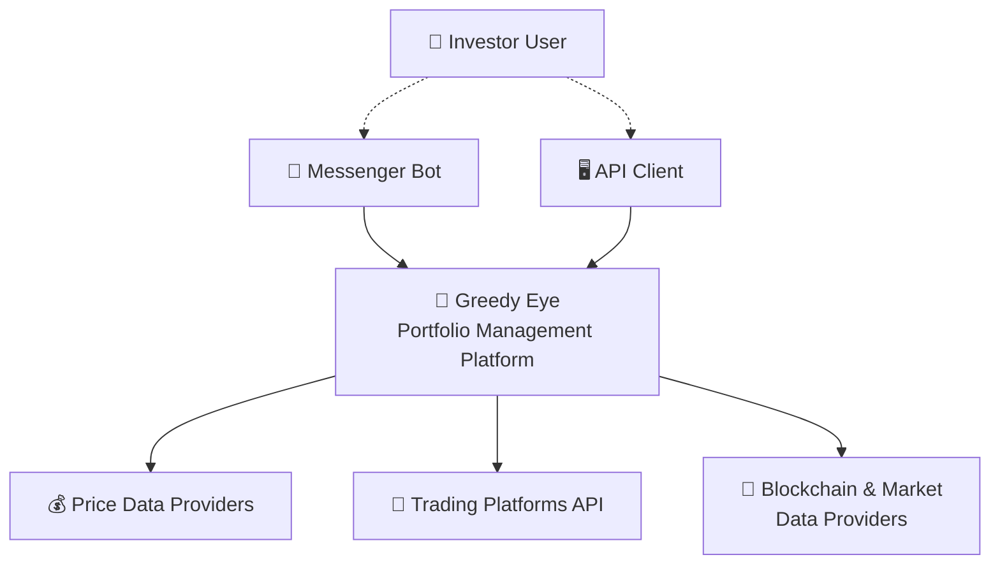
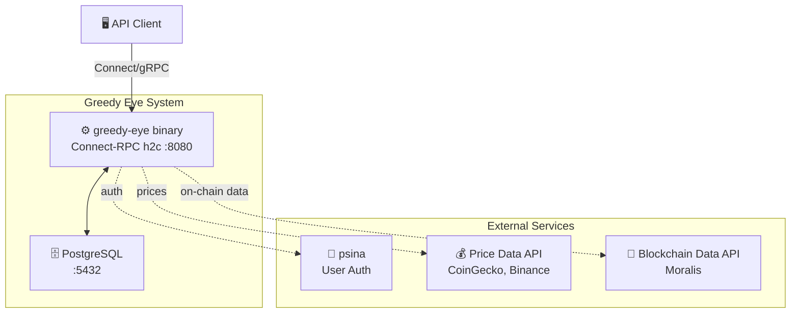
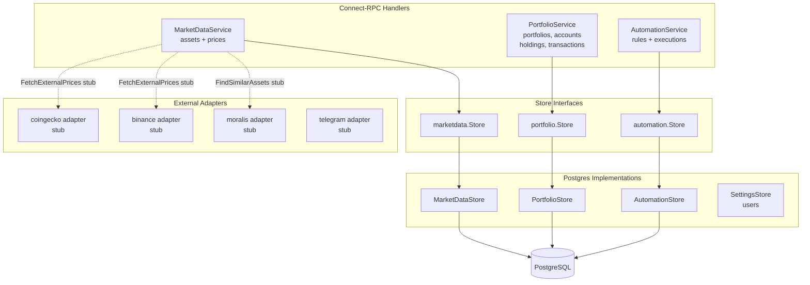

# Greedy Eye - Architecture Documentation

## Overview

Universal portfolio management system based on arc42 + C4 Model

---

## Document Navigation

This architecture document is organized according to the arc42 template and C4 model. Different sections serve
different audiences:

**Business & Product Context** (Sections 1-4)
- Introduction, requirements, constraints, and solution strategy
- Target audience: Product owners, business stakeholders, new team members

**Technical Implementation** (Sections 5-7)
- Building blocks, components, runtime behavior, and deployment
- Target audience: Developers, architects, DevOps engineers

**Operational & Quality Aspects** (Section 8)
- Security, performance, monitoring, and crosscutting concerns
- Target audience: SRE, operations team, security engineers

**Architecture Decisions & Risk Management** (Sections 9-11)
- ADRs, quality requirements, and technical debt tracking
- Target audience: Tech leads, architects, decision makers

**Reference** (Section 12)
- Glossary of domain terms
- Target audience: All stakeholders

---

## 1. Introduction and Goals

### 1.1 Requirements and Constraints

**Business Requirements:**
- Universal investment portfolio management (cryptocurrencies, securities, derivatives) platform
- Automated investment strategies (DCA, rebalancing, stop-losses)
- Different interfaces types and easy integration with client apps
- Integration with external APIs (exchanges, brokers, data providers)

**Functional Requirements:**
- Portfolio management with portfolio service
- Automated trading strategies using rule system
- Real-time price tracking from multiple sources
- Notifications and alerts about portfolio changes
- Support for multiple asset types and accounts

**Non-functional Requirements:**
- HTTP API response time < 200ms for simple operations
- Support for 100+ concurrent users
- 99.9% system availability
- Secure storage of API keys and user data

### 1.2 Quality Goals

**Top-3 priority quality goals:**

1. **Scalability** - Modular monolith architecture with microservices transition capability
   - Metrics: support 10x user growth without architectural changes
   - Horizontal scaling through configuration

2. **Security** - Multi-layered protection for financial data
   - Metrics: encryption of all external API keys, audit of all operations
   - JWT authentication + API key authorization with rate limiting
3. **Reliability** - Fault tolerance for financial operations
   - Metrics: 99.9% uptime, automatic recovery after failures
   - Graceful degradation when external services are unavailable

### 1.3 Stakeholders

| Role | Contact | Expectations |
| --- | --- | --- |
| Founder | fox@darkfox.info | Fast MVP delivery, universality for all asset types, maintainability |

---

## 2. Constraints

### 2.1 Technical Constraints

**Technology Stack:**
- **Language**: Go 1.25+
- **Database**: PostgreSQL 17+ (ACID compliance for financial data)
- **Protocol**: Connect-RPC over HTTP/2 (h2c) — serves both Connect and gRPC clients
- **Schema Management**: Atlas declarative migrations
- **Containerization**: Docker + Docker Compose

**Performance Constraints:**
- API response time < 200ms for 95% of requests
- Support up to 1000 concurrent connections
- Price fetch batch processing < 5 seconds

**Compatibility and Integrations:**
- Messenger Bot APIs (chat interface)
- Price data providers (cryptocurrency and securities market data)
- Trading platform APIs (exchanges and brokers)
- Blockchain data providers (on-chain analytics and wallet information)

### 2.2 Organizational Constraints

**Development Team:**
- 1 Developer (Go, docker, ansible, protobuf)

**Development Processes:**
- Code generation with proto using buf
- Declarative schema management with Atlas (schema.hcl)
- Integration tests with testcontainers (ephemeral PostgreSQL)
- Continuous Integration through GitHub Actions

### 2.3 External Constraints

**Legal Requirements:**
- GDPR compliance for user data

**Corporate Standards:**
- Open Source approach (MIT License)
- Documentation of architectural decisions (ADR)
- Security: encrypted at rest, encrypted in transit

---

## 3. Context and Scope

### 3.1 C1: Context Diagram


```mermaid
graph TB
    User[👤 Investor User]
    MessengerBot[📱 Messenger Bot]
    APIClient[🖥️ API Client]

    GreedyEye[🏦 Greedy Eye<br/>Portfolio Management Platform]

    Price[💰 Price Data Providers]
    Trading[🔄 Trading Platforms API]
    DataProviders[🔎 Blockchain & Market<br/>Data Providers]

    User -.-> MessengerBot
    User -.-> APIClient
    MessengerBot --> GreedyEye
    APIClient --> GreedyEye

    GreedyEye --> Price
    GreedyEye --> Trading
    GreedyEye --> DataProviders
```

### 3.2 Business Context

**External Systems and Their Roles:**
- **Messenger Bot API**: Chat user interface
- **Price Data Providers**: Cryptocurrency and securities price data and market information
- **Trading Platforms API**: Trading operations for various asset types
- **Blockchain & Market Data Providers**: On-chain data and market analytics
- **Speech APIs**: Voice to text conversion and vice versa

**User Roles:**
- **Individual Investors**: Primary system users
- **API Clients**: Integration with external systems through HTTP API

### 3.3 Technical Context

**Network Protocols:**
- **gRPC**: Internal communication between services
- **HTTP/HTTPS**: External API and webhook integrations
- **WebSocket**: Real-time notifications (planned)

**Data Formats:**
- **Protocol Buffers**: Internal API definitions
- **JSON**: HTTP API requests/responses
- **Encrypted**: Storage of API keys and sensitive data

---

## 4. Solution Strategy

### 4.1 Architectural Decisions

**Selected Architectural Patterns:**
- **Modular Monolith**: Balance between development simplicity and scalability
- **3-service domain API**: MarketDataService, PortfolioService, AutomationService
- **Layered architecture**: handler → store interface → postgres implementation
- **CQRS elements**: Separation of read and write operations in critical places

**Technology Stack:**
- **Backend**: Go 1.25+ for performance and type safety
- **Database**: PostgreSQL + pgx (raw SQL) for reliability
- **Schema**: Atlas declarative migrations (schema.hcl)
- **Communication**: Connect-RPC (h2c) — single server serves both Connect and gRPC clients
- **Deployment**: Docker containers for environment consistency

**Responsibility boundaries:**
- **User management / Auth**: delegated to external service (psina)
- **Messenger Bot**: separate future service
- **Greedy Eye core**: market data, portfolios, automation rules

### 4.2 Approach to Quality Goals

**Scalability:**
- Modular architecture with clear service boundaries
- Deployment capability as monolith or separate microservices
- Connection pooling and efficient resource usage

**Security:**
- Multi-layer authentication (JWT + API keys)
- Encryption of external API keys in database
- Rate limiting and audit logging of all operations

**Reliability:**
- Health checks for all services
- Graceful degradation when external APIs are unavailable
- Retry mechanisms with exponential backoff

---

## 5. Building Block View

### 5.1 C2: Container Diagram


```mermaid
graph TB
    subgraph "Greedy Eye System"
        App[⚙️ greedy-eye binary<br/>Connect-RPC h2c :8080]
        Database[🗄️ PostgreSQL<br/>:5432]
    end

    subgraph "External Services"
        Psina[👥 psina<br/>User Auth]
        PriceAPI[💰 Price Data API<br/>CoinGecko, Binance]
        BlockchainAPI[🔎 Blockchain Data API<br/>Moralis]
    end

    APIClient[🖥️ API Client] -->|Connect/gRPC| App
    App <--> Database
    App -.->|prices| PriceAPI
    App -.->|on-chain data| BlockchainAPI
    App -.->|auth| Psina
```

**Level 1 Containers:**

- **greedy-eye binary**:
  - Purpose: Single Go binary serving 3 domain services over Connect-RPC
  - Technologies: Go, Connect-RPC, Protocol Buffers, h2c
  - Services: MarketDataService, PortfolioService, AutomationService
  - Health check: `GET /eye/health`

- **PostgreSQL Database**:
  - Purpose: Persistent storage with ACID guarantees
  - Technologies: PostgreSQL 17+, pgx driver
  - Schema: Atlas declarative migrations (schema.hcl)
  - Interfaces: SQL, pgxpool connection pooling

### 5.2 C3: Component Diagrams

#### Service Layer - Component Details


```mermaid
graph TB
    subgraph "Connect-RPC Handlers"
        MDS[MarketDataService<br/>assets + prices]
        PS[PortfolioService<br/>portfolios, accounts<br/>holdings, transactions]
        AS[AutomationService<br/>rules + executions]
    end

    subgraph "Store Interfaces"
        MDSI[marketdata.Store]
        PSI[portfolio.Store]
        ASI[automation.Store]
    end

    subgraph "Postgres Implementations"
        MDSP[MarketDataStore]
        PSP[PortfolioStore]
        ASP[AutomationStore]
        SSP[SettingsStore<br/>users]
    end

    subgraph "External Adapters"
        CoinGecko[coingecko adapter<br/>stub]
        Binance[binance adapter<br/>stub]
        Moralis[moralis adapter<br/>stub]
        Telegram[telegram adapter<br/>stub]
    end

    MDS --> MDSI --> MDSP --> DB[(PostgreSQL)]
    PS  --> PSI  --> PSP  --> DB
    AS  --> ASI  --> ASP  --> DB

    MDS -.->|FetchExternalPrices stub| CoinGecko
    MDS -.->|FetchExternalPrices stub| Binance
    MDS -.->|FindSimilarAssets stub| Moralis
```

### 5.3 Level 3: Service Details

**MarketDataService** (`internal/service/marketdata/`):
- RPCs implemented: CreateAsset, GetAsset, UpdateAsset, DeleteAsset, ListAssets, CreatePrice,
  CreatePrices, GetLatestPrice, ListPriceHistory, ListPricesByInterval, DeletePrice, DeletePrices
- RPCs stubbed: EnrichAssetData, FindSimilarAssets, FetchExternalPrices
- Store: `MarketDataStore` (PostgreSQL) — assets + prices

**PortfolioService** (`internal/service/portfolio/`):
- RPCs implemented: full CRUD for Portfolio, Account, Holding, Transaction
- RPCs stubbed: CalculatePortfolioValue, GetPortfolioPerformance
- Store: `PortfolioStore` (PostgreSQL)

**AutomationService** (`internal/service/automation/`):
- RPCs implemented: CRUD for Rule and RuleExecution, EnableRule, DisableRule, PauseRule,
  ResumeRule, ValidateRule, ExecuteRule, ExecuteRuleAsync, CancelRuleExecution, SimulateRule
- Store: `AutomationStore` (PostgreSQL) — `rules` + `rule_executions` tables

**SettingsStore** (`internal/service/settings/`):
- Provides user CRUD for auth integration (psina)
- No Connect handler — consumed internally

**External Adapters** (Integration Layer):

The system uses the **Adapter Pattern** to isolate external API dependencies from core business logic.

- **Price Adapters** (`internal/adapter/coingecko/`, `internal/adapter/binance/`): CoinGecko, Binance (stubs)
- **Blockchain Adapters** (`internal/adapter/moralis/`): Moralis (stub)
- **Messenger Adapters** (`internal/adapter/telegram/`): Telegram (stub)

---

## 6. Runtime View

### 6.1 Execution Scenarios

#### Scenario 1: Track a New Asset Price

```text
API Client → MarketDataService → MarketDataStore → PostgreSQL
  1. POST /eye.v1.MarketDataService/CreateAsset (or CreatePrice)
  2. Handler validates request, maps proto → entity
  3. Store persists to PostgreSQL
  4. Response: created Asset or Price proto
```

#### Scenario 2: Fetch Prices from External Provider

```text
API Client → MarketDataService/FetchExternalPrices → (stub) → Error Unimplemented
  → When implemented: adapter.GetCurrentPrice → CreatePrices
  1. POST /eye.v1.MarketDataService/FetchExternalPrices
  2. Handler calls external adapter (CoinGecko / Binance)
  3. Prices are bulk-inserted via CreatePrices
  4. Response: FetchExternalPricesResponse{prices_fetched, prices_stored}
```

#### Scenario 3: Execute Rebalancing Rule

```text
Cron / API Client → AutomationService/ExecuteRule
  1. Validate rule_id, check rule.status == active
  2. CreateRuleExecution(status=in_progress)
  3. Run rule logic (calculate rebalancing trades)
  4. Create Transaction records via PortfolioService
  5. UpdateRuleExecution(status=completed, completed_at=now)
  Note: dry_run=true returns simulated execution without DB writes
```

### 6.2 Critical Scenarios

**Error Handling:**
- Graceful degradation when external APIs are unavailable
- Retry with exponential backoff for temporary failures
- Transaction rollback for critical errors

**Load Scenarios:**
- Database connection pooling under high load
- Rate limiting to prevent exceeding external API limits
- Circuit breaker pattern for protection against cascading failures

---

## 7. Deployment View

### 7.1 Infrastructure

```
[Production Environment]
├── Reverse Proxy (Traefik)
│   ├── SSL Termination
│   ├── h2c upstream (HTTP/2 cleartext for Connect-RPC)
│   └── Path routing: Host($EYE_DOMAIN) && PathPrefix(/eye)
├── Application Container
│   ├── Connect-RPC h2c Server (:8080)
│   │   ├── MarketDataService
│   │   ├── PortfolioService
│   │   └── AutomationService
│   └── Health: GET /eye/health
├── Database Container
│   ├── PostgreSQL 17+
│   ├── Automated Backups
│   └── pgxpool Connection Pooling
└── Monitoring Stack
    ├── Health Checks
    ├── Sentry (error tracking)
    └── Structured JSON logging
```

### 7.2 Component Mapping to Infrastructure

**Production Deployment:**
- **Single Container**: All gRPC services + HTTP Gateway in one Go binary
- **Database**: Separate PostgreSQL container with persistent volumes
- **Configuration**: Environment variables for API keys and settings
- **Scaling**: Horizontal scaling through load balancer + multiple app instances

**Development Environment:**
- **Docker Compose**: Local deployment of entire stack
- **Live Reload**: Air for automatic reloading on changes
- **Debug Mode**: Delve integration for debugging

---

## 8. Crosscutting Concepts

### 8.1 Security

**Authentication and Authorization:**
- **JWT Tokens**: For HTTP API with expiration and refresh logic
- **API Keys**: For programmatic access with scopes and rate limiting
- **User Context**: Binding operations to specific user
- **Service Authentication**: Internal authentication between gRPC services

**Data Protection:**
- **Encryption at Rest**: Encryption of external API keys in database
- **Encryption in Transit**: TLS for all external connections
- **Data Minimization**: Storage of only necessary user data
- **GDPR Compliance**: User data export and deletion capabilities

### 8.2 Performance

**Caching:**
- **Price Data**: Caching current prices with TTL
- **Portfolio Calculations**: Caching portfolio calculations
- **Session Data**: In-memory caching of Telegram Bot sessions

**Query Optimization:**
- **Database Indexing**: Indexes on foreign keys and timestamp fields
- **Connection Pooling**: Efficient use of database connections
- **Batch Operations**: Group operations for multiple records

### 8.3 Data Management

**Data Model:**
- **Universal Asset Support**: Unified model for all asset types
- **Flexible Configuration**: JSON fields for rules and settings
- **Audit Trail**: Complete history of all operations

**Schema Management:**
- **Atlas Declarative**: Schema defined in `schema.hcl` (HCL format)
- **Automated Migrations**: `atlas schema apply` for dev environment
- **Backward Compatibility**: Support for backward compatibility
- **Data Integrity**: ACID transactions for critical operations

**Testing:**
- **Testcontainers**: Ephemeral PostgreSQL for integration tests
- **Schema Apply**: Atlas CLI applies schema to test containers
- **Isolation**: Each test run gets clean database

### 8.4 Operational Concepts

**Monitoring and Alerting:**
- **Health Checks**: /health endpoint for all services
- **Metrics Collection**: Prometheus-compatible metrics
- **Error Tracking**: Structured logging with correlation IDs
- **SLA Monitoring**: Response time SLA tracking

**Logging:**
- **Structured Logging**: JSON format with logging levels
- **Request Tracing**: Unique IDs for request tracking
- **Security Events**: Logging of all authentication events
- **Configuration**: TEXT format for development, JSON for production
- **Log Levels**: DEBUG, INFO, WARN, ERROR, FATAL

**Configuration Management:**
- **Environment Variables**: All sensitive data via env vars
- **Config Files**: YAML format for non-sensitive settings
- **Money Precision**: Decimal amounts stored as `amount / 10^precision`
- **External APIs**: Encrypted API keys with rotation support

---

## 9. Architecture Decisions

### ADR-001: Modular Monolith vs Microservices
- **Status**: accepted
- **Context**: Choice between microservice architecture and monolith for MVP
- **Decision**: Modular monolith with microservices transition capability
- **Consequences**:
  - ➕ Fast MVP development, deployment simplicity
  - ➕ Clear service boundaries through gRPC interfaces
  - ➖ Need for caution when changing shared components

### ADR-002: Connect-RPC over h2c instead of gRPC-Gateway
- **Status**: accepted (supersedes original gRPC + gRPC-Gateway decision)
- **Context**: Original plan used gRPC internally + gRPC-Gateway for HTTP. Connect-RPC handles both natively.
- **Decision**: Connect-RPC with h2c transport. Single server accepts both Connect (JSON/protobuf) and gRPC clients.
- **Consequences**:
  - ➕ No separate gateway process, single port, simpler deployment
  - ➕ Browser-friendly Connect protocol without grpc-web proxy
  - ➕ Type safety via generated code, same proto definitions
  - ➖ Requires h2c-aware reverse proxy (Traefik `server.scheme=h2c`)

### ADR-003: 3-service domain API instead of 8 services
- **Status**: accepted
- **Context**: Initial design had 8 gRPC services (Storage, User, Asset, Portfolio, Price, Rule,
  Auth, Messenger). This caused excessive indirection and coupling.
- **Decision**: Consolidate into 3 domain services: MarketDataService (assets + prices),
  PortfolioService (portfolios, accounts, holdings, transactions), AutomationService (rules + executions).
- **Consequences**:
  - ➕ Simpler handler structure, fewer inter-service calls
  - ➕ Each service owns its store directly (no StorageService middleman)
  - ➖ Larger individual service surface area
  - ➖ Cross-domain operations (e.g. calculate portfolio value using prices) require service-to-service calls in the future

### ADR-004: User management delegated to external service (psina)
- **Status**: accepted
- **Context**: Managing users, auth, and sessions is significant scope separate from portfolio domain.
- **Decision**: Delegate user management and authentication to external `psina` service.
  Greedy Eye stores user references (user_id) but does not manage user lifecycle.
- **Consequences**:
  - ➕ Greedy Eye stays focused on financial domain
  - ➕ Auth reused across multiple services
  - ➖ Dependency on external service availability

---

## 10. Quality Requirements

### 10.1 Quality Tree

```
System Quality
├── Performance
│   ├── HTTP API response time < 200ms (95th percentile)
│   ├── gRPC response time < 50ms (95th percentile)
│   ├── Throughput > 1000 RPS
│   └── Voice processing < 3s
├── Availability
│   ├── 99.9% uptime
│   ├── Graceful degradation on external API failures
│   └── Health checks for monitoring
├── Security
│   ├── Authentication (JWT + API keys)
│   ├── Authorization (user-scoped operations)
│   ├── Encryption (TLS + database encryption)
│   └── Audit logging
├── Scalability
│   ├── Horizontal scaling readiness
│   ├── Database connection pooling
│   └── Stateless services design
└── Usability
    ├── Intuitive Telegram commands
    ├── Voice control
    └── Automatic notifications
```

### 10.2 Quality Scenarios

**Performance:**
- **Scenario**: Peak load of 100 concurrent Telegram Bot users
- **Metric**: 95th percentile response time < 500ms for portfolio commands
- **Current State**: Architecture ready, load testing required

**Security:**
- **Scenario**: Unauthorized portfolio access attempt
- **Metric**: 100% blocking of unauthorized requests
- **Current State**: JWT + API key mechanisms implemented

**Reliability:**
- **Scenario**: External price data API unavailable for 30 minutes
- **Metric**: System continues working with cached data
- **Current State**: Graceful degradation implementation required

---

## 11. Risks and Technical Debt

### 11.1 Identified Risks

| Risk | Probability | Impact | Mitigation |
| --- | --- | --- | --- |
| External API rate limit exceeded | High | Medium | Circuit breaker + caching + multiple providers |
| Data inaccuracy from price providers | Medium | High | Data validation + multiple sources + alerts |
| Monolith scaling issues | Low | High | Ready architecture for microservice split |
| API key security breach | Medium | Critical | Encryption + rotation + audit + least privilege |

### 11.2 Technical Debt

#### Debt 1: Partial business logic implementation

- Description: CRUD and execution flow implemented for all 3 services. Remaining stubs:
  CalculatePortfolioValue, GetPortfolioPerformance, EnrichAssetData, FindSimilarAssets,
  FetchExternalPrices. ExecuteRule runs a minimal synchronous engine (no real trading logic yet).
- Impact: Core data management and rule lifecycle work; portfolio calculations and external
  price fetching not yet usable.
- Resolution Plan: FetchExternalPrices (connects adapters to store) →
  CalculatePortfolioValue → full rule execution engine with actual trading logic

#### Debt 2: Lack of comprehensive monitoring

- Description: Basic health checks without detailed metrics
- Impact: Difficulty diagnosing production issues
- Resolution Plan: Prometheus + Grafana dashboards integration

#### Debt 3: Insufficient integration tests

- Description: Unit tests exist, but few end-to-end tests
- Impact: Regression risk during changes
- Resolution Plan: Automated integration tests in CI/CD

---

## 12. Glossary

| Term | Definition |
| --- | --- |
| **Asset** | Financial instrument: cryptocurrency, stock, bond, derivatives |
| **Holding** | Current position of a specific asset within an Account |
| **Account** | User's connection to an exchange, wallet, or broker |
| **Rule** | Portfolio automation rule (DCA, rebalancing, stop-loss, withdrawal) |
| **RuleExecution** | Single run of a Rule, with status and transaction references |
| **Connect-RPC** | Protocol from Buf that serves gRPC and browser-compatible HTTP API from one server |
| **h2c** | HTTP/2 cleartext — HTTP/2 without TLS, used for Connect-RPC behind a TLS-terminating proxy |
| **psina** | External service responsible for user management and authentication |
| **Price Provider** | External service providing price data (CoinGecko, Binance, etc.) |
| **Graceful Degradation** | Continued operation with limited functionality during failures |
| **Circuit Breaker** | Pattern protecting against cascading failures when external services are unavailable |

---

**Document Version**: 1.3
**Last Updated**: 2026-03-03
**Owner**: foxcool
**Status**: Active
