# Greedy Eye - Architecture Documentation

## Overview

Universal portfolio management system based on arc42 + C4 Model

---

## Document Navigation

This architecture document is organized according to the arc42 template and C4 model. Different sections serve
different audiences:

**Business & Product Context** (Sections 1-4)
- Introduction, requirements, constraints, and solution strategy
- Target audience: Product owners, business stakeholders, new team members

**Technical Implementation** (Sections 5-7)
- Building blocks, components, runtime behavior, and deployment
- Target audience: Developers, architects, DevOps engineers

**Operational & Quality Aspects** (Section 8)
- Security, performance, monitoring, and crosscutting concerns
- Target audience: SRE, operations team, security engineers

**Architecture Decisions & Risk Management** (Sections 9-11)
- ADRs, quality requirements, and technical debt tracking
- Target audience: Tech leads, architects, decision makers

**Reference** (Section 12)
- Glossary of domain terms
- Target audience: All stakeholders

---

## 1. Introduction and Goals

### 1.1 Requirements and Constraints

**Business Requirements:**
- Universal investment portfolio management (cryptocurrencies, securities, derivatives) platform
- Automated investment strategies (DCA, rebalancing, stop-losses)
- Different interfaces types and easy integration with client apps
- Integration with external APIs (exchanges, brokers, data providers)

**Functional Requirements:**
- Portfolio management with portfolio service
- Automated trading strategies using rule system
- Real-time price tracking from multiple sources
- Notifications and alerts about portfolio changes
- Support for multiple asset types and accounts

**Non-functional Requirements:**
- HTTP API response time < 200ms for simple operations
- Support for 100+ concurrent users
- 99.9% system availability
- Secure storage of API keys and user data

### 1.2 Quality Goals

**Top-3 priority quality goals:**

1. **Scalability** - Modular monolith architecture with microservices transition capability
   - Metrics: support 10x user growth without architectural changes
   - Horizontal scaling through configuration

2. **Security** - Multi-layered protection for financial data
   - Metrics: encryption of all external API keys, audit of all operations
   - JWT authentication + API key authorization with rate limiting
. **Reliability** - Fault tolerance for financial operations
   - Metrics: 99.9% uptime, automatic recovery after failures
   - Graceful degradation when external services are unavailable

### 1.3 Stakeholders

| Role | Contact | Expectations |
|------|---------|-------------|
| Founder | fox@darkfox.info | Fast MVP delivery, universality for all asset types, maintainability |

---

## 2. Constraints

### 2.1 Technical Constraints

**Technology Stack:**
- **Language**: Go 1.23+
- **Database**: PostgreSQL 13+ (ACID compliance for financial data)
- **Protocol**: gRPC + HTTP API Gateway (internal/external communication)
- **Containerization**: Docker + Docker Compose

**Performance Constraints:**
- API response time < 200ms for 95% of requests
- Support up to 1000 concurrent gRPC connections
- Voice message processing < 3 seconds

**Compatibility and Integrations:**
- Messenger Bot APIs (chat interface)
- Price data providers (cryptocurrency and securities market data)
- Trading platform APIs (exchanges and brokers)
- Blockchain data providers (on-chain analytics and wallet information)

### 2.2 Organizational Constraints

**Development Team:**
- 1 Developer (Go, docker, ansible, protobuf)

**Development Processes:**
- Code generation with proto using buf
- SQL migrations with atlas 
- Continuous Integration through GitHub Actions

### 2.3 External Constraints

**Legal Requirements:**
- GDPR compliance for user data

**Corporate Standards:**
- Open Source approach (MIT License)
- Documentation of architectural decisions (ADR)
- Security: encrypted at rest, encrypted in transit

---

## 3. Context and Scope

### 3.1 C1: Context Diagram

```mermaid
graph TB
    User[👤 Investor User]
    MessengerBot[📱 Messenger Bot]
    APIClient[🖥️ API Client]

    GreedyEye[🏦 Greedy Eye<br/>Portfolio Management Platform]

    Price[💰 Price Data Providers]
    Trading[🔄 Trading Platforms API]
    DataProviders[🔎 Blockchain & Market<br/>Data Providers]

    User -.-> MessengerBot
    User -.-> APIClient
    MessengerBot --> GreedyEye
    APIClient --> GreedyEye

    GreedyEye --> Price
    GreedyEye --> Trading
    GreedyEye --> DataProviders
```



### 3.2 Business Context

**External Systems and Their Roles:**
- **Messenger Bot API**: Chat user interface
- **Price Data Providers**: Cryptocurrency and securities price data and market information
- **Trading Platforms API**: Trading operations for various asset types
- **Blockchain & Market Data Providers**: On-chain data and market analytics
- **Speech APIs**: Voice to text conversion and vice versa

**User Roles:**
- **Individual Investors**: Primary system users
- **API Clients**: Integration with external systems through HTTP API

### 3.3 Technical Context

**Network Protocols:**
- **gRPC**: Internal communication between services
- **HTTP/HTTPS**: External API and webhook integrations
- **WebSocket**: Real-time notifications (planned)

**Data Formats:**
- **Protocol Buffers**: Internal API definitions
- **JSON**: HTTP API requests/responses
- **Encrypted**: Storage of API keys and sensitive data

---

## 4. Solution Strategy

### 4.1 Architectural Decisions

**Selected Architectural Patterns:**
- **Modular Monolith**: Balance between development simplicity and scalability
- **Service-oriented internal architecture**: 8 clearly separated gRPC services
- **API Gateway pattern**: Single entry point for external clients
- **CQRS elements**: Separation of read and write operations in critical places

**Technology Stack:**
- **Backend**: Go 1.23+ for performance and type safety
- **Database**: PostgreSQL + Ent ORM for reliability and migrations
- **Communication**: gRPC + gRPC-Gateway for efficient communication
- **Deployment**: Docker containers for environment consistency

### 4.2 Approach to Quality Goals

**Scalability:**
- Modular architecture with clear service boundaries
- Deployment capability as monolith or separate microservices
- Connection pooling and efficient resource usage

**Security:**
- Multi-layer authentication (JWT + API keys)
- Encryption of external API keys in database
- Rate limiting and audit logging of all operations

**Reliability:**
- Health checks for all services
- Graceful degradation when external APIs are unavailable
- Retry mechanisms with exponential backoff

---

## 5. Building Block View

### 5.1 C2: Container Diagram

```mermaid
graph TB
    subgraph "Greedy Eye System"
        WebApp[📱 Telegram Bot<br/>Interface]
        APIGateway[🌐 HTTP API Gateway<br/>:8080]
        ServiceLayer[⚙️ gRPC Services<br/>:50051]
        Database[🗄️ PostgreSQL<br/>:5432]
    end

    subgraph "External Systems"
        MessengerAPI[📱 Messenger API]
        PriceAPI[💰 Price Data API]
        TradingAPI[🔄 Trading Platform API]
        DataAPI[🔎 Blockchain Data API]
        SpeechAPIs[🎤 Speech APIs]
    end

    User[👤 User] --> WebApp
    APIClient[🖥️ API Client] --> APIGateway

    WebApp <--> ServiceLayer
    APIGateway <--> ServiceLayer
    ServiceLayer <--> Database

    WebApp <--> MessengerAPI
    ServiceLayer <--> PriceAPI
    ServiceLayer <--> TradingAPI
    ServiceLayer <--> DataAPI
    WebApp <--> SpeechAPIs
```



**Level 1 Containers:**

- **Messenger Bot Interface**:
  - Purpose: Conversational interface with voice support
  - Technologies: Go, Messenger Bot API, Speech APIs
  - Interfaces: gRPC client to service layer

- **HTTP API Gateway**:
  - Purpose: External REST API with auto-generation from gRPC
  - Technologies: gRPC-Gateway, JWT middleware
  - Interfaces: HTTP/JSON → gRPC/Protocol Buffers

- **gRPC Services Layer**:
  - Purpose: Business logic as 8 separate services
  - Technologies: Go, gRPC, Protocol Buffers
  - Interfaces: Internal gRPC, External HTTP APIs

- **PostgreSQL Database**:
  - Purpose: Persistent storage with ACID guarantees
  - Technologies: PostgreSQL 13+, Ent ORM
  - Interfaces: SQL, Connection pooling

### 5.2 C3: Component Diagrams

#### gRPC Services Layer - Component Details

```mermaid
graph TB
    subgraph "Core Services"
        Storage[🗄️ StorageService<br/>CRUD Operations]
        User[👥 UserService<br/>User Management]
        Asset[🏦 AssetService<br/>Asset Metadata]
        Portfolio[📈 PortfolioService<br/>Calculations]
        Price[💲 PriceService<br/>Market Data]
        Rule[⚙️ RuleService<br/>Automation]
        Auth[🔐 AuthService<br/>Security]
        Messenger[💬 MessengerService<br/>Multi-Platform Chat]
    end

    subgraph "External Adapters"
        MessengerAdapter[Messenger Adapters<br/>Telegram, WhatsApp, Discord]
        PriceAdapter[Price Data Adapters<br/>CoinGecko, CoinMarketCap]
        ExchangeAdapter[Exchange Adapters<br/>Binance, Gate.io, Bybit]
        BlockchainAdapter[Blockchain Adapters<br/>Moralis, Etherscan]
    end

    Storage --> Database[(PostgreSQL)]

    Price --> PriceAdapter
    Price --> ExchangeAdapter
    Price --> BlockchainAdapter

    Messenger --> MessengerAdapter

    Rule --> User
    Rule --> Portfolio
    Rule --> Asset
    Rule --> Price

    Portfolio --> Asset
    Portfolio --> Storage
    Portfolio --> ExchangeAdapter

    User --> Storage
    Asset --> Storage
    Asset --> BlockchainAdapter
    Price --> Storage
```



### 5.3 Level 3: Component Details

**StorageService** (Foundation Service):
- Responsibilities: CRUD operations for all entities, schema migrations
- Interfaces: gRPC methods for each data model
- Technologies: Ent ORM, PostgreSQL connections
- Dependencies: PostgreSQL database

**PriceService** (Key Service):
- Responsibilities: Fetching prices from external sources, caching
- Interfaces: FetchExternalPrices gRPC method, Provider interface
- Technologies: HTTP clients for external APIs, retry logic
- Dependencies: AssetService (validation), StorageService (persistence)

**RuleService** (Automation):
- Responsibilities: Portfolio rule execution, alert system
- Interfaces: ExecuteRule, ValidateRule, SimulateRule gRPC methods
- Technologies: Rule engine, cron scheduler, alert manager
- Dependencies: All other services for rule execution

**MessengerService** (Multi-Platform User Interface):
- Responsibilities: Message processing, voice processing, notifications across multiple platforms
- Interfaces: Messenger adapters (Telegram, WhatsApp, Discord), Speech APIs
- Technologies: Session management, NLP, STT/TTS, platform-agnostic handlers
- Dependencies: All services for data access, messenger adapters for communication
- Commands: `/start`, `/portfolio`, `/balance`, `/prices`, `/alerts`, `/transactions`, `/settings`, `/help`
- See: [Adapters Documentation](adapters.md) for integration details

**External Adapters** (Integration Layer):

The system uses the **Adapter Pattern** for external integrations. See [adapters.md](adapters.md) for detailed documentation.

- **Messenger Adapters** (`internal/adapters/messengers/`):
  - Telegram Bot API integration
  - Future: WhatsApp, Discord, Slack

- **Price Data Adapters** (`internal/adapters/pricedata/`):
  - CoinGecko API integration
  - Future: CoinMarketCap, Cryptocompare

- **Exchange Adapters** (`internal/adapters/exchanges/`):
  - Binance API (spot, futures, margin)
  - Future: Gate.io, Bybit, OKX, Coinbase

- **Blockchain Adapters** (`internal/adapters/blockchain/`):
  - Moralis multi-chain data
  - Future: Etherscan, Blockcypher, Alchemy

All adapters follow consistent patterns for configuration, error handling, and testing. Current status: **Stub implementations** with comprehensive test coverage.

---

## 6. Runtime View

### 6.1 Execution Scenarios

#### Scenario 1: Get Portfolio Balance via Messenger

```text
User → Messenger Platform → MessengerService → PortfolioService → StorageService → Database
  1. User sends "/portfolio" command
  2. MessengerService receives update via webhook (e.g., Telegram)
  3. MessengerService parses command and authenticates user
  4. PortfolioService calculates current portfolio value
  5. StorageService returns user holdings
  6. PriceService provides current prices
  7. Result is formatted and sent via messenger adapter
```

#### Scenario 2: Fetch Prices from External Provider

```text
HTTP API → PriceService → Price Data API → StorageService → Database
  1. POST /api/v1/prices/fetch-external
  2. PriceService gets list of assets to update
  3. Price Data API returns current prices
  4. Prices are validated and saved through StorageService
  5. Update statistics are returned
```

#### Scenario 3: Execute Rebalancing Rule

```text
RuleService → PortfolioService → AssetService → PriceService → External APIs
  1. Cron trigger activates rebalancing rule
  2. RuleService calculates necessary portfolio changes
  3. Rule creates transactions to achieve target allocation
  4. Trading operations are executed through external APIs if needed
  5. Result is saved and notifications are sent
```

### 6.2 Critical Scenarios

**Error Handling:**
- Graceful degradation when external APIs are unavailable
- Retry with exponential backoff for temporary failures
- Transaction rollback for critical errors

**Load Scenarios:**
- Database connection pooling under high load
- Rate limiting to prevent exceeding external API limits
- Circuit breaker pattern for protection against cascading failures

---

## 7. Deployment View

### 7.1 Infrastructure

```
[Production Environment]
├── Reverse Proxy (Nginx)
│   ├── SSL Termination
│   └── Load Balancing
├── Application Container
│   ├── gRPC Server (:50051)
│   ├── HTTP API Gateway (:8080)
│   └── All 8 Services
├── Database Container
│   ├── PostgreSQL 13+
│   ├── Automated Backups
│   └── Connection Pooling
└── Monitoring Stack
    ├── Health Checks
    ├── Metrics Collection
    └── Log Aggregation
```

### 7.2 Component Mapping to Infrastructure

**Production Deployment:**
- **Single Container**: All gRPC services + HTTP Gateway in one Go binary
- **Database**: Separate PostgreSQL container with persistent volumes
- **Configuration**: Environment variables for API keys and settings
- **Scaling**: Horizontal scaling through load balancer + multiple app instances

**Development Environment:**
- **Docker Compose**: Local deployment of entire stack
- **Live Reload**: Air for automatic reloading on changes
- **Debug Mode**: Delve integration for debugging

---

## 8. Crosscutting Concepts

### 8.1 Security

**Authentication and Authorization:**
- **JWT Tokens**: For HTTP API with expiration and refresh logic
- **API Keys**: For programmatic access with scopes and rate limiting
- **User Context**: Binding operations to specific user
- **Service Authentication**: Internal authentication between gRPC services

**Data Protection:**
- **Encryption at Rest**: Encryption of external API keys in database
- **Encryption in Transit**: TLS for all external connections
- **Data Minimization**: Storage of only necessary user data
- **GDPR Compliance**: User data export and deletion capabilities

### 8.2 Performance

**Caching:**
- **Price Data**: Caching current prices with TTL
- **Portfolio Calculations**: Caching portfolio calculations
- **Session Data**: In-memory caching of Telegram Bot sessions

**Query Optimization:**
- **Database Indexing**: Indexes on foreign keys and timestamp fields
- **Connection Pooling**: Efficient use of database connections
- **Batch Operations**: Group operations for multiple records

### 8.3 Data Management

**Data Model:**
- **Universal Asset Support**: Unified model for all asset types
- **Flexible Configuration**: JSON fields for rules and settings
- **Audit Trail**: Complete history of all operations

**Migrations:**
- **Ent Migrations**: Automatic generation of schema migrations
- **Backward Compatibility**: Support for backward compatibility
- **Data Integrity**: ACID transactions for critical operations

### 8.4 Operational Concepts

**Monitoring and Alerting:**
- **Health Checks**: /health endpoint for all services
- **Metrics Collection**: Prometheus-compatible metrics
- **Error Tracking**: Structured logging with correlation IDs
- **SLA Monitoring**: Response time SLA tracking

**Logging:**
- **Structured Logging**: JSON format with logging levels
- **Request Tracing**: Unique IDs for request tracking
- **Security Events**: Logging of all authentication events
- **Configuration**: TEXT format for development, JSON for production
- **Log Levels**: DEBUG, INFO, WARN, ERROR, FATAL

**Configuration Management:**
- **Environment Variables**: All sensitive data via env vars
- **Config Files**: YAML format for non-sensitive settings
- **Money Precision**: Decimal amounts stored as `amount / 10^precision`
- **External APIs**: Encrypted API keys with rotation support

---

## 9. Architecture Decisions

### ADR-001: Modular Monolith vs Microservices
- **Status**: accepted
- **Context**: Choice between microservice architecture and monolith for MVP
- **Decision**: Modular monolith with microservices transition capability
- **Consequences**:
  - ➕ Fast MVP development, deployment simplicity
  - ➕ Clear service boundaries through gRPC interfaces
  - ➖ Need for caution when changing shared components

### ADR-002: gRPC + gRPC-Gateway
- **Status**: accepted
- **Context**: Need for efficient internal communication and HTTP API
- **Decision**: gRPC for internal services + gRPC-Gateway for HTTP API
- **Consequences**:
  - ➕ Type safety, performance, HTTP API auto-generation
  - ➕ Single source of truth for API definitions
  - ➖ Additional complexity in debugging

### ADR-003: Integrated Alert System
- **Status**: accepted
- **Context**: Need for notifications about portfolio events
- **Decision**: Integrate alerts into RuleService instead of separate service
- **Consequences**:
  - ➕ YAGNI principle compliance, architecture simplification
  - ➕ Easy integration with automation rules
  - ➖ Potential RuleService complexity increase

### ADR-004: Multi-provider Speech Integration
- **Status**: accepted
- **Context**: Need for reliable voice message processing
- **Decision**: Support multiple STT/TTS providers with fallback
- **Consequences**:
  - ➕ High reliability, optimization by language and cost
  - ➕ Flexibility in provider choice depending on task
  - ➖ Additional configuration complexity

---

## 10. Quality Requirements

### 10.1 Quality Tree

```
System Quality
├── Performance
│   ├── HTTP API response time < 200ms (95th percentile)
│   ├── gRPC response time < 50ms (95th percentile)
│   ├── Throughput > 1000 RPS
│   └── Voice processing < 3s
├── Availability
│   ├── 99.9% uptime
│   ├── Graceful degradation on external API failures
│   └── Health checks for monitoring
├── Security
│   ├── Authentication (JWT + API keys)
│   ├── Authorization (user-scoped operations)
│   ├── Encryption (TLS + database encryption)
│   └── Audit logging
├── Scalability
│   ├── Horizontal scaling readiness
│   ├── Database connection pooling
│   └── Stateless services design
└── Usability
    ├── Intuitive Telegram commands
    ├── Voice control
    └── Automatic notifications
```

### 10.2 Quality Scenarios

**Performance:**
- **Scenario**: Peak load of 100 concurrent Telegram Bot users
- **Metric**: 95th percentile response time < 500ms for portfolio commands
- **Current State**: Architecture ready, load testing required

**Security:**
- **Scenario**: Unauthorized portfolio access attempt
- **Metric**: 100% blocking of unauthorized requests
- **Current State**: JWT + API key mechanisms implemented

**Reliability:**
- **Scenario**: External price data API unavailable for 30 minutes
- **Metric**: System continues working with cached data
- **Current State**: Graceful degradation implementation required

---

## 11. Risks and Technical Debt

### 11.1 Identified Risks

| Risk | Probability | Impact | Mitigation |
|------|-------------|--------|------------|
| External API rate limit exceeded | High | Medium | Circuit breaker + caching + multiple providers |
| Data inaccuracy from price providers | Medium | High | Data validation + multiple sources + alerts |
| Monolith scaling issues | Low | High | Ready architecture for microservice split |
| API key security breach | Medium | Critical | Encryption + rotation + audit + least privilege |

### 11.2 Technical Debt

#### Debt 1: Absence of real business logic

- Description: All services implemented as stubs
- Impact: Cannot be used in production
- Resolution Plan: Phased implementation starting with UserService and PriceService

#### Debt 2: Lack of comprehensive monitoring

- Description: Basic health checks without detailed metrics
- Impact: Difficulty diagnosing production issues
- Resolution Plan: Prometheus + Grafana dashboards integration

#### Debt 3: Insufficient integration tests

- Description: Unit tests exist, but few end-to-end tests
- Impact: Regression risk during changes
- Resolution Plan: Automated integration tests in CI/CD

---

## 12. Glossary

| Term | Definition |
|------|------------|
| **Asset** | Financial instrument: cryptocurrency, stock, bond, derivatives |
| **Holding** | Current position of specific asset in portfolio |
| **Rule** | Portfolio automation rule (DCA, rebalancing, alerts) |
| **External API Key** | Encrypted key for external service access |
| **Session Context** | User conversation state with Telegram Bot |
| **Price Provider** | External service providing price data for various asset types |
| **STT/TTS** | Speech-to-Text / Text-to-Speech conversion |
| **gRPC-Gateway** | HTTP API auto-generation from gRPC definitions |
| **Graceful Degradation** | Continued operation with limited functionality during failures |
| **Circuit Breaker** | Pattern protecting against cascading failures when external services are unavailable |

---

**Document Version**: 1.0
**Last Updated**: 2025-09-28
**Owner**: foxcool
**Status**: Active
