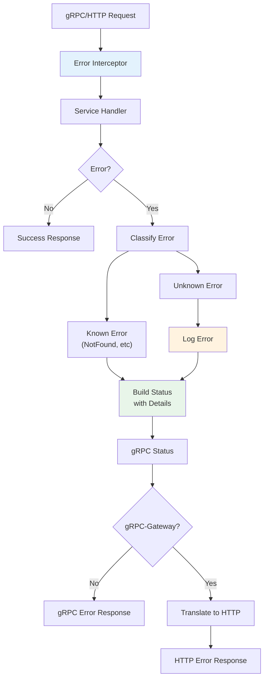

# 🎨 CREATIVE PHASE: Error Handling Strategy

## PROBLEM STATEMENT

Current issues with error handling:

- No consistent error format across gRPC and HTTP
- Silent failures for service registration
- No gRPC → HTTP status code mapping
- Missing circuit breaker for resilience
- No retry logic for transient failures
- Error details lost in translation

## OPTIONS ANALYSIS

### Option 1: gRPC Status with Details

**Description**: Use native gRPC status with error details, translate to HTTP
**Pros**:

- Native gRPC approach
- Rich error details support
- Standard status codes
- Good client library support
**Cons**:
- Complex translation to HTTP
- Loss of details in HTTP responses
- Different error formats for gRPC vs HTTP
**Complexity**: Medium
**Implementation Time**: 2-3 days

### Option 2: Custom Error Type with Dual Format

**Description**: Create custom error type that can serialize to both gRPC and HTTP formats
**Pros**:

- Consistent error structure
- Full control over format
- Can preserve all details
**Cons**:
- More code to maintain
- Not standard gRPC pattern
- Client libraries need custom handling
**Complexity**: High
**Implementation Time**: 3-4 days

### Option 3: gRPC Status + Structured Details

**Description**: Use gRPC status with structured error details proto, auto-translate to HTTP
**Pros**:

- Standard gRPC pattern
- Structured error details
- Auto-translation possible
- Works with gRPC-Gateway
**Cons**:
- Need to define error detail protos
- Some complexity in translation
**Complexity**: Medium
**Implementation Time**: 2-3 days

### Option 4: Error Interceptor Pattern

**Description**: Unified error interceptor that handles both gRPC and HTTP errors
**Pros**:

- Single place for error handling
- Consistent logging
- Easy to add circuit breaker
- Clean separation of concerns
**Cons**:
- Need careful design for translation
- Some overhead in processing
**Complexity**: Medium
**Implementation Time**: 2-3 days

## DECISION

**Selected Approach**: Combination of Option 3 + Option 4

- Use gRPC Status with structured details
- Implement unified error interceptor
- Auto-translate to HTTP via gRPC-Gateway

**Rationale**:

1. Follows gRPC best practices
2. Single implementation for error handling
3. Preserves error details across protocols
4. Enables advanced patterns (circuit breaker, retry)
5. Works seamlessly with gRPC-Gateway

## IMPLEMENTATION PLAN

### 1. Error Details Proto

```proto
// api/models/error_details.proto
syntax = "proto3";

package models;

message ErrorDetails {
  string error_code = 1;     // Machine-readable error code
  string field = 2;          // Field that caused error (for validation)
  map<string, string> metadata = 3; // Additional context
}

message RetryInfo {
  google.protobuf.Duration retry_delay = 1;
  int32 max_attempts = 2;
}
```

### 2. Error Builder

```go
// pkg/errors/builder.go
type ErrorBuilder struct {
    code       codes.Code
    message    string
    details    []proto.Message
}

func NewError(code codes.Code, message string) *ErrorBuilder {
    return &ErrorBuilder{
        code:    code,
        message: message,
    }
}

func (e *ErrorBuilder) WithDetails(details *models.ErrorDetails) *ErrorBuilder {
    e.details = append(e.details, details)
    return e
}

func (e *ErrorBuilder) WithRetry(delay time.Duration, maxAttempts int) *ErrorBuilder {
    e.details = append(e.details, &models.RetryInfo{
        RetryDelay:  durationpb.New(delay),
        MaxAttempts: int32(maxAttempts),
    })
    return e
}

func (e *ErrorBuilder) Build() error {
    st := status.New(e.code, e.message)
    if len(e.details) > 0 {
        st, _ = st.WithDetails(e.details...)
    }
    return st.Err()
}
```

### 3. Error Interceptor

```go
// pkg/interceptors/error_interceptor.go
func ErrorInterceptor(log *zap.Logger) grpc.UnaryServerInterceptor {
    return func(ctx context.Context, req interface{}, info *grpc.UnaryServerInfo, handler grpc.UnaryHandler) (interface{}, error) {
        resp, err := handler(ctx, req)
        if err != nil {
            err = translateError(ctx, err, log)
        }
        return resp, err
    }
}

func translateError(ctx context.Context, err error, log *zap.Logger) error {
    // Already a gRPC status error
    if _, ok := status.FromError(err); ok {
        logError(ctx, err, log)
        return err
    }
    
    // Translate known errors
    switch {
    case errors.Is(err, sql.ErrNoRows):
        return NewError(codes.NotFound, "Resource not found").Build()
    case errors.Is(err, context.DeadlineExceeded):
        return NewError(codes.DeadlineExceeded, "Request timeout").Build()
    default:
        // Log unexpected errors
        log.Error("Unexpected error", 
            zap.Error(err),
            zap.String("method", info.FullMethod),
        )
        return NewError(codes.Internal, "Internal server error").Build()
    }
}
```

### 4. HTTP Error Handler for gRPC-Gateway

```go
// pkg/gateway/error_handler.go
func HTTPErrorHandler(ctx context.Context, mux *runtime.ServeMux, marshaler runtime.Marshaler, w http.ResponseWriter, r *http.Request, err error) {
    const fallback = `{"error": "Internal server error"}`
    
    w.Header().Set("Content-Type", "application/json")
    
    st, ok := status.FromError(err)
    if !ok {
        w.WriteHeader(http.StatusInternalServerError)
        w.Write([]byte(fallback))
        return
    }
    
    // Map gRPC codes to HTTP status
    httpStatus := grpcToHTTPStatus(st.Code())
    w.WriteHeader(httpStatus)
    
    // Build error response
    resp := buildHTTPError(st)
    
    buf, _ := json.Marshal(resp)
    w.Write(buf)
}

func buildHTTPError(st *status.Status) map[string]interface{} {
    resp := map[string]interface{}{
        "error": map[string]interface{}{
            "code":    st.Code().String(),
            "message": st.Message(),
        },
    }
    
    // Extract details
    for _, detail := range st.Details() {
        switch d := detail.(type) {
        case *models.ErrorDetails:
            resp["error"].(map[string]interface{})["details"] = d
        case *models.RetryInfo:
            resp["error"].(map[string]interface{})["retry"] = d
        }
    }
    
    return resp
}
```

### 5. Circuit Breaker Integration

```go
// pkg/circuit/breaker.go
type CircuitBreaker struct {
    failureThreshold int
    resetTimeout     time.Duration
    state           atomic.Value // open, closed, half-open
    failures        atomic.Int32
    lastFailure     atomic.Value // time.Time
}

func (cb *CircuitBreaker) Call(fn func() error) error {
    if cb.isOpen() {
        return NewError(codes.Unavailable, "Service temporarily unavailable").
            WithRetry(cb.resetTimeout, 3).
            Build()
    }
    
    err := fn()
    if err != nil {
        cb.recordFailure()
    } else {
        cb.reset()
    }
    
    return err
}
```

## VISUALIZATION



## ERROR RESPONSE FORMATS

### gRPC Error Response

```protobuf
code: NOT_FOUND (5)
message: "User not found"
details: [
  {
    "@type": "type.googleapis.com/models.ErrorDetails",
    "error_code": "USER_NOT_FOUND",
    "field": "user_id",
    "metadata": {
      "user_id": "12345"
    }
  }
]
```

### HTTP Error Response

```json
{
  "error": {
    "code": "NOT_FOUND",
    "message": "User not found",
    "details": {
      "error_code": "USER_NOT_FOUND",
      "field": "user_id",
      "metadata": {
        "user_id": "12345"
      }
    }
  }
}
```

## BENEFITS

1. **Consistency**: Same error handling for gRPC and HTTP
2. **Rich Details**: Structured error information preserved
3. **Resilience**: Built-in circuit breaker support
4. **Debugging**: Comprehensive error logging
5. **Standards**: Follows gRPC and REST best practices

🎨🎨🎨 EXITING CREATIVE PHASE - DECISION MADE 🎨🎨🎨
