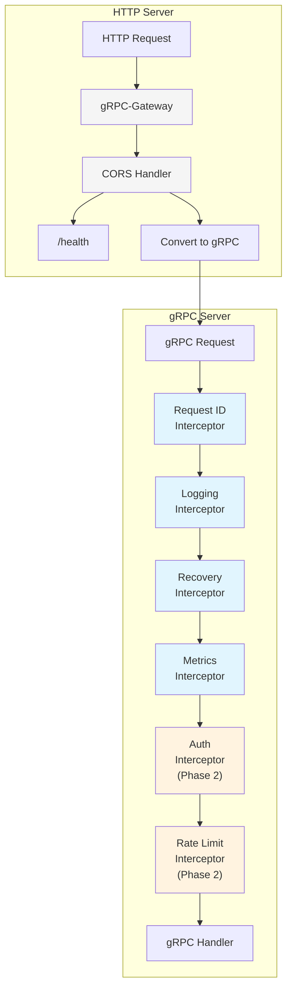

# 🎨 CREATIVE PHASE: Middleware Pipeline Architecture

## PROBLEM STATEMENT

The current server implementation lacks:

- Request/response logging
- Authentication and authorization
- Rate limiting capabilities
- CORS configuration
- Metrics collection
- Extensible middleware pipeline

We need a unified middleware architecture that works consistently across both gRPC and HTTP (via gRPC-Gateway) without duplicating logic.

## OPTIONS ANALYSIS

### Option 1: Dual Middleware Layers

**Description**: Separate middleware for gRPC and HTTP
**Pros**:

- Protocol-specific optimizations
- Independent scaling of middleware
- Flexibility to handle protocol-specific needs
**Cons**:
- Code duplication
- Inconsistent behavior between protocols
- Higher maintenance burden
- More complex testing requirements
**Complexity**: High
**Implementation Time**: 4-5 days

### Option 2: HTTP-First with gRPC Adaptation

**Description**: Primary HTTP middleware adapted for gRPC
**Pros**:

- Rich HTTP middleware ecosystem
- Familiar patterns for web developers
- Easy integration with web frameworks
**Cons**:
- Not optimal for gRPC
- Complex adaptation layer needed
- Performance overhead
**Complexity**: Medium
**Implementation Time**: 3-4 days

### Option 3: Unified gRPC Interceptors

**Description**: Primary gRPC interceptors with thin HTTP layer
**Pros**:

- Single implementation of core features
- Consistent behavior across protocols
- Better performance (no double processing)
- Simpler testing (test once at gRPC level)
- Natural fit with gRPC-Gateway
**Cons**:
- Requires careful handling of HTTP-specific concerns
- Less familiar pattern for pure web developers
**Complexity**: Medium
**Implementation Time**: 2-3 days

## DECISION

**Selected Approach**: Option 3 - Unified gRPC Interceptors

**Rationale**:

1. DRY principle - implement core features once
2. Consistent behavior between gRPC and HTTP APIs
3. Better performance with single processing pipeline
4. Simpler maintenance and testing
5. Natural fit with our gRPC-first architecture

## IMPLEMENTATION PLAN

### 1. Core Interceptor Chain

```go
// middleware/interceptors.go
func UnaryServerInterceptor() grpc.UnaryServerInterceptor {
    return grpc.ChainUnaryServer(
        RequestIDInterceptor(),
        LoggingInterceptor(),
        RecoveryInterceptor(),
        MetricsInterceptor(),
        AuthInterceptor(),      // Phase 2
        RateLimitInterceptor(), // Phase 2
    )
}
```

### 2. Interceptor Components

#### Request ID Interceptor

```go
func RequestIDInterceptor() grpc.UnaryServerInterceptor {
    return func(ctx context.Context, req interface{}, info *grpc.UnaryServerInfo, handler grpc.UnaryHandler) (interface{}, error) {
        requestID := metadata.ValueFromIncomingContext(ctx, "x-request-id")
        if requestID == "" {
            requestID = uuid.New().String()
        }
        
        ctx = metadata.AppendToOutgoingContext(ctx, "x-request-id", requestID)
        return handler(ctx, req)
    }
}
```

#### Logging Interceptor

```go
func LoggingInterceptor(log *zap.Logger) grpc.UnaryServerInterceptor {
    return func(ctx context.Context, req interface{}, info *grpc.UnaryServerInfo, handler grpc.UnaryHandler) (interface{}, error) {
        start := time.Now()
        
        resp, err := handler(ctx, req)
        
        log.Info("gRPC request",
            zap.String("method", info.FullMethod),
            zap.Duration("duration", time.Since(start)),
            zap.String("request_id", GetRequestID(ctx)),
            zap.Error(err),
        )
        
        return resp, err
    }
}
```

#### Recovery Interceptor

```go
func RecoveryInterceptor(log *zap.Logger) grpc.UnaryServerInterceptor {
    return func(ctx context.Context, req interface{}, info *grpc.UnaryServerInfo, handler grpc.UnaryHandler) (resp interface{}, err error) {
        defer func() {
            if r := recover(); r != nil {
                log.Error("panic recovered",
                    zap.Any("panic", r),
                    zap.String("stack", string(debug.Stack())),
                )
                err = status.Error(codes.Internal, "internal error")
            }
        }()
        return handler(ctx, req)
    }
}
```

#### Metrics Interceptor

```go
func MetricsInterceptor(collector MetricsCollector) grpc.UnaryServerInterceptor {
    return func(ctx context.Context, req interface{}, info *grpc.UnaryServerInfo, handler grpc.UnaryHandler) (interface{}, error) {
        start := time.Now()
        
        resp, err := handler(ctx, req)
        
        collector.RecordRequest(
            info.FullMethod,
            status.Code(err),
            time.Since(start),
        )
        
        return resp, err
    }
}
```

### 3. HTTP-Specific Layer (via gRPC-Gateway)

```go
func createHTTPServer(ctx context.Context, grpcPort int, httpPort int, log *zap.Logger) (*http.Server, error) {
    // gRPC-Gateway with minimal configuration
    gwMux := runtime.NewServeMux(
        runtime.WithIncomingHeaderMatcher(customHeaderMatcher),
        runtime.WithOutgoingHeaderMatcher(customHeaderMatcher),
        runtime.WithErrorHandler(errorHandler),
        runtime.WithMetadata(metadataAnnotator),
    )
    
    // Register services...
    
    // HTTP-specific concerns only
    handler := cors.Handler(gwMux, &cors.Options{
        AllowedOrigins: config.CORS.Origins,
        AllowedMethods: config.CORS.Methods,
        AllowedHeaders: config.CORS.Headers,
    })
    
    // Health check endpoint
    mux := http.NewServeMux()
    mux.Handle("/health", healthHandler())
    mux.Handle("/", handler)
    
    return &http.Server{
        Addr:    fmt.Sprintf(":%d", httpPort),
        Handler: mux,
    }, nil
}
```

## VISUALIZATION



## BENEFITS

1. **Single Source of Truth**: Core features implemented once in gRPC interceptors
2. **Protocol Consistency**: Same behavior for both gRPC and HTTP clients
3. **Performance**: No middleware duplication or double processing
4. **Maintainability**: Changes automatically affect both APIs
5. **Testing**: Test interceptors once, covers both protocols
6. **Extensibility**: Easy to add new interceptors without protocol-specific code

## HTTP-SPECIFIC CONCERNS

The following concerns remain HTTP-specific and are handled in the thin HTTP layer:

1. **CORS Headers**: Browser security requirement
2. **Health Endpoint**: Simple HTTP endpoint outside gRPC
3. **Content Type**: HTTP-specific content negotiation
4. **Header Translation**: Mapping between HTTP and gRPC metadata

## NEXT STEPS

1. Implement core interceptors (RequestID, Logging, Recovery, Metrics)
2. Set up gRPC server with interceptor chain
3. Configure gRPC-Gateway with minimal HTTP-specific handling
4. Add interceptor configuration to config.go
5. Create comprehensive tests for interceptors
6. Prepare for Phase 2 interceptors (Auth, Rate Limiting)

🎨🎨🎨 EXITING CREATIVE PHASE - UNIFIED MIDDLEWARE ARCHITECTURE 🎨🎨🎨
